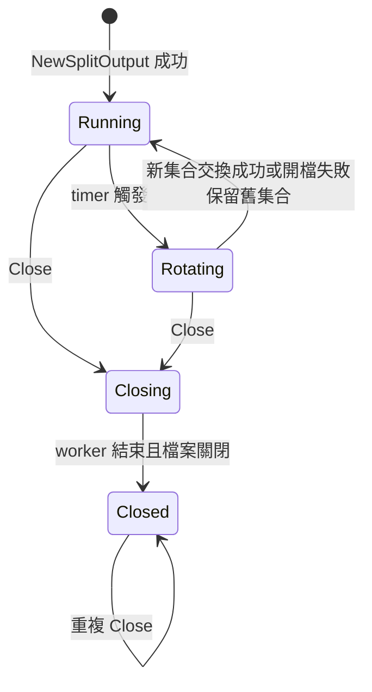
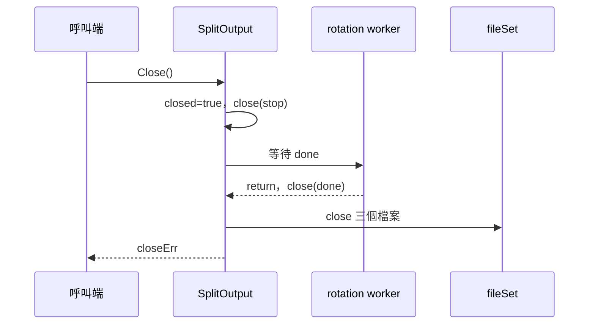

# 設計文件：修正分級日誌生命週期與路由

## 設計摘要

以 package-private 的 clock／timer 抽象讓每日換檔可取消且可測，並在 `SplitOutput` 內加入停止、完成、關閉狀態與冪等控制。檔案集合採「先完整開啟、再鎖內交換、最後關閉舊集合」流程，避免換檔失敗先破壞現有輸出。公開 API、檔名格式與同步寫入模型維持不變；mutex 拆分、buffer 與其他 logger 架構不在本次範圍。

## 文件定位

本設計實現同目錄 `requirements.md`，並以 `_workspace/05_review_summary.md` 的第一優先問題為來源。只規劃 `split_output.go`、`split_output_test.go` 與必要文件更新，不重寫 `core.go`、Config、encoder、context 或 fields。

## 已知契約狀態

- 需求來源：`requirements.md` 的目標、已定決策與六個驗收情境
- API / CLI / Hook contract：`NewSplitOutput(directory, filePrefix string) (*SplitOutput, error)`、`GetSplitCore(...) (zapcore.Core, func(), error)`、`Write`、`Close` 簽章保持不變
- Data contract：檔名維持 `{prefix}-{info|warn|error}-{YYYY-MM-DD}.log`，日期使用執行環境 local timezone
- 既有實作：`split_output.go` 直接持有三個 `io.Writer`、一個 mutex，並以無限迴圈與 `time.Sleep` 換檔
- 不可假造：不得新增外部服務、設定欄位、公開錯誤型別或未經確認的 log level；不得宣稱 cleanup 可回傳 error

## Bounded Context

包含：

- 分級輸出的檔案集合所有權
- 每日換檔 worker 的啟動、取消與結束
- `Write`、`Sync`、`Close` 與換檔間的同步
- DEBUG 至 FATAL 的檔案路由
- 決定性的時間與失敗路徑測試
- README、DESIGN 與 godoc 的契約同步

不包含：

- 全域 `Init` 與一般 file core 的資源所有權
- Config schema、檔名安全驗證與權限策略
- encoder、SQL 字串處理、context 欄位
- 非同步寫入、buffer、mutex 效能重構與 benchmark 門檻
- Go module、CI 或 dependency 變更

## 設計原則

- 保持既有公開 API 與檔名格式相容。
- 每個 goroutine 必須有明確停止與等待機制。
- 關閉狀態為單向轉移，不允許資源復活。
- 在邊界完整處理錯誤，不吞掉可回傳的 Sync／Close 錯誤。
- 時間與 I/O 失敗測試必須可控制，不使用長時間 sleep 或固定絕對路徑。
- 只修改 task Boundary 允許的檔案。

## 需求對應

| 需求 / 驗收情境 | 設計處理方式 | 驗證方式 |
|-----------------|--------------|----------|
| Close 停止 worker | stop channel、done channel、closeOnce | `TestSplitOutputCloseStopsRotation` |
| Close 冪等與並行安全 | `sync.Once` 保存第一次 close 結果 | `TestSplitOutputCloseIdempotent`、race detector |
| 關閉後拒絕操作 | mutex 保護的 closed 狀態；回傳包裝 `os.ErrClosed` | `TestSplitOutputAfterClose` |
| 分級路由 | info enabler 明確接受 DEBUG 與 INFO | `TestGetSplitCoreRoutesLevels` |
| Sync 實際下沉 | `SplitOutput.Sync` 同步當前檔案集合；wrapper 委派 | `TestSplitOutputSync` |
| 換檔失敗保留舊檔 | 新集合先開啟成功，再交換 | `TestSplitOutputRotationFailureKeepsCurrentFiles` |
| 文件契約一致 | 同步更新 README、DESIGN、godoc | `rg` 與人工檢查 |

## 受影響檔案計畫

| 檔案 | 預期變更 | 原因 | 風險 |
|------|----------|------|------|
| `split_output.go` | 增加生命週期狀態、timer 抽象、原子換檔、Sync 與路由修正 | 修正核心缺陷 | 鎖順序錯誤可能 deadlock |
| `split_output_test.go` | 改為內容路由、並行 Close、可控換檔與失敗路徑測試 | 建立可驗收回歸保護 | fake clock 設計過度耦合實作 |
| `README.md` | 補充 DEBUG 路由、cleanup 與 Sync 契約 | 公開文件一致性 | 無 |
| `DESIGN.md` | 更新 worker 生命週期與換檔流程 | 設計文件一致性 | 無 |

## 目標結構或流程

### 內部結構

規劃加入下列 package-private 概念，名稱可在實作時依現有慣例微調，但不得改變契約：

- `fileSet`：持有 info、warn、error 三個 `*os.File`，提供 `write`、`sync`、`close` 所需操作。
- `rotationClock`：提供 `Now` 與建立可停止 timer 的能力；正式環境包裝 `time.Now`、`time.NewTimer`。
- `rotationTimer`：提供事件 channel 與 `Stop`；測試可手動觸發。
- `SplitOutput.stop`：只關閉一次，用於通知 worker。
- `SplitOutput.done`：worker return 前關閉，供 `Close` 等待。
- `SplitOutput.closeOnce`、`closeErr`：確保並行 Close 只執行一次並得到一致結果。
- `SplitOutput.closed`：由 mutex 保護，阻止 Write、Sync 與換檔交換。

### 建構流程

1. 驗證並建立 directory，維持現有公開行為。
2. 完整開啟初始 `fileSet`；任一檔案失敗時關閉已開啟檔案並回傳 error。
3. 建立 stop、done 與正式 clock。
4. 僅在初始化完全成功後啟動一個 rotation worker。

### 換檔流程

1. 由 clock 計算下一個 local midnight。
2. 建立 timer，使用 `select` 等待 timer 或 stop。
3. timer 觸發後，先在鎖外完整開啟新 `fileSet`。
4. 取得 mutex；若已 closed，釋放新集合並結束或等待 stop。
5. 交換目前集合後釋放 mutex，再關閉舊集合。
6. 開檔失敗時保留舊集合，回報 stderr 後進入下一輪；不得 busy loop。

### 關閉流程

1. `closeOnce.Do` 內取得 mutex，將 closed 設為 true 並取出目前集合。
2. 關閉 stop channel，釋放 mutex。
3. 等待 done channel，確認 worker 結束。
4. 關閉取出的檔案集合，以 `errors.Join` 聚合可回傳錯誤並保存於 `closeErr`。
5. 所有 Close 呼叫回傳相同 `closeErr`。

### Write 與 Sync

- `Write` 在 mutex 保護下確認未關閉，依 level 選擇目前檔案並同步完成單次寫入。
- `Sync` 在 mutex 保護下確認未關閉，對三個目前檔案執行 `Sync`，以 `errors.Join` 聚合錯誤。
- `splitOutputWrapper.Sync` 改為委派 `SplitOutput.Sync`。
- 本次維持鎖內同步 I/O；是否拆鎖必須由後續 benchmark spec 決定。

## Mermaid Diagrams

## 介面與資料契約

### API / CLI / Hook

- Input：既有 directory、filePrefix、encoderConfig 與 zap log entries
- Output：既有三種日期檔案與 cleanup function
- Error：建構、Write、Sync、Close 回傳底層錯誤；關閉後操作包裝 `os.ErrClosed`

### Data / Config

- 新增資料：僅 package-private 生命週期狀態與測試抽象
- 既有資料相容性：檔名、JSON encoding 與既有 INFO/WARN/ERROR 路由不變；不需 migration

## 關鍵行為

- Close 回傳前 worker 必須已結束。
- closed 狀態一旦成立不可逆轉。
- 新檔案集合未完整開啟前不得替換或關閉現有集合。
- DEBUG 與 INFO 共用 info core，但不得重複寫入其他檔案。
- cleanup 維持 `func()`，因此只能忽略 Close error；直接呼叫 `Close` 可觀察錯誤。

## 前後端或跨模組設計

不涉及前端或外部服務。跨模組影響限於 zap core 呼叫 `WriteSyncer.Sync` 及 README、DESIGN 的公開說明。

## Protected Behavior

- 公開函式與方法簽章不變。
- 檔名格式及 local date 語意不變。
- INFO、WARN、ERROR 以上的既有正確路由不變。
- `GetSplitCore` 仍回傳 core、cleanup、error。
- 不增加外部依賴，不變更 go.mod。

## 替代方案

| 方案 | 優點 | 缺點 | 結論 |
|------|------|------|------|
| stop channel + timer + done | Go 慣用、可取消、可等待 | 需明確鎖順序 | 採用 |
| `context.Context` 保存於 struct | 可使用 cancel | 違反本專案不將 context 保存於 struct 的規範，且此 worker 無外部 context 契約 | 不採用 |
| 只在 Close 設 closed，不停止 goroutine | 修改小 | goroutine 仍洩漏，不符合驗收 | 不採用 |
| 使用 `time.After` | 程式短 | timer 不易停止與替換測試 | 不採用 |
| 以 `runtime.NumGoroutine` 驗證 | 不需內部抽象 | 容易受測試環境干擾，無法驗證不重開檔 | 不採用 |
| 本次同時拆鎖與加 buffer | 可能提升吞吐 | 缺少 benchmark，擴大風險 | 延後 |

## 風險與處理方式

| 風險 | 影響 | 處理方式 | 驗證 |
|------|------|----------|------|
| Close 等待自身 worker 鎖造成 deadlock | 程序無法關機 | 等待 done 前不得持有 mutex；文件固定順序 | `TestSplitOutputCloseIdempotent`、timeout 保護 |
| 換檔與 Close 競爭 | 新檔案洩漏或資源復活 | 交換前檢查 closed；失敗與 closed 都關閉新集合 | race detector、可控 timer 測試 |
| 關閉錯誤不一致 | 重複 Close 行為不可預期 | 保存第一次 closeErr | `TestSplitOutputCloseIdempotent` |
| fake clock 過度暴露實作 | 維護成本增加 | 只保留最小 interface，僅 private constructor 接收 | code review、golangci-lint |
| 鎖內 Sync 延長阻塞 | 寫入延遲 | 保持正確性優先，另以 benchmark spec 評估 | 後續 benchmark |

## 實作注意事項

- 先寫會失敗的驗收測試，再修改生命週期；不得以降低測試要求通過。
- 測試使用 channel 與 timeout 避免永久卡住，但 timeout 只作失敗保護，不作正常同步機制。
- 所有新註解、測試訊息與錯誤說明使用繁體中文；技術識別字保留英文。
- close、sync 的多重錯誤使用 `errors.Join`；不得只記錄後吞掉可回傳錯誤。
- 若實作需要修改 Boundary 外檔案，先更新 `tasks.md` 或詢問使用者。
