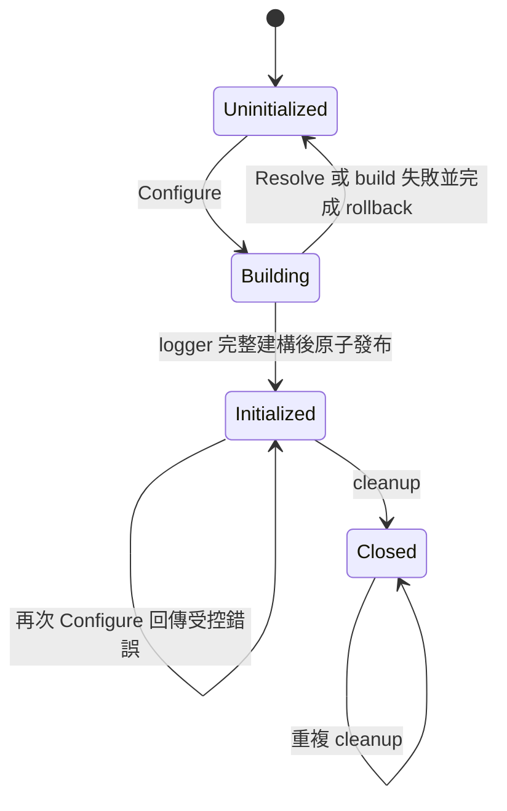

# 設計文件：補強 Config 與初始化契約

## 設計摘要

以新增的三態部分設定模型解決一般 bool 無法表示「未提供」的問題，解析後產生獨立、完整且已驗證的 `Config`。logger 建構拆成「純設定解析與驗證」、「資源建構」、「成功後發布」三階段；任何失敗都回傳 error 並回收已建立資源。既有 `Config`、`Merge`、`Init` 與套件級函式保留為相容層，避免 v1 來源碼破壞。

## 文件定位

本設計實現同目錄 `requirements.md`。T0 已完成，以下 API 名稱、生命週期型別、重複初始化與 legacy 行為視為本次已核准契約。

## 已知契約狀態

- `Config` 為公開 struct，呼叫端可直接使用 composite literal，不能相容地把 bool 改為 pointer。
- `Init(cfg *Config)` 無回傳值，直接修改簽章會影響既有 API 契約。
- `DefaultConfig()` 的 AddCaller 與 ColorEnabled 預設為 true。
- `Merge` 會修改 receiver，字串與 Outputs 只在非空時覆寫，bool 一律覆寫。
- `Init` 透過 package-level `sync.Once` 執行一次 `initLogger`。
- `buildFileCore` 直接開啟 `*os.File`，錯誤以 panic 處理，資源沒有 cleanup 所有者。
- `SetLevel` 透過既有 `zap.AtomicLevel` 動態調整全域 logger 級別。
- `Init(nil)`、套件級日誌函式與既有日誌格式是 Protected Behavior。

## Bounded Context

包含：

- 部分設定表示、預設值解析、正規化與驗證
- console／一般 file logger 的 core 建構
- 建構失敗的資源回滾
- 非全域 logger 與 owned resources 的生命週期
- 全域 logger 成功發布、失敗重試與重複初始化控制
- legacy API 相容層與遷移文件

不包含：

- SplitOutput、每日換檔與分級檔案
- 路徑逸出、symlink、權限、secret redaction
- encoder 假 API 與 SQL dead code
- context fields、非同步 buffer、效能重構
- 設定檔讀取套件、環境變數優先級與動態 reload
- CI、module、依賴與發布

## 設計原則

- v1 採 additive API，既有公開簽章不變。
- 驗證先於 I/O，資源成功後才發布可見狀態。
- 失敗不得留下半初始化 logger、已開啟檔案或不可重試狀態。
- 輸入與輸出邊界複製 slice，避免別名共享。
- cleanup 僅關閉其擁有的資源，且可重複與並行呼叫。
- 可恢復錯誤以 `%w` 包裝回傳；library 新入口不得 panic。
- T0 未確認項目不得由實作者自行猜測。

## 需求對應

| 需求 | 設計處理方式 | 驗證 |
|------|--------------|------|
| 保留預設與明確 false | `ConfigPatch` 使用 pointer 欄位 | Resolve table-driven tests |
| 不共享 Outputs | Resolve 進出邊界執行 slice clone | aliasing test |
| 嚴格設定驗證 | `Config.Validate` 產生 `ErrInvalidConfig` 錯誤鏈 | invalid value table |
| I/O 不 panic | builder 全面回傳包裝 error | deterministic file-open error test |
| 資源可關閉 | 建構結果持有 closers，cleanup 使用 `sync.Once` | concurrent cleanup test |
| 失敗可重試 | mutex 保護狀態，只在成功後標記 initialized | retry test、race detector |
| 成功後重複設定受控 | 回傳 `ErrAlreadyConfigured`，不替換既有 logger | second configure test |
| 舊 API 相容 | 保留 Config、Merge、Init 與全域函式簽章 | compile／regression tests |

## 公開 API

T0 採用以下公開契約：

```go
type ConfigPatch struct {
    Level         *string
    Format        *string
    Outputs       *[]string
    LogPath       *string
    FileName      *string
    AddCaller     *bool
    AddStacktrace *bool
    Development   *bool
    ColorEnabled  *bool
}

func (p *ConfigPatch) Resolve() (*Config, error)

type Instance struct {
    // 欄位不公開，由方法提供受控存取與生命週期。
}

func New(cfg *Config) (*Instance, error)

func (i *Instance) Logger() *zap.Logger
func (i *Instance) Sync() error
func (i *Instance) Close() error

func Configure(patch *ConfigPatch) (func() error, error)
```

設計意義：

- `ConfigPatch` 只表示使用者是否提供欄位，不直接承擔執行期設定。
- `Resolve` 從 DefaultConfig 建立新物件、套用明確欄位、正規化並驗證。
- `New` 接收完整設定；nil 表示 DefaultConfig。它不修改全域狀態，並以 `Instance` 承載 logger 與 owned resources。
- `Instance.Close` 採冪等且並行安全的 cleanup；`Logger` 與 `Sync` 提供受控使用方式。
- `Configure` 完成 Resolve、New 與全域發布，回傳全域資源 cleanup。
- 成功後再次 `Configure` 回傳 `ErrAlreadyConfigured`；失敗完成 rollback 後仍可重試。

## 設定解析與驗證

### Resolve 流程

1. 建立新的 DefaultConfig，不使用呼叫端物件作 receiver。
2. 只套用 ConfigPatch 中非 nil 的欄位；`*bool=false` 必須生效。
3. Outputs 在讀入與回傳時都複製。
4. Level、Format 與每個 Output 正規化為小寫。
5. 執行完整驗證；失敗不回傳部分可用設定。

### 驗證矩陣

| 欄位 | 接受值 | 拒絕條件 | 備註 |
|------|--------|----------|------|
| Level | debug、info、warn、error、fatal | 空白、未知值 | 大小寫不敏感 |
| Format | console、json | 空白、未知值 | 大小寫不敏感 |
| Outputs | console、file | 空集合、未知值、重複值 | 保持提供順序 |
| LogPath | 未提供時為 `./logs` | file 啟用且明確提供空字串 | 路徑安全另案處理 |
| FileName | 空字串或合法字串 | 本 spec 不新增路徑安全限制 | 空字串維持日期檔名 |

新增 `ErrInvalidConfig` 與 `ErrAlreadyConfigured`，讓 `errors.Is` 可判斷 validation 與重複初始化。單一欄位錯誤使用 `fmt.Errorf("驗證設定欄位 %s: %w", field, sentinel)` 類型的包裝，不將 secret 或完整外部內容寫入錯誤。

## 內部建構設計

### 建構暫存狀態

`New` 以 package-private 的 cores 與 closers 暫存尚未發布的資源，不寫入
`globalLogger`、`globalConfig` 或 zap globals。每成功建立一個 owned resource
就加入 closers；後續失敗時以反向順序關閉，並以 `errors.Join` 聚合原始錯誤
與 rollback 錯誤。完整成功後才建立 `Instance` 承接 logger 與 closers。

### core builder

- console core 不擁有 `os.Stdout`，不得由 cleanup 關閉。
- file core 開啟的 `*os.File` 由 buildResult 擁有。
- output validation 已在 I/O 前完成，builder 不再靜默忽略 unknown output。
- encoder 與 AtomicLevel 保持既有行為；本次不修改編碼欄位與日誌格式。
- `New` 成功後將 `buildResult` 封裝成 `Instance` 回傳呼叫端。

### cleanup 契約

1. 第一次 cleanup 依 LIFO 關閉所有 owned resources，以 `errors.Join` 聚合錯誤。
2. 後續 cleanup 不重做關閉，回傳第一次結果。
3. 多個 goroutine 同時呼叫不得 panic、deadlock 或 data race。
4. cleanup 不關閉 stdout／stderr，也不負責吞掉 `logger.Sync()` 錯誤。
5. 公開文件要求呼叫端先處理 `Instance.Sync`，再執行 `Instance.Close`；Close 不隱藏 Sync 錯誤。

## 全域初始化狀態

### 建議狀態機



### 發布順序

1. mutex 下確認尚未成功初始化，保留本次建構權。
2. 執行 Resolve 與 resource build，不觸碰可見全域 logger。
3. 失敗時 rollback 並將狀態恢復為 Uninitialized。
4. 成功後一次更新 globalConfig、zapGlobalLevel、globalLogger 與 zap globals。
5. 回傳只屬於這次成功初始化的 cleanup。

本 spec 不要求支援「記錄進行中同時重新 Configure」。呼叫端必須在啟動階段、其他 goroutine 開始記錄前完成 Configure。Configure 本身與競爭中的 Configure／cleanup 仍須 race-free。

## legacy 相容層

- `Config` 欄位與 tags 維持來源相容。
- `DefaultConfig` 預設值不變。
- `Merge` 簽章與既有測試可保留，但文件標示 bool 無法表示未提供；新程式使用 ConfigPatch.Resolve。
- `Init` 簽章不變並標示 deprecated。它忽略 `ErrAlreadyConfigured`；其他錯誤維持 legacy panic 行為，新程式使用 Configure 處理 error。
- 套件級 Debug、Info、Warn、Error、DPanic、Panic、Fatal、With、Named、SetLevel、Sync 保持既有簽章與成功初始化後行為。

## 受影響檔案計畫

| 檔案 | 預期變更 | 風險 |
|------|----------|------|
| `config.go` | 新增 ConfigPatch、Resolve、驗證與 defensive copy | 公開 API 命名與 tags |
| `config_test.go` | 新增三態、正規化、驗證與 aliasing 測試 | 過度綁定內部實作 |
| `core.go` | 拆分無副作用 builder、回傳 error／cleanup、加入 Configure 狀態 | 全域狀態與資源回滾 |
| `core_test.go` | 新增 I/O error、cleanup、重試與相容測試 | 全域測試隔離 |
| `README.md` | 新安全入口範例、遷移與 cleanup 說明 | 新舊範例混淆 |
| `DESIGN.md` | 更新初始化流程、錯誤與所有權 | 與實作漂移 |

## Protected Behavior

- `Config`、`DefaultConfig`、`Merge`、`Init` 與現有套件級函式簽章不變。
- `Init(nil)` 的零設定使用方式仍可編譯。
- DefaultConfig 的值、既有 console／json 格式與日期檔名不變。
- SetLevel 仍可動態調整成功發布 logger 的級別。
- 不新增外部依賴，不修改 go.mod 或 go.sum。
- 不變更 SplitOutput 與 encoder 公開 API。

## 替代方案

| 方案 | 優點 | 缺點 | 結論 |
|------|------|------|------|
| 直接將 Config bool 改為 `*bool` | 模型單一 | 破壞 composite literal 與呼叫端型別 | 不採用於 v1 |
| 以 `map[string]any` 表示 patch | 可表達缺席 | 喪失編譯期型別安全，驗證複雜 | 不採用 |
| 新增 ConfigPatch | 型別安全、可表達三態、可相容新增 | 新舊模型並存 | 建議採用 |
| 將 Init 改成回傳 error | API 直觀 | 公開簽章契約改變 | 不採用於 v1 |
| 新增 Configure | 相容且可回傳 error／cleanup | 需文件化兩個入口 | 建議採用 |
| New 回傳三個值 | 修改小 | 呼叫端容易漏 cleanup，生命週期不易發現 | 不採用 |
| New 回傳具名生命週期型別 | API 可擴充、Close 易發現 | 新增 Instance 型別 | 採用 |
| 保留 sync.Once | 實作簡單 | 失敗後不可重試 | 不採用於新入口 |
| mutex 狀態機 | 失敗可重試、可控制並行 | 必須嚴格測試狀態轉移 | 建議採用 |

## 風險與處理方式

| 風險 | 影響 | 處理方式 | 驗證 |
|------|------|----------|------|
| API 名稱過早固定 | 後續相容成本 | T0 先確認，再寫公開程式碼 | spec 審閱 |
| 建構失敗遺漏已開檔案 | FD 洩漏 | buildResult 集中 ownership 與 rollback | 注入／決定性失敗測試 |
| 全域發布一半失敗 | logger 狀態不一致 | 先完整建構，最後在單一臨界區發布 | retry test、狀態斷言 |
| cleanup 與第二次初始化競爭 | 關錯資源或 data race | cleanup 綁定特定 buildResult，狀態由 mutex 保護 | race detector |
| legacy Init 錯誤策略不明 | panic 或靜默失敗 | T0 阻擋實作，不自行決定 | API review |
| 嚴格驗證改變寬鬆行為 | 新入口拒絕舊錯誤設定 | 僅新入口採嚴格規則，遷移文件列差異 | compatibility tests |

## 實作注意事項

- 先完成 T0 並更新本文件，再開始 TDD Red。
- 測試全域狀態時使用 package-private fixture 保存與恢復狀態，不得依賴測試執行順序。
- 不使用 `/nonexistent` 驗證權限錯誤；使用 `t.TempDir()` 內一般檔案形成穩定的 ENOTDIR 類錯誤。
- 新 error 需支援 `errors.Is`，並以 `%w` 保留底層 I/O error。
- 對輸入 Config、ConfigPatch 與 Outputs 執行 defensive copy，不保存呼叫端可變 slice。
- 若需要修改 Boundary 以外檔案，先更新 tasks 並取得確認。
