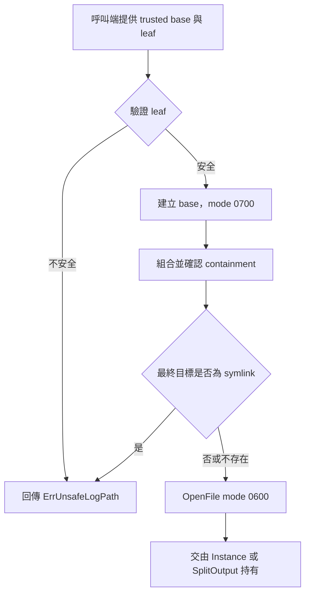

# 設計文件：建立檔案輸出安全邊界

## 設計摘要

新增共享的 `file_security.go`，集中 leaf-name 驗證、安全路徑組合、既有最終 symlink 檢查與預設 mode。Config 驗證與 SplitOutput 建構都在任何 I/O 前套用相同規則；一般與分級輸出則透過同一安全開檔 helper 建立 `0600` 檔案。另新增 `Redacted` field helper 與敏感資訊文件指引。

本設計不提高 Go 1.21 最低版本，因此 symlink 保護採「拒絕建構時已存在的最終 symlink」，不宣稱消除檢查與開檔間的 TOCTOU race。

## 文件定位

本設計實現同目錄 `requirements.md`，接續已完成的 Config／初始化契約與 SplitOutput 生命週期修正。只強化檔案輸出與敏感欄位 guardrail，不重寫 logger 架構、換檔排程、encoder 或 SQL core。

## 已知契約狀態

- API：`New(*Config)`、`Configure(*ConfigPatch)`、`NewSplitOutput(directory, filePrefix string)`、`GetSplitCore(...)` 簽章已公開。
- Data：一般檔預設 `{YYYY-MM-DD}.log`；分級檔為 `{prefix}-{info|warn|error}-{YYYY-MM-DD}.log`。
- Config：file output 已要求非空 LogPath，但尚未限制 FileName 的路徑語意。
- I/O：一般與分級輸出分別直接呼叫 `os.MkdirAll`、`os.OpenFile`。
- Mode：目錄 `0755`、檔案 `0644`，只在建立時受 umask 影響。
- Resource：一般 file 由 Instance.Close 管理；SplitOutput Close 已停止 worker 並關閉檔案。
- Toolchain：`go.mod` 與 CI 為 Go 1.21；本機為 Go 1.26.5。
- 不可假造：不得宣稱 LogPath 不可為絕對路徑、不得宣稱具備原子 symlink race 防護、不得自動判定哪些任意欄位是秘密。

## Bounded Context

包含：

- Config FileName 與 SplitOutput filePrefix 的 leaf-name 規則
- 基準目錄直接子檔 containment
- 既有最終 symlink 拒絕
- 新目錄／新檔安全預設 mode
- 安全錯誤分類
- Redacted field 與敏感資訊 README 指引
- 一般／分級輸出安全測試與既有行為回歸

不包含：

- LogPath／directory 設定來源的授權與輸入驗證
- 原子 open-beneath／no-follow guarantee
- Go 最低版本、CI matrix、os.Root 或外部 safe-open dependency
- 自訂 mode options、ACL、owner、SELinux 或 Kubernetes securityContext
- 自動 redaction、訊息掃描、secret manager 整合
- SQL、encoder、Context slice、buffer 與 benchmark 重構

## 設計原則

- 驗證必須早於任何 I/O 與 goroutine 啟動。
- 一般與分級輸出不得各自實作不同安全規則。
- leaf name 不得包含任何平台的路徑語意。
- 新資源採最小權限，既有資源不主動改權限。
- 安全錯誤可由 errors.Is 判斷，不要求呼叫端解析文字。
- 明確揭露標準庫與最低版本造成的剩餘風險。
- Redacted helper 不接收秘密值，減少秘密在呼叫鏈傳遞。

## 需求對應

| 需求 | 設計處理方式 | 驗證 |
|------|--------------|------|
| FileName traversal | Config.Validate 呼叫 validateLogLeaf | table-driven test |
| prefix traversal | NewSplitOutput 在 MkdirAll 前驗證 | directory-not-created test |
| 規則一致 | file_security.go 單一 helper | 一般／分級共用 table |
| containment | leaf 驗證後 secureLogPath 再做 Rel 防禦檢查 | outside-file assertion |
| symlink | OpenFile 前 Lstat 最終路徑 | outside-content assertion |
| 私有權限 | dir 0700、file 0600 | mode bits tests |
| 既有 mode 不變 | 不呼叫 Chmod | existing-file test |
| error chain | ErrUnsafeLogPath；Config 以多重 `%w` 包裝 | errors.Is assertions |
| sensitive guide | Redacted helper + README guardrail | field encode test、rg |

## 共享安全元件

### 常數與錯誤

建議放於 `file_security.go`：

```go
var ErrUnsafeLogPath = errors.New("日誌檔案路徑不安全")

const (
    defaultLogDirMode  os.FileMode = 0o700
    defaultLogFileMode os.FileMode = 0o600
)
```

mode 常數維持 package-private，避免在尚未提供自訂權限 API 前形成過度承諾。

### leaf-name 驗證

```go
func validateLogLeaf(name string, allowEmpty bool) error
```

規則順序：

1. 空字串依 allowEmpty 決定；FileName 與 prefix 均允許空字串。
2. 拒絕 `.`、`..`。
3. 拒絕 NUL。
4. 拒絕 `/` 與 `\\`，不依當前 GOOS 才判斷。
5. 拒絕 `filepath.IsAbs(name)`。
6. 拒絕 Windows drive-prefix 形式，例如 `C:` 開頭。
7. 以 `filepath.Base(name) == name` 作最後一致性檢查。

一般安全名稱可包含空白、點、底線與連字號；本次不建立字元白名單，避免不必要破壞 Unicode 檔名。

### containment 組合

```go
func secureLogPath(baseDir, leaf string) (string, error)
```

流程：

1. 驗證 leaf。
2. `base := filepath.Clean(baseDir)`。
3. `target := filepath.Join(base, leaf)`。
4. 以 `filepath.Rel(base, target)` 再次確認結果不是 `..` 且不以 `../` 開頭。
5. 回傳 target。

此 Rel 檢查是 defense in depth；主要邊界仍是 leaf 不得包含分隔符。

### 安全開檔

```go
func openSecureLogFile(baseDir, leaf string) (*os.File, error)
```

流程：

1. 透過 secureLogPath 取得 target。
2. 對 target 執行 `os.Lstat`。
3. target 存在且 mode 含 `os.ModeSymlink` 時回傳 `ErrUnsafeLogPath`。
4. 其他非 NotExist 的 Lstat 錯誤直接包裝回傳。
5. 使用 `os.OpenFile(target, os.O_CREATE|os.O_APPEND|os.O_WRONLY, 0o600)`。
6. 不對既有檔案執行 Chmod。

Lstat 與 OpenFile 間不是原子操作。README、DESIGN 與 godoc 必須說明 Go 1.21 下的限制；不得使用「完全防止 symlink attack」等敘述。

## Config 整合

- `Config.Validate` 只在 Outputs 含 file 時驗證 FileName。
- FileName 空字串合法，後續由 `newFileCore` 產生既有日期檔名。
- 不安全 FileName 回傳：

```go
fmt.Errorf("%w: FileName: %w", ErrInvalidConfig, ErrUnsafeLogPath)
```

多個 `%w` 在目前 Go 1.21 契約中可由 errors.Is 同時判斷兩個 sentinel。

- `New` 與 `Configure` 已在 I/O 前呼叫 Validate，因此不需重複驗證公開 Config。
- `newFileCore` 仍使用共享 helper 作第二層防禦，避免未來 private 呼叫繞過。

## SplitOutput 整合

- `NewSplitOutput`／private constructor 在 `MkdirAll` 前驗證 prefix。
- directory 以 `0700` 傳入 MkdirAll；既有 directory mode 不會因此改變。
- `openSplitFiles` 以既有命名規則先產生三個 leaf，再逐一呼叫 openSecureLogFile。
- 第二或第三檔失敗時沿用既有 `errors.Join` 回收已開檔案。
- 換檔重用相同 opener，因此後續日期也套用 symlink 與 mode 規則。

## Redacted field

在 `fields.go` 新增：

```go
func Redacted(key string) Field {
    return zap.String(key, "[REDACTED]")
}
```

此 API 刻意不接受 value，避免秘密值為了遮罩而進入 logger helper。它不會攔截其他 Field，也不會根據 key 自動遮罩。

## 目標流程



## 受影響檔案計畫

| 檔案 | 預期變更 | 風險 |
|------|----------|------|
| `file_security.go` | 新增共享路徑、symlink、mode helper | TOCTOU 被誤解為完整防護 |
| `file_security_test.go` | leaf、containment、symlink、mode tests | 平台差異 |
| `config.go`／`config_test.go` | FileName 驗證與 error chain | 新入口變嚴格 |
| `core.go`／`core_test.go` | 一般 file 改用共享 helper | 既有檔 append／cleanup 回歸 |
| `split_output.go`／`split_output_test.go` | prefix 驗證、0700／0600、共享 helper | 換檔與 partial cleanup |
| `fields.go`／`fields_test.go` | Redacted helper | 使用者誤解為自動遮罩 |
| `README.md` | 安全邊界、權限、敏感資訊與遷移 | 文件過度承諾 |
| `DESIGN.md` | threat model、I/O 流程、剩餘風險 | 與最低版本漂移 |

## Protected Behavior

- `New`、`Configure`、`NewSplitOutput`、`GetSplitCore` 及既有 Field helper 簽章不變。
- 安全 FileName、空 FileName、安全 prefix、空 prefix 均保持可用。
- 一般日期檔與 SplitOutput 三種檔名格式不變。
- DEBUG／INFO／WARN／ERROR 路由、每日換檔、Sync、Close 與 worker 生命週期不變。
- 既有檔案以 append 模式寫入，且不主動 chmod。
- 不新增 dependency，不修改 go.mod、go.sum 或 CI。

## 替代方案

| 方案 | 優點 | 缺點 | 結論 |
|------|------|------|------|
| 只用 filepath.Clean／Rel | 修改小 | 最終 symlink 仍可逸出 | 不足 |
| leaf 驗證 + Lstat | Go 1.21 可用、可阻止穩定既有 symlink | 有 TOCTOU | 本次採用並揭露限制 |
| Go 1.24 os.Root | containment 強、跨平台標準庫 | 需提高最低版本與 CI | 後續優先方案 |
| 外部 safe-open 套件 | 可支援舊版 Go | 增加供應鏈與平台風險 | 本次不採用 |
| 自製 syscall O_NOFOLLOW | Unix 可原子拒絕 final symlink | 跨平台與維護成本高 | 不採用 |
| 自動依 key redaction | 呼叫端省事 | 黑名單不完整、可能誤遮罩 | 不採用 |
| Redacted(key) | 不接觸秘密值、意圖明確 | 需呼叫端主動使用 | 採用 |

## 風險與處理方式

| 風險 | 影響 | 處理方式 | 驗證 |
|------|------|----------|------|
| symlink 在 Lstat 後被置換 | 仍可能跟隨 | 文件揭露；後續 os.Root spec | code review、文件 rg |
| mode 變更造成部署讀取失敗 | log collector 無權限 | release note 說明；既有檔不 chmod | mode regression test |
| 三個 split 檔中途失敗 | FD 洩漏 | 沿用 splitFileSet.close 聚合錯誤 | symlink 放在 warn／error 目標測試 |
| Config 與 Split 規則漂移 | 某入口仍可 traversal | 單一 validateLogLeaf helper | shared table tests |
| 平台無 symlink 權限 | 測試假失敗 | 建立 symlink 失敗時依錯誤明確 skip | CI matrix 後續補強 |
| 文件讓人誤以為自動 redaction | 秘密仍外洩 | 明示 Redacted 需主動使用 | README review |

## 實作注意事項

- 先建立 traversal、symlink、mode 與 Redacted 的 Red tests，再修改產品碼。
- 測試不可使用 `/tmp` 固定路徑或假設 root 權限；全部使用 `t.TempDir()`。
- symlink 測試必須先確認 `os.Symlink` 是否成功，失敗時記錄原因後 skip。
- mode 測試在 Windows skip，POSIX 只斷言 group／other bits 為 0。
- 使用 `errors.Is` 驗證 sentinel，不綁定完整錯誤文字。
- 不因本 spec 順便修正 SQL core、英文舊註解或 CI。
- 若需要 os.Root、外部 dependency 或 go.mod 變更，立即停止並更新 spec。
