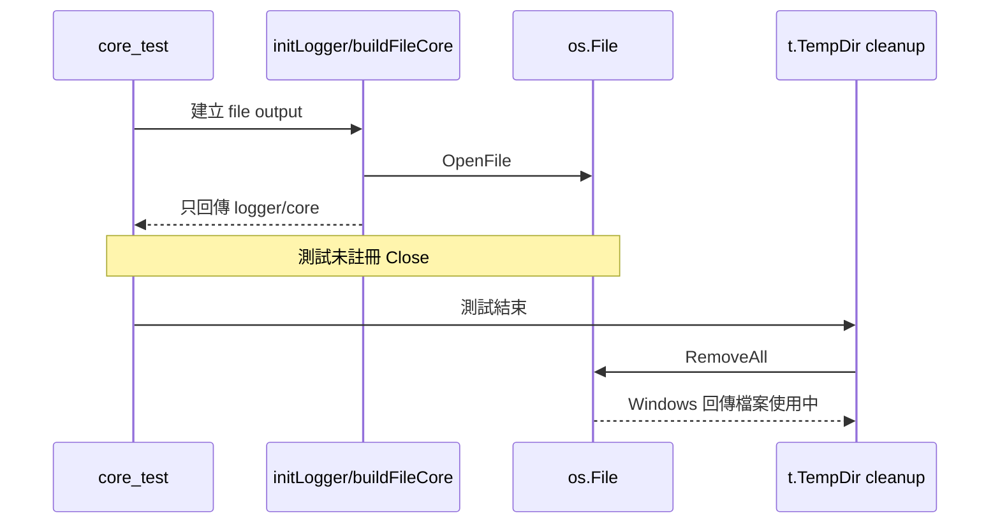
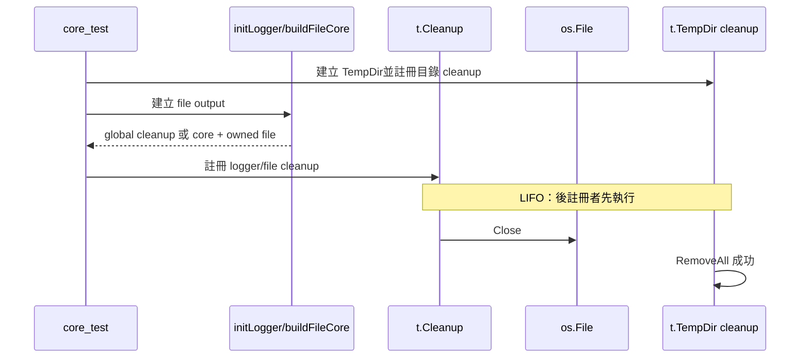

# 設計文件：修正 Windows 測試檔案 handle 洩漏

## 設計摘要

修正兩條測試資源生命週期：全域 init 測試在 `t.TempDir()` 建立後註冊 global reset cleanup；package-private `buildFileCore` 改為回傳 core 與 owned `*os.File`，由各測試透過共同 helper 註冊關閉。兩者都利用 `t.Cleanup` 的 LIFO 語意，確保檔案先關閉、暫存目錄後刪除。

## 文件定位

本設計實現同目錄 `requirements.md`，只處理 PR #4 Windows 2025 portability job 暴露的測試 handle 洩漏。工具鏈與 CI matrix 已完成，不在本批修改；`os.Root` 仍是後續獨立 spec。

## 已知契約狀態

- 公開生命週期：`New` 回傳 `Instance`，呼叫端 Close；`Configure` 回傳 cleanup。
- 全域測試入口：`initLogger` 呼叫 legacy `Init`，成功後 cleanup 保存於 `globalCleanup`。
- `resetGlobalState`：若有 globalCleanup 會執行，但目前忽略 error。
- `buildFileCore`：只由四個 `core_test.go` 測試呼叫；建立 file 後丟棄 `*os.File`。
- TempDir：cleanup 由 testing package 註冊；後註冊的 cleanup 先執行。
- CI：Windows 2025 的七個測試只在 TempDir RemoveAll 階段失敗。
- 不可假造：不能宣稱 runtime Configure 洩漏；目前證據只指向測試未執行 cleanup。

## Bounded Context

包含：

- core_test 全域 logger reset 與 cleanup 註冊
- 三個 init file-output 測試
- buildFileCore package-private owned file 回傳
- 四個 buildFileCore 測試的 file cleanup
- Windows portability 重新驗證
- 前置 CI spec T9 狀態回填

不包含：

- Instance／Configure／SplitOutput runtime lifecycle 重構
- os.Root、path validation、permission、symlink 行為
- workflow、runner、Go 版本、lint 或 coverage 設定
- Context、encoder、SQL 或效能重構

## 設計原則

- 建立資源的呼叫端必須能看見並關閉資源。
- 測試 cleanup 必須在 Fatal 後仍執行。
- cleanup error 必須使測試失敗，不能只記錄或忽略。
- 修正必須跨平台，不新增 Windows 條件分支。
- 保持 package-private fallback 行為，避免混入無關清理。
- 遠端 Windows job 是完成條件，不以交叉編譯取代。

## 根因流程



## 目標流程



## 全域 logger 測試 cleanup

建議新增 test-only helper：

```go
func registerGlobalCleanup(t *testing.T) {
    t.Helper()
    t.Cleanup(func() {
        resetGlobalState(t)
    })
}
```

`resetGlobalState` 改接收 `testing.TB` 或 `*testing.T`，在 global cleanup 回傳錯誤時使用 `t.Errorf` 回報，再恢復測試全域狀態。所有既有呼叫同步調整，避免 test helper 吞掉 Close error。

file-output 測試順序固定為：

```go
resetGlobalState(t)
tmpDir := t.TempDir()
registerGlobalCleanup(t)
initLogger(cfg)
```

因為 TempDir cleanup 先註冊、global cleanup 後註冊，測試結束時 global cleanup 先執行。

console-only 測試也可註冊 global cleanup，確保全域狀態不跨測試殘留；但本批至少覆蓋所有會建立 file 的 init 測試。

## buildFileCore 所有權

簽章由：

```go
func buildFileCore(encoderConfig zapcore.EncoderConfig) zapcore.Core
```

改為：

```go
func buildFileCore(encoderConfig zapcore.EncoderConfig) (zapcore.Core, *os.File)
```

內部保留：

- globalConfig nil 時使用 DefaultConfig
- LogPath 空白時 fallback 至 `./logs`
- newFileCore error 時 panic 的 package-private legacy 行為

但不再丟棄 file。呼叫端測試立即註冊：

```go
core, file := buildFileCore(encoderConfig)
t.Cleanup(func() {
    if err := file.Close(); err != nil {
        t.Errorf("關閉測試日誌檔案失敗：%v", err)
    }
})
```

可抽出 `registerFileCleanup(t, file)` 減少四處重複，helper 必須 `t.Helper()`。

`TestBuildFileCore_EmptyLogPath` 不應在 file 關閉前呼叫並忽略 `os.RemoveAll`；移除該手動 cleanup，交由 file cleanup 與 TempDir cleanup 的 LIFO 順序處理。

## 錯誤處理

- global cleanup error：`t.Errorf`，之後仍重設全域變數，避免污染後續測試。
- file Close error：`t.Errorf`。
- nil file：建立階段立即 `t.Fatal` 或明確 assertion，不能註冊 nil close。
- 已關閉錯誤：不預設忽略；若實作發現雙重 ownership，應修正 ownership 而非放寬。

## TDD 策略

Red 證據採既有 Windows 2025 job：七個測試因 open handle 失敗。這是平台語意才能可靠暴露的 failure，不用 sleep 或人造鎖模擬。

Green：

1. 先修 init file tests cleanup，Windows 對應三個 failure 消失。
2. 再讓 buildFileCore 回傳 file 並註冊 cleanup，剩餘四個 failure 消失。
3. Targeted tests 連續 20 次。
4. 完整 local race 與 GitHub Windows job。

## 需求對應

| 需求 | 設計 | 驗證 |
|------|------|------|
| init file cleanup | TempDir 後註冊 global cleanup | 三個 init tests、Windows job |
| build core ownership | 回傳 `*os.File` | 四個 build tests |
| Fatal 仍清理 | t.Cleanup | code review、Windows job |
| error 不忽略 | test helper 回報 Errorf | lint、review |
| 無平台 workaround | 不新增 GOOS 分支 | rg |
| 公開相容 | 只改 package-private 與 tests | API diff、完整回歸 |

## 受影響檔案計畫

| 檔案 | 預期變更 | 風險 |
|------|----------|------|
| `core.go` | buildFileCore 回傳 owned file | package-private 呼叫點需全改 |
| `core_test.go` | global/file cleanup helper 與七個測試 | cleanup LIFO 順序錯誤 |
| 前置 CI `tasks.md` | Windows green 後完成 T9 | 過早標記完成 |
| 本 spec 文件 | 狀態與驗證證據 | 無產品風險 |

## 替代方案

| 方案 | 優點 | 缺點 | 決策 |
|------|------|------|------|
| Windows skip | 修改最少 | 隱藏真實 handle 洩漏 | 不採用 |
| sleep/retry RemoveAll | 可能降低失敗率 | handle 沒有 owner，不會可靠釋放 | 不採用 |
| 只在測試結尾手動 Close | 直觀 | Fatal 時不執行 | 不採用 |
| 刪除 buildFileCore | 移除 test-only product helper | 混入 legacy helper 清理與測試重寫 | 本批不採用 |
| buildFileCore 回傳 file | ownership 明確、變更集中 | package-private 簽章改變 | 採用 |

## 風險與處理

| 風險 | 處理 |
|------|------|
| t.Cleanup 順序錯誤 | TempDir 後立即註冊 logger/file cleanup |
| reset helper cleanup error 污染後續狀態 | 先記錄 error，再無條件重設 globals |
| file 雙重 Close | 每個 file 只交給一個 test cleanup owner |
| 本機無法重現 Windows unlink | 保留原 Windows job 作必要 remote gate |

## 實作注意事項

- 不對七個測試加入 `runtime.GOOS` 判斷。
- 不使用 defer 取代 t.Cleanup；測試資源統一由 testing lifecycle 管理。
- 不在 cleanup 前手動 RemoveAll。
- 修改 reset helper 後需更新全部呼叫點，避免編譯殘留。
- rg 確認 buildFileCore 只有 core_test 使用。
- Windows job 通過前，不得把本 spec 或前置 T9 標記 Complete。
