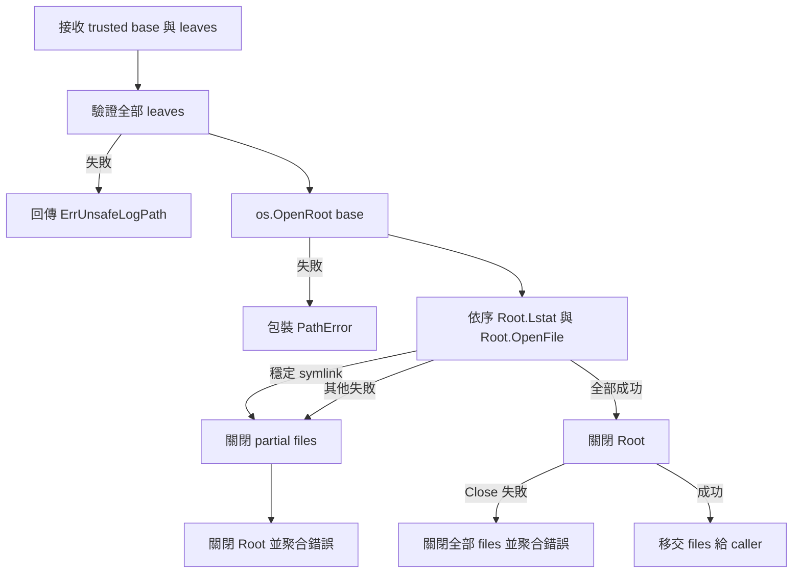

# 設計文件：以 os.Root 建立原子檔案 containment

## 文件定位

本設計替換 `file_security.go` 中 `Lstat` 完整路徑後再 `os.OpenFile` 的非原子開檔流程。既有 leaf validation、Config error chain、檔名格式、檔案權限、SplitOutput rotation 與公開 API 都是受保護契約，不在本批重寫。

## 已知契約狀態

| 類別 | 目前契約 |
|------|----------|
| Go module | 最低 Go 1.25.0，可使用 Go 1.24 引入的 `os.Root` |
| trusted boundary | `LogPath`／`directory` 是呼叫端信任的 base |
| untrusted input | `FileName`／`filePrefix` 僅允許單一 leaf |
| error contract | 不安全 leaf 與穩定 symlink 支援 `errors.Is(err, ErrUnsafeLogPath)` |
| file contract | 新目錄 `0700`、新檔 `0600`、既有 mode 不改寫、append 寫入 |
| lifecycle | `Instance.Close` 與 `SplitOutput.Close` 關閉持有檔案；rotation worker 必須收斂 |
| CI | Go 1.25.11／1.26.5 race，macOS 15、Windows 2025，90% coverage |

標準庫契約：`os.OpenRoot` 會跟隨 base directory 名稱中的 symlink；Root 方法解析的名稱不可逸出 root。Root 允許 root 內部 symlink，但不得解析到 root 外，也不阻止 mount boundary、bind mount 或特殊裝置。

## Bounded Context

### 包含

- 一般 file output 的 root-relative 開檔。
- SplitOutput 每批三個檔案的 root-relative 開檔。
- 穩定 symlink 拒絕與並行替換 containment。
- root／partial file ownership 與錯誤聚合。
- README、DESIGN 的安全說明更新。

### 不包含

- Config schema、公開 API 或 filename 規則變更。
- SplitOutput worker、timer、level routing 或鎖模型重構。
- base directory 真實性驗證與 mount boundary 防護。
- mode options、redaction、Context、encoder、SQL 或 CI 變更。
- coverage badge 恢復。

## 設計原則

1. 標準庫優先：使用 `os.Root`，不新增依賴或 syscall 分支。
2. 每批單一 root：一般輸出一檔一批；SplitOutput 三檔一批。
3. 所有權顯式：root 只服務建立批次，回傳前必須關閉。
4. 先驗證再 I/O：所有 leaf 先通過既有 validation。
5. 保留穩定 symlink 契約：以 `Root.Lstat` 辨識既有最終 symlink。
6. containment 由 `Root.OpenFile` 保證：即使 Lstat 後發生替換，也不得逸出 root。
7. 失敗即回收：partial files 與 root close error 一併聚合。

## 目標結構

```go
func openRootedLogFiles(baseDir string, leaves ...string) ([]*os.File, error)
```

此 package-private helper 負責完整批次：

1. 驗證每個 leaf，空 leaf 不允許。
2. 呼叫 `os.OpenRoot(baseDir)` 一次。
3. 對每個 leaf 執行 `root.Lstat`，穩定 symlink 回傳 `ErrUnsafeLogPath`。
4. 以 `root.OpenFile(leaf, os.O_CREATE|os.O_APPEND|os.O_WRONLY, 0o600)` 開檔。
5. 任一 leaf 失敗時，關閉所有 partial files。
6. 所有路徑都關閉 root；Close error 不忽略。
7. 只有所有檔案成功且 root 關閉成功時才回傳 files。

既有 `secureLogPath` 與完整路徑 `openSecureLogFile` 不再位於產品開檔路徑。若 `secureLogPath` 已無產品用途，連同只驗證字串組合的測試移除，避免留下看似提供 runtime containment 的假契約；leaf validation 保留。

## 資源交易



root 本身不移交給 runtime owner。一般輸出只接收一個 `*os.File`；SplitOutput 接收固定順序的 info、warn、error 三個 `*os.File`。

## 一般 file output 整合

`newFileCore` 維持先 `os.MkdirAll(cfg.LogPath, 0o700)`，再計算既有日期檔名 fallback。之後呼叫：

```go
files, err := openRootedLogFiles(cfg.LogPath, logFileName)
```

成功時只移交 `files[0]`。helper 必須保證成功結果長度與輸入 leaf 數一致，避免 caller 承擔 partial 狀態。

## SplitOutput 整合

`openSplitFiles` 先產生既有三個 leaf：

- `{prefix}-info-{date}.log`
- `{prefix}-warn-{date}.log`
- `{prefix}-error-{date}.log`

三個 leaf 一次傳入 `openRootedLogFiles`。成功後依固定索引組成 `splitFileSet`。失敗清理由 helper 完成，`openSplitFiles` 只負責加入 info／warn／error 的業務語境；不得改動 `splitFileOpener` 注入點、rotation transaction 或 Close 鎖順序。

## Symlink 行為

### 穩定 symlink

`root.Lstat(leaf)` 若回傳 `ModeSymlink`，維持既有 `ErrUnsafeLogPath`。這保留使用者可感知契約，不因 `os.Root` 預設允許 root 內 symlink 而放寬。

### 並行替換

`Root.Lstat` 後 leaf 可能被替換。此時不承諾一定回傳 `ErrUnsafeLogPath`，因結果取決於平台與競態時序；但後續 `Root.OpenFile` 必須符合核心安全不變量：不得解析並寫入 root 外。

若替換成指向 root 內的 symlink，`os.Root` 可能允許開啟。這不違反 containment，但文件不宣稱能原子拒絕所有 root 內 symlink。

## 錯誤與 cleanup

- leaf validation：原樣保留 `ErrUnsafeLogPath`。
- 穩定 symlink：包裝 `ErrUnsafeLogPath`，訊息包含 leaf 與 base 語境。
- `OpenRoot`／`Root.Lstat`／`Root.OpenFile`：以小寫開頭的繁體中文語境及 `%w` 包裝。
- partial file close 與 root close：使用 `errors.Join` 保留主要錯誤與 cleanup error。
- root close 失敗但檔案已開啟：關閉全部檔案後回傳錯誤，不移交半成功資源。

## TDD 策略

### Red

- 建立並行替換測試，證明外部 sentinel 是安全不變量。
- 建立批次單一 root 與 partial cleanup 測試。
- 測試需先在現行 `Lstat`／完整路徑 `OpenFile` 實作保存失敗或缺少能力的證據。

若無法在所有平台穩定命中納秒級競態，不得以 sleep 製造時序假象。可使用 package-private filesystem seam 控制「檢查後、開檔前」的替換點，但 seam 只能服務安全 opener，不得進入公開 API 或 runtime 全域狀態。

### Green

- 使用 `os.Root` 完成最小實作。
- 既有安全、mode、append、rotation 與 lifecycle tests 全數通過。

### Refactor

- 移除不再使用的完整路徑 opener 與誤導性註解。
- 保持 helper 專注且不超出檔案安全 context。

## 跨平台策略

- Linux、macOS：執行 symlink replacement 與 POSIX mode tests。
- Windows：若建立 symlink 因權限明確失敗，既有策略允許帶原因 skip；一般 root open、file lifecycle 與 TempDir cleanup 仍必須執行。
- 不使用 `runtime.GOOS` 跳過整組 root tests。
- 不以 sleep、retry 掩蓋資源關閉錯誤。

## 受影響檔案計畫

| 檔案 | 預期變更 | 風險 |
|------|----------|------|
| `file_security.go` | 導入批次 `os.Root` opener，移除完整路徑開檔 | cleanup 與錯誤分類 |
| `file_security_test.go` | 新增 root containment、競態與資源測試 | 平台 symlink 差異 |
| `core.go`／`core_test.go` | 一般輸出改用批次 opener | owner 索引與 Close |
| `split_output.go`／`split_output_test.go` | 三檔共用單一 root | partial failure 與 rotation |
| `README.md` | 將 TOCTOU 剩餘風險改為 os.Root 契約 | 過度承諾 |
| `DESIGN.md` | 更新安全架構與限制 | 文件漂移 |
| 本 spec | 狀態與驗證證據 | 無產品風險 |

## Protected Behavior

- `New`、`Configure`、`NewSplitOutput`、`GetSplitCore` 與 exported types 簽章不變。
- trusted base／untrusted leaf 與所有拒絕規則不變。
- 安全 FileName、空 FileName、安全 prefix、空 prefix 均保持可用。
- 日期檔名、分級檔名、level routing、每日換檔、Sync 與 Close 不變。
- 新資源 mode、既有 mode 與 append 行為不變。
- 不修改 go.mod、go.sum、CI、Makefile、coverage 或 dependency。

## 替代方案

| 方案 | 優點 | 缺點 | 結論 |
|------|------|------|------|
| 保留 `Lstat` + `OpenFile` | 修改最少 | 無法消除 leaf replacement 逸出 | 不採用 |
| `os.Root` 每個 leaf 開一次 | 實作直觀 | SplitOutput 同批可能綁定不同目錄實體 | 不採用 |
| `os.Root` 每批開一次 | 標準庫、同批一致、資源短生命週期 | 需集中 cleanup | 採用 |
| SplitOutput 長期持有 Root | rotation 可追蹤被 rename 的原目錄 | 擴張 runtime lifecycle 與 Windows handle | 本批不採用 |
| 自製 `O_NOFOLLOW` | Unix 可拒絕 final symlink | 不跨平台且只解決部分問題 | 不採用 |
| 外部 safe-open 套件 | 可能提供額外策略 | 增加 dependency 與供應鏈面 | 不採用 |

## 風險與處理方式

| 風險 | 影響 | 處理方式 | 驗證 |
|------|------|----------|------|
| 誤把 Root 宣稱為 sandbox | 使用者高估保護 | 明列 mount、device、base trust 限制 | README／DESIGN review |
| root Close error 被忽略 | handle 洩漏 | 集中 helper、錯誤聚合 | cleanup seam test |
| SplitOutput partial files 洩漏 | Windows cleanup 失敗 | helper transaction 關閉所有 partial files | Windows CI、failure test |
| root 內 symlink 在競態中被跟隨 | 與穩定拒絕語意不同 | 只承諾不逸出 root，不宣稱原子 no-follow | adversarial test、文件 |
| 測試無法穩定命中競態 | 假綠或 flaky | 使用受限 seam，不使用 sleep | `-count=20` |
| 移除 `secureLogPath` 造成測試缺口 | leaf 規則回歸 | 保留完整 validation tables | targeted regression |

## README 覆蓋率說明

目前 README 頂部的 Codecov badge 在工具鏈基線提交中被移除，原因是 CI 已移除 Codecov 上傳與 token 相依，改由 repository 自身的 90% coverage gate 驗證。若要恢復顯示，應另選以下方案：

1. 恢復 Codecov 或其他 coverage service，提供動態實際百分比。
2. 顯示「coverage gate ≥ 90%」政策 badge，明確避免冒充即時實際值。
3. 由 CI 產生 badge JSON 並發布到可信任位置，但需新增 write permission 與發布流程。

本 spec 不選擇方案，避免安全修正同時擴張 CI 權限。
