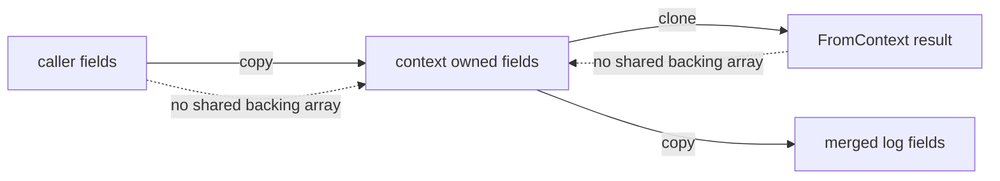

# 設計文件：Context fields 邊界防禦性複製

## 設計摘要

`WithContext` 在每次加入欄位時建立 context 自有的 `[]Field`，`FromContext` 則回傳內部 slice 的淺層副本。新增 package-private accessor 讓 `WithContext` 與 `mergeContextFields` 讀取內部欄位，避免公開 `FromContext` 的 clone 在內部流程造成雙重配置。設計只隔離 slice 與 `zap.Field` 元素，不深拷貝欄位中的參照型資料。

## 文件定位

本文件實作 `requirements.md` 定義的輸入與輸出 ownership 契約，接續前置安全 spec 的 Context defensive copy 待辦。只調整 `context.go`、`context_test.go`、`DESIGN.md` 與本 spec，不重寫 logger 初始化、輸出 core、Context helper key 或 zap encoder。

## 已知契約狀態

- 需求來源：本 spec `requirements.md` 的六個驗收情境
- API / CLI / Hook contract：`WithContext(context.Context, ...Field) context.Context`、`FromContext(context.Context) []Field` 與既有 `*Context` 日誌函式；無 CLI 或 hook
- Data contract：context value 使用私有 `loggerContextKey` 保存 `[]Field`，欄位型別為 `zap.Field` alias
- 既有實作：`WithContext` 第一次加入欄位時直接保存輸入 slice；`FromContext` 直接回傳內部 slice；`mergeContextFields` 透過 `FromContext` 讀取欄位
- 不可假造：不得新增公開 ownership API、不得更換 context key、不得更改欄位 key、值或順序、不得承諾 nested value deep copy

## Bounded Context

包含：

- `[]Field` 寫入 context 前的所有權隔離
- `[]Field` 從公開 API 回傳前的所有權隔離
- package 內部唯讀欄位存取
- Context helper、合併與日誌輸出的回歸驗證
- ownership 契約的 godoc 與設計文件

不包含：

- `zap.Field.Interface` 內 map、slice、pointer 或自訂物件的深拷貝
- context cancellation、deadline 或其他 value
- 全域 logger 與 `Instance` lifecycle
- file output、SplitOutput、rotation、encoder 與 SQL
- README.en 或公開 API 重設計

## 設計原則

- context 內保存的 slice 建立後視為 immutable，任何 package 外輸入或輸出都不得共享其底層陣列。
- 公開契約安全優先，內部熱路徑只做完成輸出所需的一次配置。
- 保留現有 nil、空 fields、欄位累積與排序行為。
- 只使用 Go 標準庫，不新增 dependency。
- 測試先保存可重現的 Red，再修改實作。

## 需求對應

| 需求 / 驗收情境 | 設計處理方式 | 驗證方式 |
|-----------------|--------------|----------|
| 首次輸入隔離 | `WithContext` 即使沒有既有欄位也配置 owned slice | `TestWithContextCopiesInputFields/first_batch` |
| 追加輸入隔離 | 合併 slice 複製 parent 與新輸入 | `TestWithContextCopiesInputFields/appended_batch` |
| 公開輸出隔離 | `FromContext` clone 私有 accessor 結果 | `TestFromContextReturnsDefensiveCopy` |
| 並行 ownership | 輸入、輸出與內部儲存使用不同底層陣列 | `TestContextFieldsDefensiveCopyConcurrentAccess` 搭配 `-race` |
| nil 與空值相容 | accessor 對 nil／無值回傳 nil；零 fields 仍回傳原 context | 既有 nil／no-fields tests |
| 合併與日誌相容 | `mergeContextFields` 讀私有 slice並配置最終合併結果 | 既有 merge 與 log tests |

## 受影響檔案計畫

| 檔案 | 預期變更 | 原因 | 風險 |
|------|----------|------|------|
| `context_test.go` | 新增輸入、輸出 mutation 與 race tests | 保存 Red 並驗收 ownership | 並行測試若未同步可能產生測試本身的 race |
| `context.go` | 新增私有 accessor，修正 `WithContext` 與 `FromContext` | 隔離 slice ownership 並避免內部雙重配置 | 額外 allocation、nil 語意或順序回歸 |
| `DESIGN.md` | 補充 defensive copy 與淺層限制 | 讓公開行為與設計一致 | 文件過度承諾 deep copy |
| `.specs/2026-07-29-14-36_BugFix-context-fields-defensive-copy/` | 追蹤需求、設計、tasks 與證據 | SDD 可恢復性 | 無 |
| `.specs/2026-07-29-11-18_BugFix-file-output-security-boundary/tasks.md` | 遠端驗收後只勾選 Context 後續項目 | 關閉來源待辦 | 不得修改其他後續項目 |

## 目標結構或流程

### 私有讀取

新增 package-private helper，名稱在實作時固定為 `contextFields`：

```go
func contextFields(ctx context.Context) []Field
```

此 helper 只做 nil 檢查、key lookup 與型別判斷，回傳內部 slice，不得由任何公開 API 直接向外傳遞。

### 寫入流程

1. `WithContext` 將 nil context 正規化為 `context.Background()`。
2. fields 為空時回傳原 context。
3. 以 `contextFields` 取得既有欄位。
4. 配置長度為 `len(existing)+len(fields)` 的新 slice。
5. 依序複製 existing 與 fields，再存入新的 child context。

### 公開讀取流程

1. `FromContext` 以 `contextFields` 取得內部 slice。
2. 無欄位時維持回傳 nil。
3. 有欄位時以標準庫 `slices.Clone` 回傳淺層副本。

### 日誌合併流程

`mergeContextFields` 直接呼叫私有 `contextFields`。有 context fields 時只配置一次最終 slice，依序複製 context fields 與呼叫端 fields；沒有 context fields 時維持回傳呼叫端 fields。

## Mermaid Diagrams



## 介面與資料契約

### API

- Input：`WithContext` 接收 `context.Context` 與零到多個 `Field`
- Output：回傳 child context；`FromContext` 回傳由呼叫端擁有的 `[]Field` 淺層副本或 nil
- Error：既有 API 不回傳 error，本次不新增 panic 或 error

### Data / Config

- 新增資料：無；仍以私有 key 保存 `[]Field`
- 既有資料相容性：無 migration；公開簽章與 context value 型別不變
- Ownership：context 擁有存入的 slice；呼叫端擁有 `FromContext` 回傳的 slice
- 深度：只複製 `zap.Field` 值；`Interface` 等內部參照仍共享原物件

## 關鍵行為

- 輸入 slice 在呼叫完成後可由呼叫端重用或修改，不影響 context。
- 每次 `FromContext` 回傳不同於內部儲存的底層陣列。
- parent 與 child context 分別擁有自己的 slice。
- 欄位順序保持 existing first、new fields second。
- `WithContext(ctx)` 回傳原 context；`FromContext(nil)` 與無欄位 context 回傳 nil。

## 前後端或跨模組設計

不涉及前後端。Context helper 與日誌 core 的交界只透過 `mergeContextFields`；core 與 encoder 不需修改。

## Protected Behavior

- 所有公開 Context API 簽章不變。
- `WithRequestID` 等 helper 的空值處理與欄位 key 不變。
- 多次 `WithContext` 的欄位順序與累積結果不變。
- `DebugContext`、`InfoContext`、`WarnContext`、`ErrorContext` 的輸出內容與 level 不變。
- global logger 為 nil 時保持 no-op；`FatalContext` 行為不修改。
- nil context 與零 fields 行為不變。

## 替代方案

| 方案 | 優點 | 缺點 | 結論 |
|------|------|------|------|
| 只在 `WithContext` 複製 | 實作最少 | `FromContext` 仍可污染內部狀態 | 不採用 |
| 只在 `FromContext` 複製 | 保護公開讀出 | 原輸入仍與 context alias | 不採用 |
| 所有內部流程都使用公開 `FromContext` | API 單純 | 合併流程會 clone 後再次複製 | 不採用 |
| 私有 accessor＋邊界複製 | ownership 清楚，內部避免雙重配置 | 必須約束私有 accessor 不可外洩 | 採用 |
| 對每個 `Field.Interface` 深拷貝 | 可隔離部分 nested mutation | 無通用安全語意，成本高且可能破壞型別 | 不採用 |

## 風險與處理方式

| 風險 | 影響 | 處理方式 | 驗證 |
|------|------|----------|------|
| 首次寫入仍誤用原 slice | context 可被輸入 mutation 污染 | 所有非空寫入統一配置 owned slice | `TestWithContextCopiesInputFields` |
| 公開讀取外洩內部 slice | 後續日誌欄位被竄改 | `FromContext` 一律 clone | `TestFromContextReturnsDefensiveCopy` |
| 私有 accessor 被未來程式向外回傳 | ownership 契約再次破壞 | helper 保持 package-private，godoc 說明僅限內部唯讀 | code review、`rg` 呼叫點 |
| 額外 allocation 造成熱路徑退化 | Context logging 成本增加 | merge 直接用私有 accessor，只配置最終 slice | benchmark smoke；必要時比較既有 benchmark |
| 並行測試自行讀寫同一測試 slice | 產生非產品缺陷的 race | 每個 goroutine只修改各自外部副本，內部只讀 context | `go test -race` |
| nested reference 被誤認為已隔離 | map 或 pointer 仍可能 race | 文件明確限定淺層複製 | DESIGN、godoc 檢查 |

## 實作注意事項

- TDD Red 必須先以 deterministic element mutation 證明兩個 aliasing 路徑，不只依賴 race detector。
- race test 不可使用 sleep；以 channel 或 `sync.WaitGroup` 控制開始與結束。
- 使用 Go 1.25 標準庫 `slices.Clone`，不新增 dependency。
- 若實作需要修改 Boundary 外檔案，先更新 tasks 或停止詢問使用者。
- 完成後回填前置安全 spec 時，只能更新 Context defensive copy 項目。
