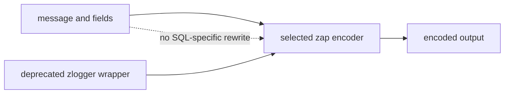

# 設計文件：Encoder 契約與 SQL dead code 清理

## 設計摘要

保留兩個既有匯出 encoder helper 以維持 v1 編譯相容，加入 `Deprecated:` marker 與 replacement；`NewNoEscapeJSONEncoder` 繼續委派 zap，`DisableHTMLEscaping` 改為原樣回傳 logger 的明確 no-op。未接入產品流程的 SQL core/helper 與對應測試直接移除。DESIGN 改為描述 encoder ownership 與字串資料保真，不再宣稱自動 SQL 改寫。

## 文件定位

本設計實作 requirements 的 encoder compatibility 與 dead code 清理，接續前置安全 spec 的後續改善。本文件不重寫 `New`、`Configure`、core factory、Config、Context、file security、SplitOutput 或 zap dependency。

## 已知契約狀態

- 需求來源：本 spec `requirements.md` 的六個驗收情境
- API / CLI / Hook contract：`NewNoEscapeJSONEncoder(zapcore.EncoderConfig) zapcore.Encoder` 與 `DisableHTMLEscaping(*zap.Logger) *zap.Logger` 已在 v1.0.x 匯出；無 CLI
- Data contract：zap encoder 負責 JSON escaping；zlogger 正式建立流程不識別 `field.Key == "sql"`
- 既有實作：前者直接委派 `zapcore.NewJSONEncoder`；後者安裝無作用 hook；SQL core/helper 只被 package tests 呼叫
- Dependency contract：`go.uber.org/zap v1.27.0` 的 JSON encoder 明確不做瀏覽器／JSONP 防護型 escaping
- 不可假造：不得宣稱能修改任意既有 logger 的 encoder、不得宣稱 SQL 自動格式化、不得在 v1 移除匯出符號

## Bounded Context

包含：

- encoder helper 的 characterization tests、deprecation 與 no-op 語意
- SQL dead code 與專屬測試移除
- DESIGN encoder／資料保真契約修正
- v1 API 編譯相容性與完整回歸驗證

不包含：

- 自訂 JSON encoder、HTML sanitizer、JSONP protection 或 zap fork
- SQL parser、formatter、redaction、參數化查詢或資料庫功能
- logger core factory、Config schema、Context、file output、SplitOutput
- dependency、CI、Makefile、README 或 README.en
- major version API removal

## 設計原則

- v1 保留已匯出符號，透過 deprecation 引導遷移，不直接造成 compile break。
- 文件只承諾可由測試驗證的行為，不以函式名稱替代實際契約。
- logger 不隱含改寫使用者 message 或 field value，escaping 由建立 core 時選擇的 encoder 決定。
- dead code 不以測試覆蓋率為理由保留。
- 不降低 dependency、lint、coverage 或跨平台驗證門檻。

## 需求對應

| 需求 / 驗收情境 | 設計處理方式 | 驗證方式 |
|-----------------|--------------|----------|
| HTML 字元行為 | encode entry 與 field，解析並檢查原字元 | `TestNewNoEscapeJSONEncoderPreservesHTMLCharacters` |
| zap 一致性 | 同輸入分別用 wrapper 與 zap encoder | `TestNewNoEscapeJSONEncoderMatchesZap` |
| 明確 no-op | `DisableHTMLEscaping` 直接回傳輸入 logger | `TestDisableHTMLEscapingReturnsOriginalLogger` |
| nil-safe | 直接回傳 nil | `TestDisableHTMLEscapingNilLogger` |
| SQL dead code 移除 | 刪除 core、helper 與專屬 tests | `rg` 無 `.go` 結果；完整 suite 通過 |
| 文件真實性 | 第 6 節改為 encoder 相容性與資料保真 | DESIGN 關鍵字與 SQL 宣稱檢查 |

## 受影響檔案計畫

| 檔案 | 預期變更 | 原因 | 風險 |
|------|----------|------|------|
| `encoder_test.go` | 以 behavior tests 取代 non-nil tests | 固定真實 escaping 與 no-op 契約 | 測試若直接比 JSON bytes 可能受欄位順序影響 |
| `encoder.go` | 加入 deprecated godoc，移除無作用 hook | 誠實描述 compatibility helper 並消除每筆 callback | pointer identity 與 nil 行為改變 |
| `core.go` | 移除 SQL core/helper | dead code 不應形成假產品能力 | 誤刪仍有呼叫點 |
| `core_test.go` | 移除只驗證 SQL dead code 的 tests | 與產品範圍一致 | 測試覆蓋率數字改變 |
| `DESIGN.md` | 替換 SQL 章節並移除差異表錯誤宣稱 | 文件與產品一致 | 使用者誤認產品功能被移除 |
| `.specs/2026-07-29-15-21_Refactor-encoder-sql-contract-cleanup/` | 追蹤需求、設計、tasks 與證據 | SDD 可恢復性 | 無 |
| `.specs/2026-07-29-11-18_BugFix-file-output-security-boundary/tasks.md` | 遠端驗收後只勾選 encoder／SQL 後續項目 | 關閉來源待辦 | 不得修改其他待辦 |

## 目標結構或流程

### Encoder compatibility wrapper

```go
// Deprecated: 請直接使用 zapcore.NewJSONEncoder。
func NewNoEscapeJSONEncoder(cfg zapcore.EncoderConfig) zapcore.Encoder {
    return zapcore.NewJSONEncoder(cfg)
}
```

wrapper 不包裝 encoder、不改寫設定，也不新增 escaping 規則。behavior test 以 JSON decode 或語意比較避免依賴非契約欄位順序。

### Logger compatibility no-op

```go
// Deprecated: 此函式無法修改既有 logger 的 encoder；請在建立 core 時選擇 encoder。
func DisableHTMLEscaping(log *zap.Logger) *zap.Logger {
    return log
}
```

此函式只為 v1 source compatibility 保留。nil 輸入自然回傳 nil；非 nil 回傳同 pointer，不安裝 hook。

### SQL dead code removal

從 `core.go` 移除：

- `sqlProcessingCore`
- `(*sqlProcessingCore).With`
- `(*sqlProcessingCore).Check`
- `(*sqlProcessingCore).Write`
- `processSQLString`

從 `core_test.go` 移除只直接測試上述 private symbols 的四組 tests。`strings` import 仍由 `parseLevel` 使用，不應一併刪除。

### 文件流程

DESIGN 第 6 節改為：

1. JSON escaping 由所選 encoder 決定。
2. pinned zap JSON encoder 不做 HTML browser escaping，但仍進行必要 JSON escaping。
3. 兩個 zlogger helper 為 deprecated compatibility API。
4. zlogger 不根據 SQL key 或 message 內容做隱含改寫。

## Mermaid Diagrams



## 介面與資料契約

### API

- Input：EncoderConfig 或 `*zap.Logger`
- Output：zap encoder 或原 logger pointer
- Error：函式簽章維持無 error；nil logger 回傳 nil，不 panic
- Deprecation：godoc 使用精確 `Deprecated:` marker 並列 replacement

### Data / Config

- 新增資料：無
- 既有資料相容性：無 migration；Config 與輸出檔格式不變
- 字串契約：message 與 fields 原值交給 encoder；zlogger 不做 SQL-specific mutation
- JSON 契約：quote、backslash、控制字元仍由 zap 轉為合法 JSON escape sequence

## 關鍵行為

- HTML 字元不因 compatibility wrapper 額外轉義。
- wrapper 與 `zapcore.NewJSONEncoder` 對同一輸入輸出語意一致。
- `DisableHTMLEscaping` 不加入 hook 或配置新的 logger。
- SQL、一般 message 與 fields 都不受隱含內容改寫。
- 匯出 helper 在 v1 仍可編譯；最終移除另立 major-version spec。

## 前後端或跨模組設計

不涉及前後端。變更只跨 encoder helper、core dead code、專屬 tests 與 DESIGN；正式 logger factory 不需修改。

## Protected Behavior

- `New`、`Configure`、`Init` 與既有 core 建立流程不變。
- JSON／console format 選擇、level、caller、time、stacktrace 不變。
- file output、SplitOutput、rotation、Sync、Close 與安全邊界不變。
- Context fields ownership 與合併行為不變。
- `NewNoEscapeJSONEncoder` 函式簽章與 zap 委派行為不變。
- zap dependency 與 Go 版本不變。

## 替代方案

| 方案 | 優點 | 缺點 | 結論 |
|------|------|------|------|
| 直接刪除兩個匯出 helper | 清理最完整 | v1 使用者 compile break | 不採用 |
| 保留無作用 hook，只改文件 | 行為最保守 | 每筆日誌仍有無意義 callback，假 side effect 持續存在 | 不採用 |
| 保留符號、deprecate、no-op identity | source compatible、契約誠實、無額外 runtime 成本 | pointer identity 與 nil 行為改變 | 採用 |
| 將 SQL core 接入正式流程 | 文件宣稱成真 | 隱含破壞資料、缺乏輸入格式與使用需求 | 不採用 |
| 保留 SQL dead code 但移除文件 | diff 較小 | 維護成本與誤用風險仍在 | 不採用 |

## 風險與處理方式

| 風險 | 影響 | 處理方式 | 驗證 |
|------|------|----------|------|
| JSON byte comparison 過度綁定欄位順序 | zap 合法變更造成脆弱測試 | decode JSON 比較值；只對必要 escaping 做原始字串檢查 | encoder behavior tests |
| no-op identity 改變 pointer | 極少數呼叫端觀察到 | PR 明確列出；公開簽章與日誌輸出相容 | pointer identity test、完整 suite |
| nil 語意改變 | 原 panic 使用者不再收到 panic | 視為安全擴張並明確測試 | nil test |
| SQL dead code仍有隱藏呼叫 | 刪除後 compile fail | 實作前後以 `rg` 和完整 build 驗證 | `rg`、`go test ./...` |
| coverage 因刪除 tests 下降 | gate 失敗 | 不為 coverage 保留 dead code；以正式行為 tests 補足 | coverage >= 90% |
| 文件仍殘留自動 SQL 宣稱 | 使用者誤解 | 搜尋 DESIGN 與 README | `rg` 文件關鍵字 |

## 實作注意事項

- T1 先把 encoder 現行可觀察行為轉為 characterization tests；identity 與 nil tests 應在舊實作呈現 Red。
- 測試取得 zap buffer 後必須 `Free`，並立即檢查 encode error。
- 移除 SQL tests 時不得順帶重構其他歷史英文測試或 core 測試 helper。
- `strings` 仍由 `parseLevel` 使用，不得因移除 SQL helper 誤刪 import。
- TDD Green 後以 `go doc` 確認 deprecation 可見。
- 若需修改 Boundary 外檔案，先更新 tasks 或停止詢問使用者。
