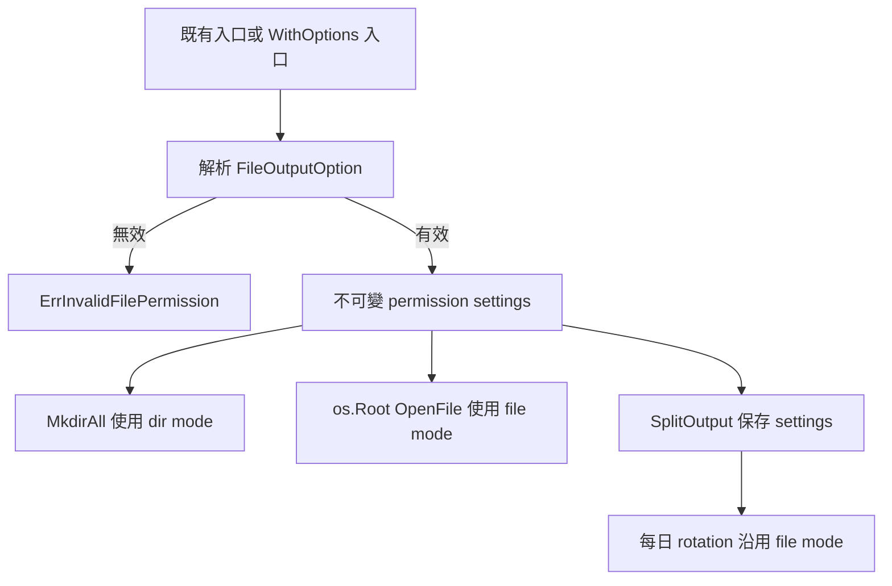

# 設計文件：可配置檔案輸出權限

## 設計摘要

新增不可由外部自行實作的 `FileOutputOption`，並由 `WithDirPerm`、`WithFilePerm` 建立 option。為保留完整來源碼相容性，既有建構函式維持原簽章並委派到新的 `*WithOptions` 入口。解析後的不可變 permission settings 會同時供一般輸出、分級輸出與每日換檔使用；預設、安全 containment 與既有 mode 不變。

## 文件定位

本設計實作 `requirements.md` 定義的五個驗收情境，接續檔案輸出安全與 `os.Root` 規格。只擴充建立 mode 的輸入與傳遞，不重寫 `validateLogLeaf`、root-relative opener transaction、SplitOutput worker 或 Config 初始化流程。

## 已知契約狀態

- 需求來源：本 spec `requirements.md` 與前置安全規格後續改善
- API / CLI / Hook contract：`New(*Config)`、`Configure(*ConfigPatch)`、`NewSplitOutput(string, string)`、`GetSplitCore(string, string, zapcore.EncoderConfig)` 簽章不得改變
- Data contract：`Config`／`ConfigPatch` schema 不新增 mode 欄位
- 既有實作：`defaultLogDirMode=0700`、`defaultLogFileMode=0600`、`os.MkdirAll`、`openRootedLogFiles`、SplitOutput rotation
- 不可假造：不得承諾 `chmod`、ACL、Windows DACL、繞過 umask 或完全 filesystem sandbox

## Bounded Context

包含：

- file output permission option 的公開 API 與 validation
- 一般輸出、分級輸出與 rotation 的新建 mode 傳遞
- POSIX mode、既有物件與預設值回歸測試
- README、DESIGN 與 godoc

不包含：

- Config file schema、環境變數或 Viper 整合
- ownership、ACL、Kubernetes securityContext
- path containment、symlink policy、logger lifecycle、encoder、Context、CI pipeline 變更

## 設計原則

- 保留既有函式的精確型別，不以 variadic 變更造成函式值不相容。
- 安全預設不變；權限放寬必須由呼叫端明確選擇。
- options 在 I/O 前一次解析，runtime 只保存驗證後的不可變值。
- 同一組 settings 必須涵蓋初始開檔與所有 rotation。
- 不以 `chmod` 改寫既有 filesystem state。

## 需求對應

| 需求 / 驗收情境 | 設計處理方式 | 驗證方式 |
|-----------------|--------------|----------|
| 一般輸出自訂權限 | `NewWithOptions`／`ConfigureWithOptions` 傳遞 settings 至 `newFileCore` | `TestNewWithOptionsUsesConfiguredPermissions` |
| 分級輸出與換檔 | `SplitOutput` 保存 settings，opener 每次使用同一 file mode | `TestSplitOutputWithOptionsPreservesPermissionsAcrossRotation` |
| 無效 mode | 共用 resolver 驗證 permission bits、owner bits、other-write | `TestFileOutputOptionsRejectInvalidPermissions` |
| 預設相容 | 舊入口以空 options 委派新入口 | `TestFileOutputsUsePrivatePermissions` 與簽章編譯斷言 |
| 既有 mode 不變 | 僅把 mode 傳給 `MkdirAll`／`OpenFile(O_CREATE)`，不呼叫 `Chmod` | `TestFileOutputOptionsPreserveExistingPermissions` |

## 受影響檔案計畫

| 檔案 | 預期變更 | 原因 | 風險 |
|------|----------|------|------|
| `file_options.go` | option type、constructors、resolver、sentinel | 集中公開契約與驗證 | 新 API 命名與錯誤分類 |
| `file_options_test.go` | table-driven validation 與 API 簽章斷言 | TDD 固定契約 | 測試遺漏 mode 組合 |
| `file_security.go` | rooted opener 接收已驗證 file mode | 套用新檔 mode | 破壞 partial cleanup |
| `file_security_test.go` | 自訂、預設、既有 mode 測試 | 驗收 filesystem 行為 | umask 污染測試程序 |
| `core.go` | 新一般輸出入口與 settings 傳遞 | 支援 Config 路徑 | 全域 Configure rollback |
| `core_test.go` | New／Configure options 與 I/O 前失敗測試 | 驗收一般輸出 | 全域狀態污染 |
| `split_output.go` | 新分級入口、settings 保存與 rotation 傳遞 | 支援分級輸出 | rotation 回歸 |
| `split_output_test.go` | 分級建立與 rotation mode 測試 | 驗收長期行為 | 時序不穩定 |
| `README.md` | 使用方式、安全責任與限制 | 公開契約 | 過度承諾 |
| `DESIGN.md` | permission settings 資料流與相容性 | 架構一致 | 文件與程式漂移 |

## 目標結構或流程

1. 舊入口呼叫對應 `*WithOptions`，不傳 options。
2. 新入口呼叫 `resolveFileOutputOptions`，先套用預設，再依序套用 options。
3. resolver 拒絕 nil option、非 permission bits、目錄缺 owner `rwx`、檔案缺 owner `rw` 與任一 other-write。
4. 一般輸出將 dir mode 傳給 `MkdirAll`，將 file mode 傳給 rooted opener。
5. 分級輸出將解析結果保存於 `SplitOutput`；初始建立與每次 rotation 使用相同 settings。
6. mode 只參與建立；已存在物件不執行 `Chmod`。

## Mermaid Diagrams



## 介面與資料契約

### API / CLI / Hook

- Input：`FileOutputOption`，由 `WithDirPerm(os.FileMode)` 或 `WithFilePerm(os.FileMode)` 建立
- Output：`NewWithOptions` 回傳 `*Instance`；`ConfigureWithOptions` 回傳 cleanup；分級入口回傳既有型別
- Error：無效 option 或 mode 回傳包含 `ErrInvalidFilePermission` 的錯誤；I/O 錯誤鏈維持原分類

新增公開入口：

```go
func NewWithOptions(cfg *Config, opts ...FileOutputOption) (*Instance, error)
func ConfigureWithOptions(patch *ConfigPatch, opts ...FileOutputOption) (func() error, error)
func NewSplitOutputWithOptions(directory, filePrefix string, opts ...FileOutputOption) (*SplitOutput, error)
func GetSplitCoreWithOptions(directory, filePrefix string, encoderConfig zapcore.EncoderConfig, opts ...FileOutputOption) (zapcore.Core, func(), error)
```

### Data / Config

- 新增資料：package-private `fileOutputSettings{dirPerm, filePerm os.FileMode}`
- 既有資料相容性：`Config`、`ConfigPatch` 與序列化 tags 完全不變，不需要 migration

## 關鍵行為

- option 順序採後者覆蓋前者，符合 functional options 慣例。
- defaults 必須經過同一 resolver validation，避免兩條行為路徑。
- `MkdirAll` 與 `OpenFile` 的 mode 仍受 umask 限制。
- 已存在目錄與檔案權限不變；append、leaf validation 與 containment 不變。
- Windows 仍接受合法 options，但不宣稱 POSIX mode 可觀察效果。

## 前後端或跨模組設計

`file_options.go` 擁有 validation 與 settings；`core.go` 和 `split_output.go` 只傳遞已驗證設定；`file_security.go` 只消費 file mode。不得讓各模組各自重做 validation。

## Protected Behavior

- 既有公開函式簽章、Config schema、預設 mode 與錯誤鏈。
- trusted base／untrusted leaf、`ErrUnsafeLogPath` 與單一 `os.Root` batch transaction。
- SplitOutput 檔名、路由、rotation transaction、Close／Sync lifecycle。
- 既有物件 mode、append 行為、cleanup 順序與 Windows handle cleanup。

## 替代方案

| 方案 | 優點 | 缺點 | 結論 |
|------|------|------|------|
| 直接新增 Config 欄位 | 設定檔可直接指定 | 破壞非具名 literal，擴張 schema，`FileMode` 序列化語意不清 | 不採用 |
| 把既有入口改為 variadic | API 數量少 | 破壞函式值的精確型別相容性 | 不採用 |
| 建立後自動 Chmod | 可強制精確 mode | 改寫既有物件並產生競態與權限窗口 | 不採用 |
| 新增 `*WithOptions` 入口 | 保留既有 API 與 schema，選用明確 | 新增四個入口 | 採用 |

## 風險與處理方式

| 風險 | 影響 | 處理方式 | 驗證 |
|------|------|----------|------|
| option validation 分散 | 一般與分級行為不一致 | 單一 resolver | `TestFileOutputOptionsRejectInvalidPermissions` |
| rotation 遺失 file mode | 次日檔案退回 `0600` | settings 保存於 SplitOutput | `TestSplitOutputWithOptionsPreservesPermissionsAcrossRotation` |
| umask 測試洩漏 | 其他測試隨機失敗 | 非並行 helper 配對還原，必要時只驗證傳入 opener 的 mode | 目標測試連續 20 次 |
| 權限放寬 | 日誌機密性降低 | 預設不變、拒絕 other-write、文件警告 | README／DESIGN review |
| 新 API 侵入 legacy Init | 全域行為改變 | `Init` 僅走預設舊入口 | legacy regression tests |

## 實作注意事項

- TDD 先以編譯斷言固定舊函式精確簽章，再新增新 API。
- 若精確 mode 測試需要操作 umask，必須限制在單一非並行測試 helper；可測 package-private opener mode 時優先避免全域 umask。
- `GetSplitCoreWithOptions` cleanup 仍維持現有 `func()` 型別，不在本 spec 改錯誤回傳契約。
- 若實作必須修改本文件未列檔案，先更新 tasks Boundary，不直接擴張。
