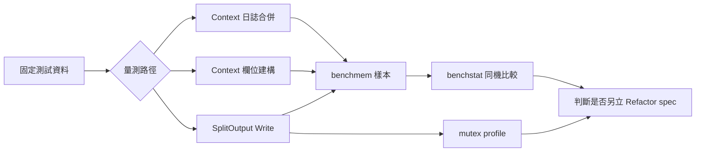

# 設計文件：SplitOutput 與 Context 效能基線

## 設計摘要

本設計在既有 `benchmark_test.go` 擴充三組 `BenchmarkLogger` 案例，量測 Context 合併、Context 建構與 SplitOutput 寫入鎖。SplitOutput 使用 test-only 無狀態 sink 直接穿過真正的 `Write` mutex，排除磁碟、worker 與額外同步成本。CI 沿用既有 `make bench` 作 smoke test，正式比較只採同一提交、同一硬體、固定參數的多次樣本；本批不修改產品碼。

## 文件定位

本文件實作 `requirements.md` 的效能量測契約，接續 `_workspace/03_performance_review.md`，並補足既有 CI 基線沒有涵蓋的 Context 與 SplitOutput 案例。不重寫 SplitOutput lifecycle、file opener、Context defensive copy、Makefile 或 GitHub Actions。

## 已知契約狀態

- 需求來源：本 spec `requirements.md` 的五個驗收情境
- API / CLI / Hook contract：公開 Go API 不變；`make bench` 仍以 `BENCH_PATTERN=BenchmarkLogger` 執行 benchmark
- Data contract：無持久資料；benchmark 結果為暫存文字與 profile
- 既有實作：`BenchmarkLoggerInfoDisabled`、`BenchmarkLoggerInfoFields`、`mergeContextFields`、`WithContext`、`SplitOutput.Write`
- 不可假造：不得預設特定 `ns/op`、`B/op`、`allocs/op` 或競爭比例；數值必須來自實際命令輸出

## Bounded Context

包含：

- Context 日誌欄位合併的配置基線
- Context 欄位批次與逐次建構的規模基線
- SplitOutput 串行與並行寫入的 mutex 成本基線
- 兩版 Go 的同機樣本與 mutex profile 解讀
- DESIGN 與 spec 的量測文件

不包含：

- SplitOutput 拆鎖、writer 替換協議、緩衝或非同步處理
- Context 儲存 logger、持久化資料結構、pool 或 unsafe 最佳化
- 真實磁碟吞吐、fsync latency、rotation 效能或跨機硬體排名
- benchmark gate、CI workflow、Makefile、dependency 或公開 API 變更

## 設計原則

- 量測單一問題：Context 案例排除 logger 建構；SplitOutput 案例排除磁碟與 worker。
- 保留真實熱路徑：Context 透過公開日誌函式或既有 helper；SplitOutput 必須呼叫真正的 `Write`。
- 可重現：固定 payload、欄位集合、Go 版本、樣本次數與命令。
- 不以 benchmark 代替正確性測試：既有 race、lifecycle、routing 與 defensive copy 測試照常執行。
- 數據先於重構：本 spec 不因觀察到競爭便直接修改產品碼。

## 需求對應

| 需求 / 驗收情境 | 設計處理方式 | 驗證方式 |
|-----------------|--------------|----------|
| Context 日誌配置基線 | discard logger 與預建 Context，分開直接、Context-only、Context 加 fields 子案例 | `BenchmarkLoggerInfoContext` |
| Context 建構規模 | 以 1／5／20 欄位比較 batch 與 incremental | `BenchmarkLoggerWithContext` |
| SplitOutput 鎖競爭 | 無狀態 sink、固定 payload、serial／parallel-same／parallel-mixed | `BenchmarkLoggerSplitOutputWrite` |
| mutex 定位 | 只執行並行子案例並產生暫存 profile | `go tool pprof -top` |
| 既有行為不變 | 差異限 benchmark 與文件，執行完整回歸 | `make verify`、兩版 race |

## 受影響檔案計畫

| 檔案 | 預期變更 | 原因 | 風險 |
|------|----------|------|------|
| `benchmark_test.go` | 新增 Context 與 SplitOutput benchmark、test-only sink 與資料 helper | 建立缺少的配置和鎖競爭基線 | 全域 logger 恢復、sink 失真 |
| `DESIGN.md` | 補 benchmark 範圍、命令、量測限制與結果摘要 | 讓後續決策可追溯 | 過度解讀單機數字 |
| `.specs/2026-07-29-16-26_Chore-split-context-performance-baseline/` | requirements、design、tasks 與實作證據 | SDD 追蹤 | 無 |
| `.specs/2026-07-29-10-52_Refactor-config-init-contract/tasks.md` | 完成後只回填既有 benchmark／鎖競爭 checkbox | 關閉歷史追蹤項目 | 不得改寫其他歷史內容 |

## 目標結構或流程

### Context 日誌基線

1. 在 timer 外建立 discard logger、固定欄位與 Context。
2. 保存既有 `globalLogger`，設定 benchmark logger，並以 Cleanup 恢復。
3. 子案例分別執行直接 `Info`、只有 Context 欄位的 `InfoContext`、Context 加呼叫欄位的 `InfoContext`。
4. 每個子案例使用 `ReportAllocs` 與 `ResetTimer`。

### Context 建構基線

1. 預先建立 1／5／20 個固定 fields。
2. `batch` 每次以單一 `WithContext(base, fields...)` 建構。
3. `incremental` 每次從 base 開始，逐欄位呼叫 `WithContext`。
4. 將結果指定至 package-level benchmark sink，避免編譯器消除工作。

### SplitOutput 鎖基線

1. 建立實作 `Write`、`Sync`、`Close` 的 test-only sink；方法不修改狀態且不加鎖。
2. 直接組裝只含三個 sink 的 `SplitOutput`，不建立 stop／done、clock、opener 或 worker。
3. `serial` 使用一般迴圈；`parallel-same` 讓所有 goroutine 寫 info；`parallel-mixed` 在每個 goroutine 內輪替 info、warn、error。
4. 所有案例使用相同固定 payload、`SetBytes` 與 `ReportAllocs`。
5. benchmark 結束後不呼叫 `Close`，因該 test-only 物件沒有 worker 或資源 ownership。

### 樣本與 profile

1. Go 1.25.11 與 Go 1.26.5 在同一台機器、同一提交各跑 `-count=10`。
2. 固定 benchstat 版本沿用 CI 基線記錄的 `golang.org/x/perf` commit，不加入 go.mod。
3. mutex profile 只跑 SplitOutput parallel selector，產物寫入 `/private/tmp` 或 `mktemp -d`。
4. Implementation Notes 與 DESIGN 只記錄可重現命令、觀察與限制，不宣稱跨機絕對效能。

## Mermaid Diagrams

## 介面與資料契約

### API / CLI / Hook

- Input：固定欄位、固定 payload、Go 版本與 benchmark flags
- Output：標準 Go benchmark 行、benchstat 比較及 mutex profile top
- Error：benchmark 或 profile 命令非零即視為驗證失敗；不吞沒錯誤

### Data / Config

- 新增資料：無；暫存 benchmark 與 profile 產物不納入 Git
- 既有資料相容性：無 migration；Config 與 FileOutputOption 不變

## 關鍵行為

- `BenchmarkLogger` 名稱確保現有 `make bench` 自動涵蓋新案例。
- test-only SplitOutput 不啟動 goroutine，不碰檔案系統，但保留真正的 level routing 與單一 mutex。
- mixed-level 案例不以全域 atomic counter 選 level，避免額外 contention 污染結果；每個 parallel worker 使用自己的循環索引。
- Context benchmark 不呼叫 `b.RunParallel` 修改 global logger；logger 在量測期間只讀且於 Cleanup 恢復。
- benchmark 數值不作功能驗收門檻；驗收重點是案例可執行、指標完整、命令可重現與產品行為不變。

## 前後端或跨模組設計

不涉及前後端。benchmark 測試、DESIGN 與既有 CI smoke 形成單一維護流程，不新增 workflow job。

## Protected Behavior

- `SplitOutput.Write` 的 level routing、鎖定、關閉後錯誤與 rotation 互斥不變。
- `Close`、`Sync`、worker lifecycle、file permissions 與 os.Root containment 不變。
- `WithContext`、`FromContext`、`mergeContextFields` 的 defensive copy 與欄位順序不變。
- `globalLogger` 初始化、Configure rollback 與公開 API 不變。
- 現有兩個 benchmark 名稱、語意及 `make bench` 入口不變。

## 替代方案

| 方案 | 優點 | 缺點 | 結論 |
|------|------|------|------|
| 使用真實暫存檔量測 SplitOutput | 接近端到端路徑 | 磁碟與 OS cache 雜訊遮蔽 mutex，CI 不穩定 | 不採用於鎖基線；既有測試保留真實 I/O |
| 以 mock mutex 或獨立函式模擬 | 容易得到穩定數字 | 沒有量到產品 `Write` 路徑 | 不採用 |
| 在本 spec 直接拆鎖 | 可立即嘗試改善 | 沒有基線，且 writer 關閉競態風險高 | 不採用；有證據後另立 spec |
| 為 benchmark 新增 CI gate | 可阻擋數值退化 | hosted runner 雜訊高，門檻缺少歷史樣本 | 不採用；CI 只做 smoke |

## 風險與處理方式

| 風險 | 影響 | 處理方式 | 驗證 |
|------|------|----------|------|
| benchmark 被編譯器消除 | 數值失真 | Context 結果寫入 package-level sink；SplitOutput 經 interface Write | `go test -bench ... -benchmem` |
| test sink 引入額外競爭 | 無法辨識產品 mutex | sink 完全無狀態且不使用 mutex／atomic | code review、mutex profile |
| global logger 未恢復 | 污染其他 benchmark 或測試 | 保存原值並使用 Cleanup 恢復 | 完整 race 與重複 benchmark |
| mixed-level 選擇器增加共享 contention | 放大非產品成本 | 每個 parallel worker 使用本地索引 | code review、profile top |
| profile 或輸出誤提交 | 污染 repository | 只寫入 `mktemp -d`，結束後檢查 status | `git status --short` |
| 單機樣本被當成普遍結論 | 錯誤最佳化決策 | 文件明列硬體、Go 版本、參數與限制 | DESIGN review |

## 實作注意事項

- 先建立 benchmark selector，再執行短 smoke，最後才收集多次樣本與 profile。
- benchmark helper 必須以 `b.Helper()` 標記，初始化放在 timer 外。
- 不使用 `t.TempDir`、sleep、網路、stdout、磁碟檔案或每日換檔 worker。
- 若 test-only 組裝無法在不修改產品碼下可靠量測，停止並更新 spec，不得為 benchmark 增加 exported seam。
- 若數據顯示 SplitOutput 競爭或 Context 配置值得改善，只在後續改善記錄候選，不在本分支修改產品碼。
