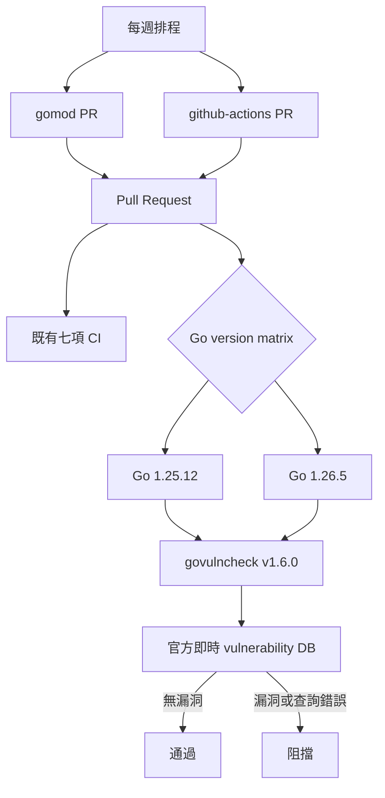

# 設計文件：依賴安全自動化

## 設計摘要

本設計新增獨立 vulnerability matrix job，使用兩個支援 Go 版本、固定 govulncheck v1.6.0 與官方即時 database 執行文字格式掃描。Makefile 提供相同 `make vuln` 入口，但不納入離線友善的 `make verify`。Dependabot 分別管理 Go modules 與 GitHub Actions，每週錯峰執行，minor／patch 分組、major 獨立；本批不更新任何依賴。

## 文件定位

本文件實作 `requirements.md` 的漏洞掃描與更新排程契約，接續既有 CI 品質基線。它擴充 `.github/workflows/ci.yml` 與 Makefile，不重建七項現有 job，也不修改 Codecov、benchmark、產品碼或 dependency graph。

## 已知契約狀態

- 需求來源：本 spec requirements 的六個驗收情境
- API / CLI / Hook contract：新增 `make vuln`；CI 由七項增加為九項；Dependabot 只在 default branch 生效
- Data contract：`dependabot.yml` schema version 2；go.mod 仍為 Go 1.25.0、zap v1.27.0、multierr v1.10.0
- 既有實作：固定 Action SHA、Go 1.25.12／1.26.5 matrix、`permissions: contents: read`、七項 CI
- 不可假造：不得捏造 vulnerability database 快照、scanner 結果、Dependabot PR 或 repository-level security setting

## Bounded Context

包含：

- govulncheck tool pinning、本機 target、兩版 CI matrix 與 fail-closed 行為
- 官方即時 vulnerability database 的可用性與重現性政策
- gomod／github-actions Dependabot weekly schedule、grouping 與 PR limit
- README、DESIGN 與 SDD 驗證證據

不包含：

- dependency／Action／Go toolchain 升級
- 自動合併、release、branch protection、security alert 開關或 repository secret
- 私有 registry、private module、VEX、SARIF upload、Code Scanning 或 database mirror
- 產品安全修復；若掃描發現漏洞，停止本 spec 並另立修復範圍

## 設計原則

- Scanner 固定、資料新鮮：固定執行工具版本，但不凍結安全資料。
- Fail closed：漏洞與基礎設施錯誤都不能被 shell 吞沒。
- 支援矩陣一致：標準庫漏洞以兩個支援 Go 版本分別分析。
- 最小權限：vulnerability job 沿用 workflow-level `contents: read`，不新增 secret。
- 更新可審查：minor／patch 降低 PR 數，major 與 security update 保持獨立。
- 外部網路隔離：`make verify` 保持可離線執行，漏洞掃描使用獨立 target／job。

## 需求對應

| 需求 / 驗收情境 | 設計處理方式 | 驗證方式 |
|-----------------|--------------|----------|
| 兩版掃描 | vulnerability matrix 使用 1.25.12／1.26.5 | 兩版 `make vuln`、遠端 job |
| 漏洞與錯誤阻擋 | 文字格式，保留原始退出碼 | workflow 靜態 contract、受控失敗 |
| scanner 不漂移 | Makefile 與 CI 固定 v1.6.0，執行前檢查版本 | 缺工具／錯版本／正確版本 |
| gomod 更新 | weekly Asia/Taipei 09:00、limit 2、minor／patch group | YAML contract |
| Actions 更新 | weekly Asia/Taipei 09:30、limit 2、minor／patch group | YAML contract |
| 既有行為不變 | 新增獨立 job，不改現有七項與 dependency | `make verify`、diff boundary |

## 受影響檔案計畫

| 檔案 | 預期變更 | 原因 | 風險 |
|------|----------|------|------|
| `Makefile` | 新增 GOVULNCHECK 變數、`vuln` target 與 help | 本機與 CI 共用入口 | 版本輸出格式判斷過度脆弱 |
| `.github/workflows/ci.yml` | 新增兩版 vulnerability matrix 與 scanner version env | 自動阻擋已知漏洞 | 外部 DB 暫時不可用 |
| `.github/dependabot.yml` | 新增 gomod／github-actions weekly 更新政策 | 定期更新供應鏈 | default branch 後才生效 |
| `README.md` | 補安裝、執行、失敗與更新政策 | 維護者可操作 | 過度承諾 DB 可用性 |
| `DESIGN.md` | 補 CI job、scanner／DB 與 Dependabot 設計 | 決策可追溯 | 與 workflow 漂移 |
| 本 spec | requirements、design、tasks 與證據 | SDD 追蹤 | 無 |
| CI 基線 spec tasks | 完成後只回填 govulncheck／Dependabot checkbox | 關閉歷史待辦 | 不得重寫其他歷史內容 |

## 目標結構或流程

### Makefile vulnerability target

1. `GOVULNCHECK ?= govulncheck` 與 `GOVULNCHECK_VERSION ?= 1.6.0`。
2. target 先檢查 binary 存在，不存在時顯示固定 `go install ...@v1.6.0`。
3. 執行 `govulncheck -version`，確認輸出包含 `govulncheck@v1.6.0`；不符時失敗。
4. 執行 `govulncheck -db=https://vuln.go.dev ./...`，直接傳遞退出碼。
5. `verify` 不相依 `vuln`，避免每個品質 job 重複查詢外部 DB。

### CI vulnerability matrix

1. `runs-on: ubuntu-24.04`、`timeout-minutes: 15`、`fail-fast: false`。
2. matrix 使用 `1.25.12` 與 `1.26.5`。
3. 沿用 checkout v6.0.2 與 setup-go v6.4.0 的完整 SHA。
4. 安裝 `govulncheck@v${GOVULNCHECK_VERSION}`，不改 go.mod／go.sum。
5. 顯示 Go 與 scanner 版本後執行 `make vuln`。
6. 不上傳 SARIF，不要求 secret，不加入 `continue-on-error`。

### Dependabot

```yaml
version: 2
updates:
  - package-ecosystem: gomod
    directory: /
    schedule:
      interval: weekly
      day: monday
      time: "09:00"
      timezone: Asia/Taipei
    open-pull-requests-limit: 2
    groups:
      go-minor-patch:
        applies-to: version-updates
        patterns: ["*"]
        update-types: [minor, patch]

  - package-ecosystem: github-actions
    directory: /
    schedule:
      interval: weekly
      day: monday
      time: "09:30"
      timezone: Asia/Taipei
    open-pull-requests-limit: 2
    groups:
      actions-minor-patch:
        applies-to: version-updates
        patterns: ["*"]
        update-types: [minor, patch]
```

實作另加 `commit-message.prefix`，讓自動 PR 可辨識 ecosystem。`open-pull-requests-limit` 只描述 version updates；GitHub 官方文件指出 security updates 有獨立內部上限，本 spec 不宣稱可由此欄位修改。

## Mermaid Diagrams



## 介面與資料契約

### API / CLI / Hook

- Input：module source、支援 Go 版本、官方 vulnerability DB、Dependabot schedule
- Output：文字漏洞報告、非零 gate、分組 dependency PR
- Error：工具缺失、版本不符、漏洞、DB／網路錯誤、YAML schema 錯誤

### Data / Config

- 新增資料：`.github/dependabot.yml` version 2
- 既有資料相容性：不修改 go.mod、go.sum、workflow event、Action SHA 或 products

## 關鍵行為

- 不使用 `@latest`；v1.6.0 同時存在 Makefile 預設與 workflow env，驗證兩處一致。
- 不把 scanner 加入 module dependencies；`go install module@version` 的 module mode 不修改專案 graph。
- 明確 `-db=https://vuln.go.dev`，避免環境變數把 CI 指向未審查資料來源。
- 不使用會永遠成功退出的結構化格式作 gate。
- 沒有 suppressions；若發現漏洞，停止合併並以 Go patch、dependency update 或不可達性證據另行處理。
- Dependabot major update 不進 minor／patch group，必須單獨經完整九項 CI。
- GitHub Actions 更新仍應保持完整 SHA 與版本註解；Dependabot PR 需由 reviewer 檢查此契約。

## 前後端或跨模組設計

不涉及前後端。Makefile 定義本機掃描 contract，workflow 在兩版 Go 重用；Dependabot 產生的 PR 再回到同一 CI。

## Protected Behavior

- 現有七項 CI 的名稱、runner、matrix、timeout、Action SHA 與步驟不變。
- workflow events 仍只有 main 的 push／pull_request，不新增 `pull_request_target`。
- permissions 仍只有 `contents: read`，Codecov token 只存在既有 coverage step。
- `make verify` 內容、90% coverage、benchmark smoke 與 lint 版本不變。
- go.mod、go.sum、產品碼、公開 API、日誌輸出與測試語意不變。

## 替代方案

| 方案 | 優點 | 缺點 | 結論 |
|------|------|------|------|
| 釘選 vulnerability DB snapshot | 相同 commit 可完全重現 | 快照快速過期，失去新漏洞偵測價值 | 不採用；只釘 scanner |
| 只掃 Go 1.26.5 | job 較少 | 可能漏掉最低支援工具鏈的標準庫差異 | 不採用 |
| 使用 SARIF 並上傳 Code Scanning | GitHub UI 整合佳 | 需要額外 permissions，且官方格式模式不以 finding 非零退出 | 不納入本 spec |
| 將 vuln 加入 make verify | 單一入口 | 所有本機與 CI 品質工作依賴外部 DB | 不採用 |
| multi-ecosystem Dependabot group | PR 更少 | module 與 workflow SHA 風險不同，review 混雜 | 不採用 |
| 自動合併 minor／patch | 維護成本低 | 供應鏈變更未經人工審查 | 不採用 |

## 風險與處理方式

| 風險 | 影響 | 處理方式 | 驗證 |
|------|------|----------|------|
| DB outage | PR 暫時被阻擋 | fail closed，人工 rerun，不加 bypass | 受控錯誤與 workflow review |
| scanner version check 格式漂移 | 正確工具被誤拒 | 以 v1.6.0 實際 `-version` 輸出建立測試 | 缺失／錯誤／正確三路徑 |
| 兩版 scan 結果不同 | 支援政策判斷複雜 | 任一版本 finding 都阻擋並記錄 Go 版本 | matrix job |
| Dependabot schema 錯誤 | 合併後不產生 PR | YAML parse、必要欄位 contract、官方 schema 人工對照 | 靜態檢查與合併後觀察 |
| Action PR 改成可移動 tag | 供應鏈基線退化 | PR review 與靜態 SHA 檢查維持 | workflow SHA regex |
| 自動 PR 過多 | 審查負擔 | weekly、錯峰、limit 2、minor／patch group | dependabot contract |

## 實作注意事項

- T0 先用官方來源確認 v1.6.0 與 Dependabot schema，再固定 Implementation Notes。
- T1 先記錄目前無 target／job／config 的 Red，以及當前兩版 govulncheck 結果。
- 若基線掃描發現漏洞，不得在本 spec 中升級 dependency 或 Go；先標記 Blocked 並另立修復。
- Makefile 錯版本測試使用暫存 fake binary，不覆寫系統工具或 repo 檔案。
- Dependabot 沒有完整官方本機 validator；不得宣稱 YAML parse 等於 GitHub 已接受設定。
- 遠端驗收預期九項 CI；Dependabot 是否產生 PR 取決於 default branch 與可用更新，不作即時完成條件。
