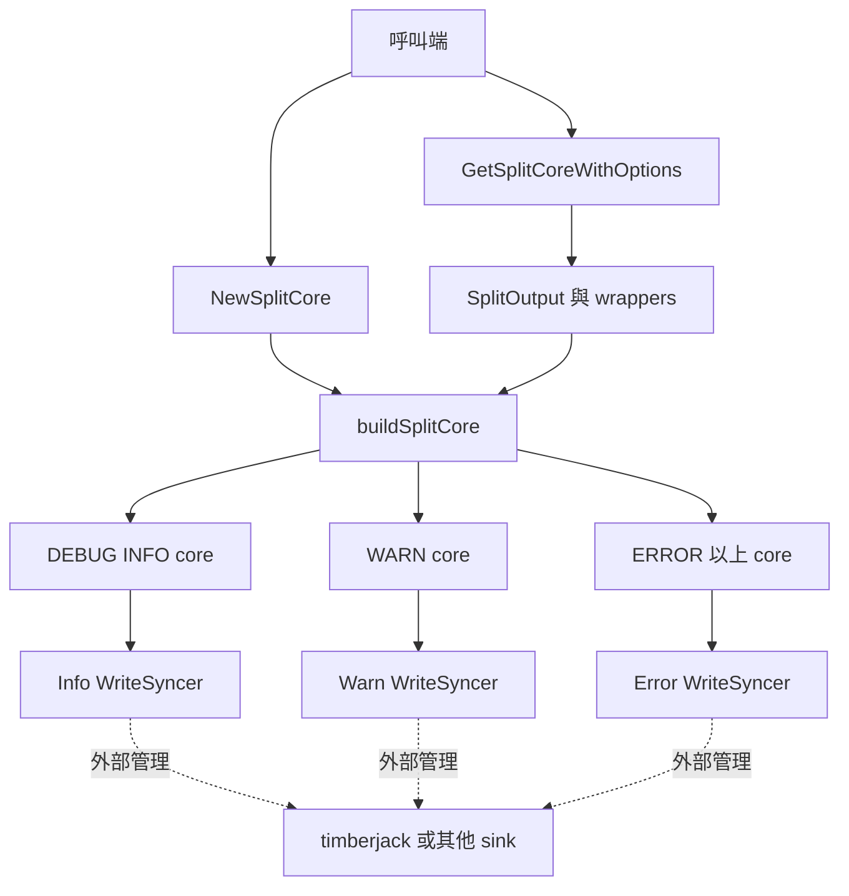
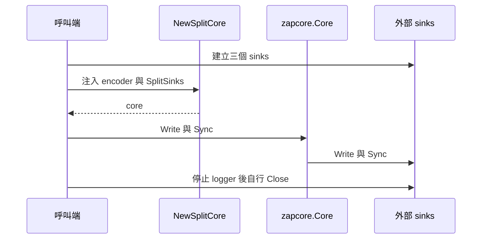

# 設計文件：通用分級 Sink

Status: InProgress

## 文件定位

本設計實作 requirements 的公開 `SplitSinks`／`NewSplitCore` 契約，將 zap level routing
與檔案 rotation 分離。現有 `SplitOutput` 繼續負責每日換檔、安全開檔及資源關閉；新
API 只把呼叫端提供的三個 `zapcore.WriteSyncer` 組成分級 core。

本設計不公開現有 opener、不導入 Factory、不加入 timberjack dependency，也不修改
Config、一般 file output、Context、encoder compatibility 或效能模型。

## 已知契約狀態

### 需求來源

- 現有 `split_output.go` 的 DEBUG／INFO、WARN、ERROR 以上路由
- `README.md` 與 `DESIGN.md` 的 timberjack 外部整合決策
- 已完成的 SplitOutput lifecycle、file security、permission 與 performance specs

### API contract

- 既有：`NewSplitOutput`、`NewSplitOutputWithOptions`、`GetSplitCore`、
  `GetSplitCoreWithOptions` 簽章及行為保持不變。
- 新增：`SplitSinks`、`NewSplitCore`、`ErrInvalidSplitCore`。
- 新 API 接收已建立的 sink，不建立檔案、不啟動 goroutine、不回傳 cleanup。

### Data contract

- `SplitSinks.Info`：DEBUG、INFO。
- `SplitSinks.Warn`：WARN。
- `SplitSinks.Error`：ERROR、DPANIC、PANIC、FATAL。
- 非標準 zap level 不列入公開保證。
- 日誌編碼由呼叫端提供的 `zapcore.Encoder` 決定。

### 既有實作

- `GetSplitCoreWithOptions` 目前直接建立 JSON encoder、三組 level enabler 與
  `zapcore.NewTee`。
- `splitOutputWrapper` 將固定 level 傳給 `SplitOutput.Write`，讓三個 core 寫入正確檔案。
- `SplitOutput` 的 `writeSyncCloser`、file set、opener、clock 與 timer 均為內部資源契約。
- `SplitOutput.Close` 停止 worker 並關閉自有檔案；此 ownership 不移轉至新 API。

## Bounded Context

### 包含

- 三路 level routing core 建構
- 注入 sink 與 encoder 的輸入驗證
- encoder clone 隔離
- 新 API 的 Sync 與 ownership 文件
- 既有 `GetSplitCoreWithOptions` 共用 routing helper
- 單元測試、example、README 與 DESIGN

### 不包含

- sink 建立、檔名、目錄、權限與 containment
- sink replacement、每日換檔或容量換檔
- sink Close、cleanup stack 或 graceful shutdown 管理
- timberjack 設定、Adapter、dependency 或壓縮驗證
- Config schema、全域 logger、一般輸出與 format 選擇
- SplitOutput mutex、worker、clock 或 opener 重構

## 設計原則

1. **新增優先**：新增公開能力，既有 API 與輸出行為不變。
2. **責任分離**：core 只路由；sink 自己處理 I/O 與 rotation；呼叫端管理外部生命週期。
3. **最小公開面**：不公開 opener、Factory 或內部 file set。
4. **依賴中立**：只依賴專案既有 zap，不綁定 timberjack。
5. **失敗即停**：建構前驗證必要輸入，不回傳部分 core。
6. **單一 routing 真相**：新舊 core 建構共用 helper，避免 level 規則漂移。

## 目標結構



## 公開型別與函式

```go
// ErrInvalidSplitCore 表示分級 core 缺少必要 encoder 或 sink。
var ErrInvalidSplitCore = errors.New("分級 core 設定無效")

// SplitSinks 定義標準 level 的三路輸出。
type SplitSinks struct {
	Info  zapcore.WriteSyncer
	Warn  zapcore.WriteSyncer
	Error zapcore.WriteSyncer
}

// NewSplitCore 使用呼叫端提供的 encoder 與 sink 建立分級 core。
// 本函式不取得 sink 所有權，呼叫端仍須管理 Sync 後的 Close。
func NewSplitCore(encoder zapcore.Encoder, sinks SplitSinks) (zapcore.Core, error)
```

### 為何接收 `zapcore.Encoder`

- 允許 JSON、console 與自訂 encoder，不把通用 sink API 綁定 JSON。
- zap 已是核心 dependency，不新增額外抽象。
- helper 對三路分別呼叫 `Clone()`，避免同一 encoder 實例在多個 core 間共享狀態。

### 為何不回傳 cleanup

- `NewSplitCore` 不建立 sink，不能假設 sink 可關閉或應由 zlogger 關閉。
- `zapcore.WriteSyncer` 沒有 `Close` 契約。
- 呼叫端可能共用 sink、由 DI container 或 graceful manager 統一管理。
- 回傳無實際 ownership 的 cleanup 容易造成 double close。

## 內部組裝

新增 package-private helper，名稱可在實作時依現有慣例微調：

```go
func buildSplitCore(
	encoder zapcore.Encoder,
	sinks SplitSinks,
) zapcore.Core
```

前置驗證由 `NewSplitCore` 負責；既有 `GetSplitCoreWithOptions` 建立的 encoder 與 wrappers
為內部已知有效值，可直接呼叫 helper。若為降低雙入口假設，helper 亦可只由一個已驗證
的內部建構函式進入，但不得改變公開錯誤行為。

組裝規則：

```go
zapcore.NewTee(
	zapcore.NewCore(encoder.Clone(), sinks.Info, infoLevel),
	zapcore.NewCore(encoder.Clone(), sinks.Warn, warnLevel),
	zapcore.NewCore(encoder.Clone(), sinks.Error, errorLevel),
)
```

level enabler 固定為：

```go
infoLevel := zap.LevelEnablerFunc(func(level zapcore.Level) bool {
	return level == zapcore.DebugLevel || level == zapcore.InfoLevel
})
warnLevel := zap.LevelEnablerFunc(func(level zapcore.Level) bool {
	return level == zapcore.WarnLevel
})
errorLevel := zap.LevelEnablerFunc(func(level zapcore.Level) bool {
	return level >= zapcore.ErrorLevel
})
```

## 輸入驗證

驗證順序固定為 encoder、info、warn、error，讓錯誤可預測。每項失敗皆包裝
`ErrInvalidSplitCore`。

Go interface 可能包含 typed nil。為避免在公開熱路徑加入 reflection，本 spec 只保證
偵測 nil interface；呼叫端提供 typed nil 屬不合法使用，Go doc 必須說明。若實作審查
認為 typed nil 必須防護，需先更新 requirements 與 tasks 邊界，不可靜默擴張。

## 資源所有權與生命週期



- 建構前後 sink ownership 均屬呼叫端。
- `core.Sync()` 由 zap tee 委派三個 core，不由 zlogger 額外重複呼叫。
- `NewSplitCore` 沒有 Close 行為，也不將 sink 包裝為 `io.Closer`。
- 三個欄位應使用不同 sink。若呼叫端重用同一實例，Sync 次數依欄位數計算。
- 現有 `GetSplitCoreWithOptions` 仍由 cleanup 關閉其自行建立的 `SplitOutput`。

## 與現有 SplitOutput 整合

`GetSplitCoreWithOptions` 保留下列流程：

1. `NewSplitOutputWithOptions` 建立安全檔案及 worker。
2. 建立三個 `splitOutputWrapper`，每個 wrapper 只同步自身 level。
3. 將 wrappers 組成 `SplitSinks`。
4. 使用 JSON encoder 呼叫共用 helper。
5. 回傳原有 cleanup，內部忽略 `SplitOutput.Close` error 的既有契約不變。

`SplitOutput.Write` 的直接 level switch 不在本 spec 重構範圍。它是公開 writer 行為，與
zap core 的 level enabler 分屬不同入口；兩者由既有回歸測試共同固定。

## timberjack 整合方式

本 spec 只在 README 顯示三個 timberjack logger 可直接作為 `SplitSinks`。範例不得：

- 把 timberjack 加入 `go.mod` 或 example test imports
- 宣稱 zlogger 擁有或關閉 timberjack
- 同時啟用現有 `SplitOutput` 每日換檔
- 隱藏 timberjack 的單一 process 寫檔限制

可執行 example test 使用專案內可控 sink；README 的 timberjack 片段作文件展示。

## 受影響檔案計畫

| 檔案 | 計畫變更 | 理由 | 主要風險 |
|------|----------|------|----------|
| `split_output.go` | 新增公開 API、sentinel、驗證與共用 helper | 提供通用分級路由 | 公開契約與 routing 回歸 |
| `split_output_test.go` | 新增新 API 測試並保留既有 selectors | 固定 level、Sync、ownership | 測試 sink 自身造成誤判 |
| `example_test.go` 或 `split_output_example_test.go` | 新增 `ExampleNewSplitCore` | 公開用法可編譯 | global state 或不穩定輸出 |
| `README.md` | 新增自訂 sink／timberjack 用法 | 降低整合工程量 | ownership 說明不足 |
| `DESIGN.md` | 更新分離輸出與 rotation 決策 | 保持架構文件一致 | 與實作漂移 |
| 本 spec | 回填 task 與驗證證據 | 可追溯性 | 狀態提前完成 |

`go.mod`、`go.sum`、Config、CI、Makefile 與其他產品檔不在變更範圍。

## 測試設計

1. 建立 thread-safe 記憶體 `zapcore.WriteSyncer`，分別收集三路輸出。
2. table-driven 測試七個標準 level，逐筆確認只命中預期 sink。
3. table-driven 測試 encoder／info／warn／error nil，驗證 sentinel 與 nil core。
4. 計數 sink 驗證 `Sync` 委派；錯誤案例遵循 zap tee 現有錯誤語意。
5. close-tracking sink 驗證新 API 不呼叫 Close。
6. example 使用 deterministic encoder，避免時間與 caller 造成不穩定輸出。
7. 執行既有 SplitOutput rotation、Close、permission、containment 與 routing selectors。

## 風險與處理方式

| 風險 | 影響 | 處理方式 | 驗證 |
|------|------|----------|------|
| 新舊 routing 規則漂移 | 不同 API 寫入不同檔案 | 共用 core helper與 level enabler | 新舊 routing tests |
| encoder 在三個 core 間共享 | 並行資料競態或欄位污染 | 每路使用 `encoder.Clone()` | race 與多欄位測試 |
| sink ownership 誤解 | double close 或資源泄漏 | API 不回 cleanup，Go doc 與 README 明示 | ownership test、文件檢查 |
| nil sink 延後 panic | 啟動成功後才失敗 | 建構時依序驗證並回 sentinel | invalid input tests |
| 同一 sink 重用 | Sync 多次、輸出混合 | 文件要求三個獨立 sink，不做反射式 identity 判斷 | README、Go doc |
| timberjack 變成核心依賴 | module 膨脹與升版負擔 | 只放文件片段，禁止 go.mod／go.sum 變更 | dependency diff |
| 公開 API 命名不易回收 | 長期相容成本 | 實作前先審閱 spec 與 Go doc | T1 API review |

## 不採用方案

### 公開 `WriteSyncerFactory`

不採用。timberjack 與多數 rotation sink 在建構後即可長期自行換檔，不需要由
`SplitOutput` 反覆建立；Factory 會增加動態替換與 Close ownership 複雜度。

### 在 Config 內加入 timberjack 欄位

不採用。這會複製第三方套件設定並把核心與特定 rotation 實作綁定。

### 直接公開現有 opener

不採用。現有 opener 回傳 package-private file set，且包含路徑、權限、日期與每日換檔
語意，不是穩定的通用 sink contract。

### 只新增 README 手寫三個 core

不採用作為最終方案。雖然變更最小，但每個使用者仍需重複 level enabler 與 Tee 組裝，
容易遺漏 DEBUG 或造成 level 重複。
