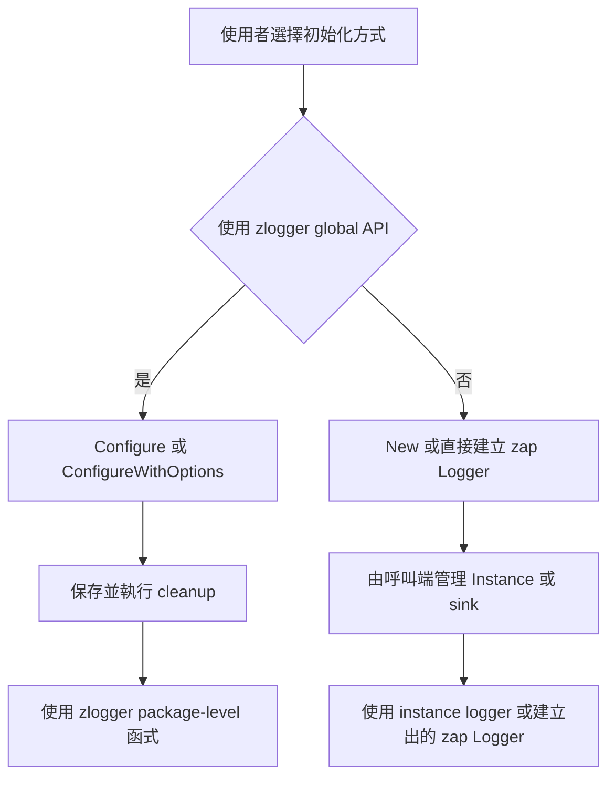
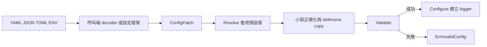
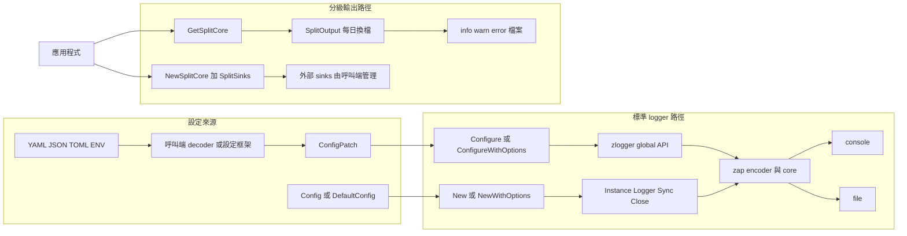

# README 使用契約與樣本正確性設計

Status: Complete

## 文件定位

本設計對應同目錄的 `requirements.md`，以最小程式修正與局部 README 編修消除使用契約
落差。既有 logger 組裝、`SplitOutput`、`SplitSinks` 與 context 實作維持不變。

## 已知契約狀態

### 需求來源

1. `README.md` 現有中文版使用樣本。
2. `core.go` 的全域與 instance logger 實作。
3. `context.go` 的 context fields API。
4. `split_output.go` 的 `SplitOutput`、`SplitSinks` 與 `NewSplitCore` 契約。
5. 現有測試所固定的初始化、關閉、同步及 level 回退行為。

### API 契約

1. `Configure` 與 `ConfigureWithOptions` 成功後發布 zlogger 與 zap global logger。
2. process 內第二次成功設定回傳 `ErrAlreadyConfigured`；cleanup 還原 logger，但不將
   `configured` 重設為 false。
3. `Init` 為 deprecated compatibility API；不可恢復的初始化失敗會 panic。
4. `SetLevel` 無回傳值，未知字串經 `parseLevel` 回退為 `info`。
5. `NewSplitCore` 驗證 encoder 與三個 sink，失敗可用
   `errors.Is(err, ErrInvalidSplitCore)` 判斷。
6. `NewSplitCore` 不取得外部 sink ownership，不負責 `Close`。
7. `Instance.Close` 管理由 `New`／`NewWithOptions` 建立的資源；現有冪等與並行安全行為
   不在本次改動。

### Data contract

1. `Config.Format` 有效值為 `console` 或 `json`。
2. `Config.ColorEnabled` 控制 level encoder 是否輸出 ANSI 色碼。
3. 新契約將 format 納入判斷：僅 `console && color_enabled` 啟用彩色 level encoder。
4. 不新增設定欄位，不變更 JSON、YAML、TOML 或 mapstructure tag。
5. `ConfigPatch` 的九個欄位皆為 pointer；nil 表示未提供，非 nil 表示明確覆寫，
   包含 `false`、空字串及空 slice。
6. `ConfigPatch.Resolve` 以 `DefaultConfig` 為基礎，複製 `Outputs`，將 level、format、
   outputs 正規化為小寫，再呼叫 `Validate`。
7. zlogger 不提供檔案讀取、格式反序列化、環境變數映射或設定優先級合併；這些工作
   屬於呼叫端 decoder 或設定框架。

### 不可假造或變更的狀態

1. 不假造不存在的 middleware package API。
2. 不宣稱 `zap.ReplaceGlobals` 能單獨替換 zlogger 自有的 `globalLogger`。
3. 不宣稱 cleanup 後允許再次 Configure。
4. 不宣稱 `SetLevel` 會拒絕未知字串或回傳錯誤。
5. 不宣稱 `NewSplitCore` 會關閉呼叫端提供的 sink。
6. 不宣稱 `Config.Validate` 能偵測 decoder 已忽略的未知設定 key。

## Bounded Context

### 包含

1. encoder level 顏色選擇。
2. README 的 Gin、timberjack、設定、生命週期、錯誤與主要 API 導覽。
3. 與上述內容直接相關的測試及可編譯 example。
4. 設定檔格式與 zlogger 設定解析邊界的文件化。
5. README 高階架構圖及其簡短圖例。
6. `README.md` 與 `README.en.md` 的雙語結構與契約同步。

### 不包含

1. Gin middleware 正式 package 化。
2. timberjack adapter 或依賴整合。
3. logger global state 架構重構。
4. `SetLevel` error-returning API。
5. `Configure` 可重新初始化能力。
6. release tag、GitHub Release、Codecov 或 CI workflow 變更。
7. YAML、JSON、TOML、Viper 或環境變數 loader 實作。
8. PNG、SVG 或其他需額外維護的架構圖資產。
9. `docs/zh-TW`、`docs/en` 目錄拆分或文件網站產生流程。

## 設計原則

1. 文件以目前程式契約為準；若文件描述的是合理且已承諾的行為，則以最小程式修正
   對齊文件。
2. 範例應能編譯，並清楚區分 zlogger package-level、`*zap.Logger` instance 與
   zap global logger。
3. 不為文件便利新增 production dependency。
4. ownership 在資源建立處說明，cleanup 順序採先 `Sync` 再 `Close`。
5. 對 legacy 行為只記錄，不在同一變更中擴張成破壞性 API 修正。

## 目標流程



## 關鍵設計

### 1. encoder 顏色選擇

`buildEncoderConfig` 的 level encoder 選擇改為：

```text
Format == console 且 ColorEnabled == true
    -> CapitalColorLevelEncoder
其他組合
    -> CapitalLevelEncoder
```

此修正不更動 encoder 類型選擇，只避免 JSON encoder 收到含 ANSI 的 level 字串。

### 2. Gin 樣本

1. 將 handler 呼叫改為 `middleware.SkipMiddlewareLog(c)`。
2. 從 `Zconfig` 與 `Logger()` 預設值移除未使用的 `TimeFormat`、`UTC`、
   `DefaultLevel`。
3. 保留目前確實生效的 `SkipPaths`、`Context`、`Category`。
4. 修正排版與縮排，但不把樣本升級成專案正式 middleware。

### 3. timberjack 單檔樣本

1. 移除未使用的 `zlogger` import。
2. 移除不必要的 `zap.ReplaceGlobals(logger)`，或只在明確示範 `zap.L()` 時保留；
   首選是直接呼叫 `logger.Info`，使 ownership 與呼叫入口一致。
3. 說明該樣本建立的是獨立 `*zap.Logger`，不會設定 zlogger package-level logger。
4. cleanup 順序維持 logger `Sync` 後關閉 timberjack sink。

### 4. timberjack 分級樣本

1. 保留 `NewSplitCore` 作為可選 adapter 入口。
2. 補充 `ErrInvalidSplitCore` 的 `errors.Is` 判斷方式。
3. 保留三個 sink 分別關閉及單一 process writer 限制。
4. 不使用 `SplitOutput` 與 timberjack 疊加管理同一檔案。

### 5. 初始化與生命週期文件

以短表格或相鄰段落比較：

| 入口 | 錯誤處理 | 資源責任 | global 影響 |
| --- | --- | --- | --- |
| `Configure` | 回傳 error | 執行 cleanup | zlogger 與 zap global |
| `ConfigureWithOptions` | 回傳 error | 執行 cleanup | zlogger 與 zap global |
| `Init` | 失敗可能 panic | compatibility 路徑 | zlogger 與 zap global |
| `New`／`NewWithOptions` | 回傳 error | 呼叫 `Instance.Close` | 無 |
| 直接 `zap.New` | 依組裝流程 | 呼叫端管理 sink | 無，除非另行 ReplaceGlobals |

同時註明：

1. cleanup 冪等，但不允許再次成功 Configure。
2. `Instance.Close` 可重複與並行呼叫；關閉後 `Sync` 回傳 `os.ErrClosed`。
3. `SetLevel` 未知值回退 `info` 是 legacy 行為。

### 6. 公開 API 導覽

在 README 既有章節附近新增精簡索引，不複製完整 GoDoc。至少包含：

1. 初始化：`ConfigureWithOptions`、`ErrAlreadyConfigured`。
2. instance：`New`、`NewWithOptions`、`Instance.Sync`、`Instance.Close`。
3. context：`FromContext`、`WithOperation`、`WithComponent`。
4. 分級輸出：`NewSplitCore`、`SplitSinks`、`ErrInvalidSplitCore`。

### 7. 設定檔與設定解析契約

README 應把「檔案解析」與「zlogger 設定解析」拆成兩個階段：



文件至少需要明示以下設定表：

| key | 型別 | 預設值 | 合法值或條件 |
| --- | --- | --- | --- |
| `level` | string | `info` | `debug`、`info`、`warn`、`error`、`fatal`，不分大小寫 |
| `format` | string | `console` | `console`、`json`，不分大小寫 |
| `outputs` | string list | `[console]` | `console`、`file`；至少一項、不得重複、不分大小寫 |
| `log_path` | string | `./logs` | 啟用 file 時不可為空；由呼叫端信任並選定基準目錄 |
| `file_name` | string | 空字串 | 啟用 file 時須為安全 leaf name；空字串代表日期命名 |
| `add_caller` | bool | `true` | 是否加入 caller |
| `add_stacktrace` | bool | `false` | 是否加入 stacktrace |
| `development` | bool | `false` | zap development mode |
| `color_enabled` | bool | `true` | 僅 console format 產生 ANSI 色碼 |

設定檔章節還須說明：

1. `ConfigPatch` 是新程式的建議輸入，pointer 用來區分未提供與明確零值。
2. `Config` 是完整執行期設定；`Config.Merge` 已 deprecated，因 bool 無法表達
   「未提供」。
3. struct tags 支援 `json`、`yaml`、`toml`、`mapstructure`，但 tags 不代表內建 loader。
4. 未知 key 是否被拒絕由 decoder 決定；安全設定應啟用 decoder 的嚴格未知欄位模式。
5. decoder 或檔案 I/O 錯誤由呼叫端工具回傳；通過反序列化後的值域錯誤可由
   `errors.Is(err, zlogger.ErrInvalidConfig)` 判斷。
6. `FileName` 不安全時同時保留 `ErrInvalidConfig` 與 `ErrUnsafeLogPath` 錯誤鏈。
7. 自訂新建目錄或檔案權限透過 `ConfigureWithOptions`、`WithDirPerm`、
   `WithFilePerm`，不是設定檔欄位；避免讓任意外部設定直接放寬 filesystem 權限。

### 8. README 高階架構圖

架構圖放在專案簡介之後、安裝章節之前，使用 GitHub 支援的 Mermaid `flowchart`。
目標圖形如下，實作時可微調節點文字，但不得改變箭頭所代表的契約：



圖後使用短文補充：

1. `Configure`／`New` 的 `outputs` 只建立標準 console 或單一 file output。
2. 每日三檔輸出須明確使用 `GetSplitCore`／`SplitOutput` 路徑。
3. 容量、保留及壓縮 rotation 使用 `NewSplitCore` 接外部 sink，例如 timberjack。
4. `NewSplitCore` 不關閉外部 sink，呼叫端負責先 `Sync` 再 `Close`。
5. 圖只呈現高階責任，不取代設定表、API 說明與生命週期章節。

### 9. 中英文文件結構

繁體中文版是本專案文件的主要契約，英文版為同步翻譯。兩份 README 採相同的資訊
架構：

```text
專案介紹 / Overview
架構概覽 / Architecture Overview
安裝 / Installation
快速開始 / Quick Start
設定 / Configuration
初始化方式 / Initialization Modes
輸出模式 / Output Modes
生命週期 / Lifecycle
錯誤處理 / Error Handling
API 導覽 / API Guide
進階整合 / Integrations
開發與驗證 / Development and Verification
授權 / License
```

同步規則：

1. 每份 README 頂端提供對應語言切換連結，連到檔案本身，不依賴翻譯後的 heading
   anchor。
2. 標題順序與層級一致；自然語言可依語境調整，不要求逐字直譯。
3. Go、YAML、JSON、shell 範例保持相同，僅註解與錯誤說明可翻譯。
4. API 名稱、設定 key、預設值、合法值、錯誤值、檔案路徑及指令不可翻譯或改寫。
5. Mermaid 圖各自使用對應語言的節點文字，但 node、edge、subgraph 關係完全一致。
6. 相對連結指向對應語言內容；本次尚未拆分 `docs/`，不得建立不存在的雙語連結。
7. 中文版有意新增契約時，同一個 task 必須同步英文版，不將翻譯延後到不確定版本。

## 受影響檔案計畫

| 檔案 | 預計變更 | 風險 |
| --- | --- | --- |
| `core.go` | 讓彩色 level encoder 僅用於 console | 低；需防止 console 顏色回歸 |
| `core_test.go` 或專用 encoder 測試 | 覆蓋 format 與 color 組合 | 低 |
| `README.md` | 修正樣本、契約、API 導覽與高階架構圖 | 中；需避免文件或圖再次偏離程式碼 |
| `README.en.md` | 依中文版同步章節、樣本、契約、API 導覽與英文架構圖 | 中；目前內容落後幅度較大 |
| `example_test.go` 或既有 example | 視需要加入可編譯樣本 | 低；不得引入 timberjack production dependency |

## 測試策略

1. 對 `console/json × color true/false` 做 table-driven test。
2. 直接編碼 entry 並檢查 ANSI sequence，避免只比較函式指標。
3. README 若保留外部依賴完整樣本，採人工編譯驗證或將不需外部依賴的核心模式抽成
   example test；不得因此把 Gin 或 timberjack 加入 `go.mod` 的必要依賴。
4. 執行完整 `go test -race -count=1 ./...` 與 `go vet ./...`。
5. 逐欄比對 README 設定表與 `Config`、`ConfigPatch`、`DefaultConfig`、`Validate`；
   確保沒有把 decoder 能力誤寫成 zlogger 能力。
6. 以 Mermaid parser 或 GitHub 預覽驗證架構圖語法，並人工核對每條箭頭的契約。
7. 比對雙語 README 的 heading tree、code fences、公開符號、設定 key、錯誤值及 Mermaid
   edges；自然語言不做字面相等比較。

## 風險與處理方式

### 風險一：JSON 行為修正影響依賴 ANSI 值的使用者

ANSI 控制碼不應存在於結構化 JSON level；此變更視為 bug fix。README 與測試同步固定
新契約，release note 應指出行為修正。

### 風險二：README 樣本再次與程式碼分歧

可抽取成 example test 的內容優先由測試覆蓋；外部整合樣本至少在 task 中保留明確的
編譯檢查步驟。

### 風險三：擴張成 middleware 或 rotation 功能開發

tasks 明確禁止新增 Gin middleware package、timberjack adapter 或 production
dependency；如有此需求，另立 Feature spec。

### 風險四：main 文件描述尚未發布 API

README 描述 repository `main` 的能力，但套件使用者取得的 tag 可能較舊。發布前應建立
包含這些 API 的新 SemVer tag；tag 與 GitHub Release 不在本 spec 內。

### 風險五：設定檔範例依賴特定 parser

核心說明保持 parser-neutral；若加入具體 loader 範例，必須標示其額外依賴與嚴格
未知欄位設定，不把該依賴加入 zlogger production module。

### 風險六：架構圖過度簡化造成錯誤理解

圖中將標準輸出與分級輸出拆成不同 subgraph，並在圖後補充 ownership 與 rotation
差異。圖不放入過細的內部函式或 goroutine，避免在非公開實作調整時頻繁失效。

### 風險七：雙語文件再次漂移

文件修改 task 同時把兩份 README 納入 Allowed Changes，最終再做結構與技術 token
對照。未來若文件持續擴大，另立 Docs spec 建立雙語 `docs/` 結構與自動檢查。
