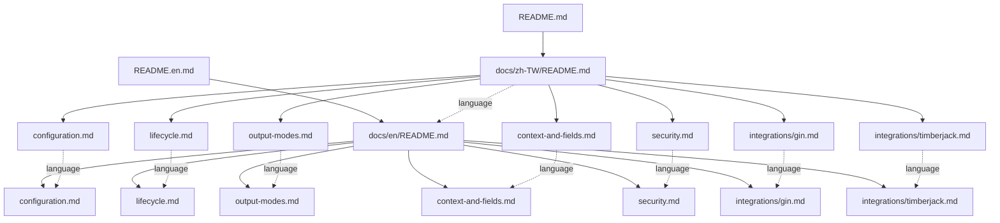

# 雙語文件結構拆分設計

Status: Complete

## 文件定位

本設計對應同目錄 `requirements.md`，只重整 `README.md`、`README.en.md` 與新增的
雙語 `docs/`。公開行為以目前 main 的 Go 原始碼、測試及已完成的 README 契約 spec
為準。

## 已知契約狀態

### 需求來源

1. `README.md`：繁體中文主要契約。
2. `README.en.md`：與中文版對齊的英文翻譯。
3. `.specs/2026-07-31-11-56_BugFix-readme-usage-contract-accuracy`：已完成的文件與
   JSON 顏色契約。
4. `config.go`、`core.go`、`context.go`、`file_options.go`、`file_security.go`、
   `split_output.go`：公開 API 與行為來源。

### API contract

1. 不新增、刪除或重新命名公開 API。
2. `Configure` 的一次成功限制、cleanup 與 global effect 維持不變。
3. `Instance`、`SplitOutput` 與外部 sinks 的 ownership 維持不變。
4. context fields defensive copy 與分級 routing 維持不變。
5. JSON 不含 ANSI，console 顏色受 `color_enabled` 控制。

### Data contract

1. `Config`、`ConfigPatch` 的九個欄位、tags、預設值與驗證規則不變。
2. 文件路徑是本次新增的導覽契約；建立後不得在同一交付中任意更名。
3. 中英文對應頁面使用相同相對檔名，避免建立翻譯名稱 mapping。

### 不可假造的狀態

1. 不宣稱 zlogger 內建設定檔 loader。
2. 不宣稱 Gin middleware 屬於 zlogger production package。
3. 不宣稱 timberjack 是必要依賴或由 zlogger 管理資源。
4. 不宣稱 root-relative I/O 是完整 filesystem sandbox。
5. 不把 README 的最新 tag 說明改成尚未發布的版本事實。

## Bounded Context

### 包含

1. 根目錄雙語 README 的縮減與專題連結。
2. `docs/zh-TW` 與 `docs/en` 的 8 組鏡像文件。
3. 文件內導航、語言切換、相對連結與範例驗證。

### 不包含

1. Go production code、Go tests 與 API 行為修改。
2. CI、Makefile、release、tag、GoDoc 產生或網站部署。
3. 第三方依賴加入 `go.mod`。
4. SDD 歷史文件搬移或清理。

## 設計原則

1. README 只負責 onboarding 與導覽，專題文件負責完整契約。
2. 繁體中文為主要契約，英文在同一 task 同步，不延後翻譯。
3. 相同資訊只保留一份完整版本；README 以摘要及連結取代長篇複製。
4. 每頁可獨立閱讀，頁首必須能切換語言並返回該語言 index。
5. 檔名固定使用英文 kebab-case，兩種語言完全一致。
6. 程式碼、設定 key、API、錯誤值及命令不翻譯。
7. 不依賴 heading anchor 進行跨語言導覽。

## 資訊架構



## 導覽契約

每份繁體中文專題頁面使用以下相對模式：

```md
**繁體中文** | [English](../en/<same-file>)

[返回文件首頁](README.md)
```

`integrations/` 內頁面需依實際深度調整：

```md
**繁體中文** | [English](../../en/integrations/<same-file>)

[返回文件首頁](../README.md)
```

英文頁面採反向連結。根 README 直接連到自身語言 index，不經過另一個語言頁面。

## 根 README 保留範圍

兩份根 README 保留相同結構：

1. badges 與語言切換。
2. 專案定位。
3. 高階 Mermaid 架構圖。
4. 安裝、tag 與 `main` 版本說明。
5. 最小 `Configure` 快速開始。
6. 初始化方式簡表。
7. 設定欄位與輸出模式摘要表。
8. context 與安全性的一段摘要。
9. API／錯誤值精簡索引。
10. 專題文件連結。
11. 開發驗證與 License。

以下內容從根 README 移除完整版本，只保留摘要與連結：

1. 嚴格 JSON loader 完整程式。
2. 檔案 containment 與 permissions 詳細規則。
3. 每日分級與 custom sinks 完整範例。
4. 完整 Gin middleware。
5. timberjack 單檔與三檔整合。
6. context helpers 完整列舉。

## 專題文件設計

### configuration.md

包含：

1. `Config`、`ConfigPatch`、`DefaultConfig` 的角色。
2. pointer 零值語意與 deprecated `Config.Merge`。
3. loader 責任與嚴格 JSON decoder 範例。
4. YAML 結構與其他 decoder 的嚴格模式要求。
5. 九欄設定表、正規化、validation 與 errors。
6. `color_enabled` 的 console／JSON 契約。

### lifecycle.md

包含：

1. 初始化入口比較表。
2. `Configure` 一次成功、失敗重試與 cleanup。
3. `Init` deprecated 與 panic 風險。
4. `Instance` 範例及 Close 後行為。
5. `SetLevel` legacy fallback。
6. graceful shutdown 的建議呼叫順序，但不引入 commons dependency。

### output-modes.md

包含：

1. console／file／每日分級／外部 rotation 比較表。
2. 標準 file output 與 `file_name`。
3. `GetSplitCore`、`SplitOutput`、`NewSplitCore` 範例。
4. DEBUG／INFO／WARN／ERROR routing。
5. internal 與 external ownership、Sync／Close 順序。
6. 將 timberjack 詳細內容連到 integration 文件。

### context-and-fields.md

包含：

1. context 建立與 logging 範例。
2. `FromContext`、`WithOperation`、`WithComponent`。
3. defensive copy 與欄位合併順序。
4. field helpers 分類，不複製完整 GoDoc。

### security.md

包含：

1. base directory 與 safe leaf contract。
2. `ErrUnsafeLogPath` 與 `ErrInvalidConfig` 錯誤鏈。
3. `os.Root` containment、symlink 與已知限制。
4. `0700`／`0600`、umask、functional options 與 Windows 限制。
5. 敏感欄位 allowlist 與 `Redacted`。

### integrations/gin.md

包含完整呼叫端 middleware、handler 用法、request ID、skip paths、custom fields 與
category。明示時間格式、UTC 由 encoder 管理，zlogger 不依賴 Gin。

### integrations/timberjack.md

包含版本化安裝指令、單檔與三檔範例、`Compression`、`NewSplitCore`、單一 process
writer、Sync／Close 順序及 `zap.ReplaceGlobals` 邊界。

## 受影響檔案計畫

| 路徑 | 變更 | 風險 |
| --- | --- | --- |
| `README.md` | 縮減為繁中快速入口與專題連結 | 中；不可遺失關鍵 onboarding |
| `README.en.md` | 同步英文快速入口 | 中；需與中文版保持契約一致 |
| `docs/zh-TW/**` | 新增 8 份繁中 index／專題文件 | 中；需避免重複與斷鏈 |
| `docs/en/**` | 新增 8 份英文鏡像文件 | 中；需避免翻譯漂移 |

## 驗證設計

1. 比對兩個語言目錄的相對檔案清單。
2. 比對每組文件的 heading 數量與意圖、code fence 語言序列、API、設定 key、錯誤值、
   commands 與 link targets。
3. 掃描 Markdown 相對連結並確認目標存在。
4. 以暫存 module 編譯 configuration、Gin、timberjack 範例。
5. 執行 markdownlint；Go code fences 的 Tab 與表格必要長行可沿用既有例外。
6. 執行 `make verify` 與 `git diff --check`，確認文件重整未伴隨程式回歸。

## 風險與處理方式

### 風險一：根 README 過度縮減

保留最小可執行範例、能力摘要表、主要 API／errors 與專題連結。沒有完成導覽前不得
移除原始詳細內容。

### 風險二：搬移造成內容遺失

採「先新增專題、驗證內容，再縮減 README」順序。每一主題需對照前一版 README
完成 checklist。

### 風險三：雙語文件漂移

每個 task 同時建立一組 zh-TW／en 文件，不將翻譯延後。檔名及技術 tokens 維持一致。

### 風險四：相對連結深度錯誤

integrations 與一般專題使用不同的固定導覽模板；最終以 link target 掃描驗證。

### 風險五：範例與 dependency 更新不同步

外部整合文件明示驗證版本，並以暫存 module 編譯，不加入 production `go.mod`。

### 風險六：文件結構持續擴大

本次固定 8 組頁面。新增主題需同時評估雙語頁面、導航與 ownership，不在本次預留空白
頁面或建立過度細碎的目錄。
