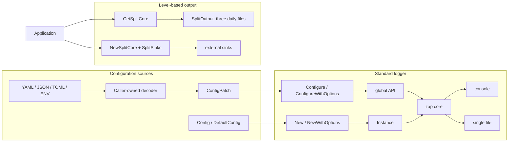

# zlogger

[](https://github.com/vincent119/zlogger)
[](LICENSE)
[](https://go.dev/)
[](https://github.com/vincent119/zlogger/actions/workflows/ci.yml)
[](https://codecov.io/gh/vincent119/zlogger)
[](https://goreportcard.com/report/github.com/vincent119/zlogger)

[繁體中文](README.md) | **English**

A structured logging library based on [zap](https://github.com/uber-go/zap). It provides
error-aware initialization, explicit resource lifecycles, context fields, secure file output,
and daily or custom level-based routing.

## Architecture Overview



Standard `outputs` create only console or one file. Use `GetSplitCore` for three daily files and
`NewSplitCore` with external sinks for size, retention, and compression rotation. The caller retains
sink ownership.

## Installation

Go 1.25 or later is required.

```bash
go get github.com/vincent119/zlogger
```

## Quick Start

```go
package main

import (
	"log"

	"github.com/vincent119/zlogger"
)

func main() {
	cleanup, err := zlogger.Configure(nil)
	if err != nil {
		log.Fatalf("initialize logger: %v", err)
	}
	defer func() {
		if err := cleanup(); err != nil {
			log.Printf("close logger: %v", err)
		}
	}()

	zlogger.Info("service started", zlogger.String("component", "api"))
	if err := zlogger.Sync(); err != nil {
		log.Printf("sync logger: %v", err)
	}
}
```

`Configure` can succeed only once in a process. Cleanup is idempotent but does not permit another
successful Configure call. Use `New` or `NewWithOptions` to hold an `Instance` without global state.

## Core Choices

### Initialization

| Requirement | Entry point | Resource responsibility |
| --- | --- | --- |
| Global logger | `Configure` / `ConfigureWithOptions` | Run cleanup |
| Instance logger | `New` / `NewWithOptions` | `Instance.Close` |
| Legacy compatibility | `Init` | Deprecated; may panic |

### Configuration

New applications use `ConfigPatch` to distinguish omitted values from explicit zero values. zlogger
does not read configuration files or environment variables. An external decoder parses strictly,
then zlogger applies defaults and validation.

| Key | Default | Summary |
| --- | --- | --- |
| `level` | `info` | debug, info, warn, error, fatal |
| `format` | `console` | console, json |
| `outputs` | `[console]` | console, file; no duplicates |
| `log_path` | `./logs` | Base directory for file output |
| `file_name` | empty | Safe leaf; empty uses the date |
| `add_caller` | `true` | Caller information |
| `add_stacktrace` | `false` | Stack traces at ERROR and above |
| `development` | `false` | zap development mode |
| `color_enabled` | `true` | Console only; JSON has no ANSI |

### Output

| Requirement | Entry point | Ownership |
| --- | --- | --- |
| Console / one file | `Configure` / `New` | Cleanup / Instance |
| Daily info, warn, error | `GetSplitCore` / `SplitOutput` | Cleanup / caller Close |
| Three custom sinks | `NewSplitCore` / `SplitSinks` | Caller manages sinks |
| Size and compression | timberjack + `NewSplitCore` | Caller manages sinks |

## Complete Documentation

| Topic | Description |
| --- | --- |
| [Configuration](docs/en/configuration.md) | Loader boundary, nine fields, validation, and color |
| [Lifecycle](docs/en/lifecycle.md) | Globals, instances, cleanup, Sync, and Close |
| [Output modes](docs/en/output-modes.md) | Single file, daily routing, custom sinks, and levels |
| [Context and fields](docs/en/context-and-fields.md) | Request fields, copies, and merge rules |
| [Security](docs/en/security.md) | Safe leaves, `os.Root`, permissions, and sensitive data |
| [Gin integration](docs/en/integrations/gin.md) | Caller-owned middleware example |
| [timberjack integration](docs/en/integrations/timberjack.md) | Size, retention, compression, and three-file rotation |
| [Changelog](CHANGELOG.en.md) | Additions, changes, fixes, and compatibility notes by release |

[Open the English documentation index](docs/en/README.md) | [GoDoc](https://pkg.go.dev/github.com/vincent119/zlogger)

## API Guide

| Category | API |
| --- | --- |
| Initialization | `Configure`, `ConfigureWithOptions`, `New`, `NewWithOptions` |
| Global logging | `Debug`, `Info`, `Warn`, `Error`, `Fatal`, `SetLevel` |
| Context | `WithContext`, `FromContext`, `WithRequestID`, `WithTraceID`, `WithOperation`, `WithComponent` |
| Split output | `GetSplitCore`, `NewSplitOutput`, `NewSplitCore`, `SplitSinks` |

Primary sentinel errors are `ErrInvalidConfig`, `ErrAlreadyConfigured`, `ErrUnsafeLogPath`,
`ErrInvalidFilePermission`, `ErrInvalidSplitCore`, and `os.ErrClosed`. Use `errors.Is`.

## Development and Verification

```bash
make verify
```

CI runs race tests and vulnerability scans with Go 1.25.12 and Go 1.26.5. Compatibility is
verified on Linux, macOS 15, and Windows 2025. The coverage threshold is 90%, and results are
uploaded to Codecov.

## License

MIT
