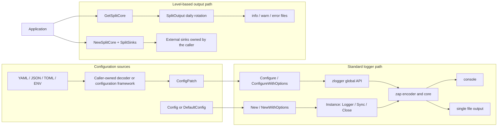

# zlogger

[](https://github.com/vincent119/zlogger)
[](LICENSE)
[](https://go.dev/)
[](https://github.com/vincent119/zlogger/actions/workflows/ci.yml)
[](https://codecov.io/gh/vincent119/zlogger)
[](https://goreportcard.com/report/github.com/vincent119/zlogger)

[繁體中文](README.md) | **English**

A structured logging library based on [zap](https://github.com/uber-go/zap). It provides
error-aware initialization, explicit resource lifecycles, context fields, secure file output,
and daily or custom level-based routing.

## Architecture Overview



The `outputs` setting used by `Configure` and `New` creates only standard console or single-file
outputs. Use `GetSplitCore` for three daily files. For size, retention, and compression rotation,
connect external sinks such as timberjack through `NewSplitCore`. `NewSplitCore` never takes
ownership of external sinks.

## Installation

Go 1.25 or later is required.

```bash
go get github.com/vincent119/zlogger
```

The latest tag is currently `v1.0.5`. It does not yet include APIs documented from `main`, such as
`Configure`, `ConfigPatch`, and `NewSplitCore`. Production builds should use a released tag. These
APIs will be included in the next SemVer release. Before that release, use the following command
only for evaluation:

```bash
go get github.com/vincent119/zlogger@main
```

## Quick Start

```go
package main

import (
	"log"

	"github.com/vincent119/zlogger"
)

func main() {
	cleanup, err := zlogger.Configure(nil)
	if err != nil {
		log.Fatalf("initialize logger: %v", err)
	}
	defer func() {
		if err := cleanup(); err != nil {
			log.Printf("close logger: %v", err)
		}
	}()

	zlogger.Info("service started", zlogger.String("component", "api"))
	if err := zlogger.Sync(); err != nil {
		log.Printf("sync logger: %v", err)
	}
}
```

A successful `Configure` call publishes both the zlogger global logger and the zap global logger.
Run cleanup after all log writes have stopped.

## Configuration

### Using ConfigPatch

New applications should use `ConfigPatch`. Pointer fields distinguish an omitted value from an
explicit zero value. Omitted fields are filled from `DefaultConfig`.

```go
level := "debug"
format := "json"
outputs := []string{"console", "file"}
logPath := "./logs"
fileName := "app.log"
addCaller := true
development := false
colorEnabled := false

cleanup, err := zlogger.Configure(&zlogger.ConfigPatch{
	Level:        &level,
	Format:       &format,
	Outputs:      &outputs,
	LogPath:      &logPath,
	FileName:     &fileName,
	AddCaller:    &addCaller,
	Development:  &development,
	ColorEnabled: &colorEnabled,
})
if err != nil {
	return fmt.Errorf("configure logger: %w", err)
}
defer func() { _ = cleanup() }()
```

`Config` represents a complete runtime configuration. `Config.Merge` is deprecated because bool
fields cannot distinguish an omitted value from `false`. New applications should not use it to
combine partial configurations.

### Loading a Configuration File

zlogger does not read YAML, JSON, TOML, or environment variables, and it does not define source
precedence. The caller must decode external data into `ConfigPatch`, then pass it to `Configure`.
zlogger applies defaults, normalizes and validates values, and creates the logger.

`ConfigPatch` provides `json`, `yaml`, `toml`, and `mapstructure` tags. These tags support mapping
by caller-selected tools; they do not imply a built-in loader.

YAML structure:

```yaml
log:
  level: debug
  format: json
  outputs:
    - console
    - file
  log_path: ./logs
  file_name: app.log
  add_caller: true
  add_stacktrace: false
  development: false
  color_enabled: false
```

The following JSON example uses only the standard library and rejects unknown fields:

```go
type AppConfig struct {
	Log zlogger.ConfigPatch `json:"log"`
}

file, err := os.Open("config.json")
if err != nil {
	return fmt.Errorf("open configuration file: %w", err)
}
defer func() { _ = file.Close() }()

var appConfig AppConfig
decoder := json.NewDecoder(io.LimitReader(file, 1<<20))
decoder.DisallowUnknownFields()
if err := decoder.Decode(&appConfig); err != nil {
	return fmt.Errorf("decode configuration file: %w", err)
}

cleanup, err := zlogger.Configure(&appConfig.Log)
if err != nil {
	return fmt.Errorf("configure logger: %w", err)
}
defer func() { _ = cleanup() }()
```

Enable the equivalent strict unknown-field mode when using YAML, TOML, or Viper. If the decoder
has already ignored an unknown key, `Config.Validate` cannot recover or detect that key later.

### Configuration Fields

| Key | Type | Default | Allowed values or conditions |
| --- | --- | --- | --- |
| `level` | string | `info` | `debug`, `info`, `warn`, `error`, `fatal`; case-insensitive |
| `format` | string | `console` | `console`, `json`; case-insensitive |
| `outputs` | []string | `[console]` | `console`, `file`; at least one, unique, case-insensitive |
| `log_path` | string | `./logs` | Required and non-empty when `file` is enabled |
| `file_name` | string | empty | A safe leaf name when `file` is enabled; empty uses the date |
| `add_caller` | bool | `true` | Adds caller information |
| `add_stacktrace` | bool | `false` | Adds stack traces |
| `development` | bool | `false` | Enables zap development mode |
| `color_enabled` | bool | `true` | Emits ANSI colors only when `format=console` |

`ConfigPatch.Resolve` copies `outputs` and normalizes level, format, and outputs to lowercase.
Unsupported values, empty outputs, duplicate outputs, and an empty `log_path` with file output
return an error that satisfies `errors.Is(err, zlogger.ErrInvalidConfig)`. Decoder and file I/O
errors are not wrapped as `ErrInvalidConfig`.

### Color Output

ANSI color codes are emitted only when `format=console` and `color_enabled=true`. JSON levels
never contain ANSI control codes, even when `color_enabled` remains true.

```go
disabled := false
cleanup, err := zlogger.Configure(&zlogger.ConfigPatch{
	ColorEnabled: &disabled,
})
```

## Initialization and Lifecycle

| Entry point | Error handling | Resource responsibility | Global effect |
| --- | --- | --- | --- |
| `Configure` | Returns an error | Run the returned cleanup | Sets zlogger and zap globals |
| `ConfigureWithOptions` | Returns an error | Run the returned cleanup | Sets zlogger and zap globals |
| `Init` | May panic on failure | Compatibility path | Sets zlogger and zap globals |
| `New` | Returns an error | Call `Instance.Close` | None |
| `NewWithOptions` | Returns an error | Call `Instance.Close` | None |
| Direct `zap.New` | Caller-defined | Caller manages sinks | None unless `zap.ReplaceGlobals` is called |

`Configure` can succeed only once in a process. Failed initialization does not publish partial
state and can be retried after the configuration is corrected. A call after the first success
returns `ErrAlreadyConfigured`. Cleanup is idempotent, but it does not permit another successful
`Configure` call.

`Init(*Config)` remains only for source compatibility. It cannot return configuration or I/O
errors and may panic when initialization fails. New applications should use `Configure`.

Hold an `Instance` directly when global state is not required:

```go
instance, err := zlogger.New(zlogger.DefaultConfig())
if err != nil {
	return fmt.Errorf("create logger: %w", err)
}
defer func() { _ = instance.Close() }()

instance.Logger().Info("service started")
if err := instance.Sync(); err != nil {
	return fmt.Errorf("sync logger: %w", err)
}
```

`Instance.Close` is safe for repeated and concurrent calls. Do not use the logger returned by
`Logger()` after Close. `Instance.Sync` then returns an error wrapping `os.ErrClosed`.

Use `SetLevel` to adjust the global logger level at runtime:

```go
zlogger.SetLevel("debug")
```

Unknown strings currently preserve legacy behavior by falling back to `info`; no error is returned.

## Output Modes

### Standard Console and File Output

`Config.Outputs` accepts `console`, `file`, or both. Standard file output writes to one file and
does not include daily or size-based rotation. An empty `file_name` uses the current date.

### File Security and Permissions

`log_path` is a trusted base directory selected by the caller. `file_name` and the split-output
`filePrefix` must be a single leaf name. They cannot be `.`, `..`, contain path separators, be an
absolute path or Windows drive-prefixed path, or contain NUL.

Unsafe names satisfy `errors.Is(err, zlogger.ErrUnsafeLogPath)`. When validation happens through
Config, the error chain also retains `ErrInvalidConfig`.

New directories and files use `0700` and `0600` by default. The process umask may restrict them
further, and existing objects are never chmodded. Explicitly relax permissions for newly created
objects only when required:

```go
instance, err := zlogger.NewWithOptions(
	cfg,
	zlogger.WithDirPerm(0o750),
	zlogger.WithFilePerm(0o640),
)
```

Directory modes must include owner `rwx`, file modes must include owner `rw`, and neither may
contain other-write or non-permission bits. Invalid values satisfy
`errors.Is(err, zlogger.ErrInvalidFilePermission)`. Permission options are intentionally not
configuration-file fields, preventing untrusted external settings from relaxing filesystem access.

File leaves are constrained below the base directory with `os.Root`, and stable final symlinks are
rejected. This is not a complete filesystem sandbox; callers must still protect the base directory,
mounts, and configuration sources.

### Daily Level-Based Output

```go
core, cleanup, err := zlogger.GetSplitCore(
	"./logs",
	"app",
	zapcore.EncoderConfig{
		TimeKey:    "ts",
		LevelKey:   "level",
		MessageKey: "msg",
		EncodeTime: zapcore.ISO8601TimeEncoder,
		EncodeLevel: zapcore.CapitalLevelEncoder,
	},
)
if err != nil {
	return err
}
logger := zap.New(core)
defer func() {
	_ = logger.Sync()
	cleanup()
}()
```

The files and routing rules are:

- `app-info-YYYY-MM-DD.log`: DEBUG and INFO
- `app-warn-YYYY-MM-DD.log`: WARN
- `app-error-YYYY-MM-DD.log`: ERROR, DPANIC, PANIC, and FATAL

Cleanup stops the daily rotation goroutine and closes all files. Stop using the logger, call
`Sync`, and then run cleanup. Use `GetSplitCoreWithOptions` to customize creation permissions.

Applications may also hold `SplitOutput` directly. Its `Close` method is safe for repeated and
concurrent calls. After Close, `Write` and `Sync` return errors wrapping `os.ErrClosed`.

### Custom Level-Based Sinks

`NewSplitCore` combines three existing `zapcore.WriteSyncer` values into a level-based core:

```go
core, err := zlogger.NewSplitCore(
	zapcore.NewJSONEncoder(encoderConfig),
	zlogger.SplitSinks{
		Info:  infoSink,
		Warn:  warnSink,
		Error: errorSink,
	},
)
if err != nil {
	if errors.Is(err, zlogger.ErrInvalidSplitCore) {
		return fmt.Errorf("invalid split output: %w", err)
	}
	return err
}
logger := zap.New(core)
```

`Info` receives DEBUG and INFO, `Warn` receives WARN, and `Error` receives ERROR and above. Use a
different sink for every field. `NewSplitCore` does not take resource ownership or call `Close` on
external sinks. The caller must sync the logger and then close each sink.

### Size-Based Rotation with timberjack

`SplitOutput` provides daily rotation only. Use
[timberjack](https://github.com/DeRuina/timberjack) for size limits, backup counts, retention, and
compression:

```bash
go get github.com/DeRuina/timberjack
```

This single-file example creates an independent `*zap.Logger`; it does not configure zlogger's
package-level logger:

```go
tjLogger := &timberjack.Logger{
	Filename:    "./logs/app.log",
	MaxSize:     100,
	MaxBackups:  10,
	MaxAge:      30,
	Compression: "gzip",
}

core := zapcore.NewCore(
	zapcore.NewJSONEncoder(encoderConfig),
	zapcore.AddSync(tjLogger),
	zap.InfoLevel,
)
logger := zap.New(core, zap.AddCaller())
defer func() {
	_ = logger.Sync()
	_ = tjLogger.Close()
}()

logger.Info("server started", zap.String("port", "8080"))
```

Even an explicit `zap.ReplaceGlobals(logger)` call replaces only `zap.L()`. It does not configure
zlogger's own global logger, so `zlogger.Info` cannot be used to call this logger.

For size-based rotation with three files, create three timberjack loggers and pass them to
`NewSplitCore`. Do not combine this path with `SplitOutput`, because only one component should
manage rotation. Each file should have one writing process; use distinct names or an external log
collector in multi-process environments.

## Context and Fields

```go
ctx := zlogger.WithRequestID(context.Background(), "req-123")
ctx = zlogger.WithUserID(ctx, 12345)
ctx = zlogger.WithTraceID(ctx, "trace-abc")
ctx = zlogger.WithOperation(ctx, "login")
ctx = zlogger.WithComponent(ctx, "auth")

zlogger.InfoContext(ctx, "process request", zlogger.String("action", "login"))
fields := zlogger.FromContext(ctx)
```

`WithContext` and `FromContext` copy the fields slice at their boundaries, preventing callers from
mutating context fields through a shared backing array. Fields passed directly to `InfoContext` and
the other context logging functions are appended after context fields.

Common field helpers:

```go
zlogger.String("key", "value")
zlogger.Strings("roles", []string{"admin"})
zlogger.Int("count", 42)
zlogger.Uint("user_id", 12345)
zlogger.Float64("price", 99.99)
zlogger.Bool("active", true)
zlogger.Duration("latency", time.Second)
zlogger.Time("timestamp", time.Now())
zlogger.Err(err)
zlogger.Any("data", value)
```

## Gin Integration Example

The Gin middleware below is caller-owned integration code, not part of the zlogger package. It
does not add Gin as a zlogger dependency. Time formatting and UTC behavior remain encoder concerns
and are not configured again in the middleware.

```go
package middleware

import (
	"time"

	"github.com/gin-gonic/gin"
	"github.com/vincent119/zlogger"
)

const (
	logCategoryKey = "log_category"
	logSkipKey     = "log_skip"
	logFieldsKey   = "log_fields"
)

type Zfn func(*gin.Context) []zlogger.Field

type Zconfig struct {
	SkipPaths []string
	Context   Zfn
	Category  string
}

func SkipMiddlewareLog(c *gin.Context) {
	c.Set(logSkipKey, true)
}

func SetLogFields(c *gin.Context, fields ...zlogger.Field) {
	current, _ := c.Get(logFieldsKey)
	existing, _ := current.([]zlogger.Field)
	c.Set(logFieldsKey, append(existing, fields...))
}

func SetLogCategory(c *gin.Context, category string) {
	c.Set(logCategoryKey, category)
}

func Logger(conf Zconfig) gin.HandlerFunc {
	skipPaths := make(map[string]struct{}, len(conf.SkipPaths))
	for _, path := range conf.SkipPaths {
		skipPaths[path] = struct{}{}
	}

	return func(c *gin.Context) {
		if _, skip := skipPaths[c.Request.URL.Path]; skip {
			c.Next()
			return
		}

		start := time.Now()
		ctx := c.Request.Context()
		if requestID := c.GetHeader("X-Request-ID"); requestID != "" {
			ctx = zlogger.WithRequestID(ctx, requestID)
			c.Request = c.Request.WithContext(ctx)
		}

		c.Next()
		if skip, _ := c.Get(logSkipKey); skip == true {
			return
		}

		category := conf.Category
		if value, ok := c.Get(logCategoryKey); ok {
			category, _ = value.(string)
		}
		fields := []zlogger.Field{
			zlogger.String("method", c.Request.Method),
			zlogger.String("path", c.Request.URL.Path),
			zlogger.Int("status", c.Writer.Status()),
			zlogger.Duration("latency", time.Since(start)),
			zlogger.String("category", category),
		}
		if value, ok := c.Get(logFieldsKey); ok {
			custom, _ := value.([]zlogger.Field)
			fields = append(fields, custom...)
		}
		if conf.Context != nil {
			fields = append(fields, conf.Context(c)...)
		}

		if len(c.Errors) > 0 {
			zlogger.ErrorContext(ctx, "HTTP request failed", fields...)
			return
		}
		zlogger.InfoContext(ctx, "HTTP request", fields...)
	}
}
```

When the handler has already written a complete log event, call the exported function to avoid a
duplicate middleware entry:

```go
middleware.SetLogFields(c, zlogger.String("user_id", "12345"))
zlogger.InfoContext(c.Request.Context(), "process callback")
middleware.SkipMiddlewareLog(c)
```

## Security

Use an allowlist for log fields and record only the minimum data required for diagnosis. Do not log
tokens, API keys, passwords, private keys, Authorization headers, cookies, session identifiers,
complete personal data, or complete request, response, Config, and arbitrary struct values that
may contain secrets.

When only the presence of a field should be recorded, use:

```go
zlogger.Info("authentication request",
	zlogger.Redacted("authorization"),
	zlogger.String("request_id", requestID),
)
```

`Redacted` always writes the fixed value `[REDACTED]`; it does not scan or mask other fields.

## API Guide

| Category | API | Description |
| --- | --- | --- |
| Global initialization | `Configure`, `ConfigureWithOptions` | Return cleanup and an error |
| Instance initialization | `New`, `NewWithOptions` | Do not modify global state |
| Compatibility | `Init` | Deprecated; may panic on failure |
| Global logging | `Debug`, `Info`, `Warn`, `Error`, `Fatal` | Use the configured global logger |
| Context logging | `DebugContext`, `InfoContext`, `WarnContext`, `ErrorContext` | Merge context fields |
| Context fields | `WithContext`, `FromContext`, `WithRequestID`, `WithUserID`, `WithTraceID`, `WithOperation`, `WithComponent` | Create and read request-scoped fields |
| Level | `SetLevel` | Change the global level at runtime |
| Managed split output | `GetSplitCore`, `GetSplitCoreWithOptions` | Three daily files with an internal lifecycle |
| Custom split output | `NewSplitCore`, `SplitSinks` | Connect external WriteSyncers |
| Direct split output | `NewSplitOutput`, `NewSplitOutputWithOptions` | Let the caller hold `SplitOutput` |

Primary error values:

| Error | Meaning |
| --- | --- |
| `ErrInvalidConfig` | A configuration value violates the public contract |
| `ErrAlreadyConfigured` | The global logger has already been configured successfully |
| `ErrUnsafeLogPath` | A file name or prefix is not a safe leaf name |
| `ErrInvalidFilePermission` | A new file or directory mode is unsafe |
| `ErrInvalidSplitCore` | The encoder or a required sink is missing |
| `os.ErrClosed` | An Instance or SplitOutput is already closed |

Use `errors.Is` for all sentinel errors.

## Development and Verification

```bash
make verify
```

Common targets:

```bash
make test-race
make lint
make coverage-check
make bench
make fmt-check
make vuln
```

CI runs race tests and vulnerability scans with Go 1.25.12 and Go 1.26.5. Compatibility is
verified on Linux, macOS 15, and Windows 2025. After the coverage job passes the 90% threshold,
`coverage.out` is uploaded to Codecov.

## License

MIT
