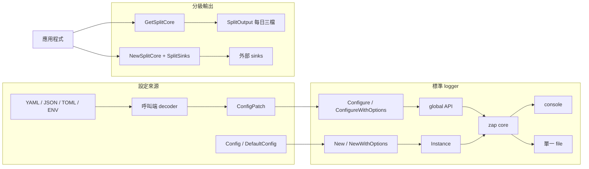

# zlogger

[](https://github.com/vincent119/zlogger)
[](LICENSE)
[](https://go.dev/)
[](https://github.com/vincent119/zlogger/actions/workflows/ci.yml)
[](https://codecov.io/gh/vincent119/zlogger)
[](https://goreportcard.com/report/github.com/vincent119/zlogger)

**繁體中文** | [English](README.en.md)

基於 [zap](https://github.com/uber-go/zap) 的結構化日誌 library，提供可處理錯誤的
初始化、明確資源生命週期、context fields、安全檔案輸出，以及每日或自訂分級輸出。

## 架構概覽



標準 `outputs` 只建立 console 或單一 file。每日三檔使用 `GetSplitCore`；容量、保留與
壓縮 rotation 使用 `NewSplitCore` 接外部 sink，ownership 仍屬呼叫端。

## 安裝

需要 Go 1.25 或更新版本。

```bash
go get github.com/vincent119/zlogger
```

## 快速開始

```go
package main

import (
	"log"

	"github.com/vincent119/zlogger"
)

func main() {
	cleanup, err := zlogger.Configure(nil)
	if err != nil {
		log.Fatalf("初始化 logger 失敗：%v", err)
	}
	defer func() {
		if err := cleanup(); err != nil {
			log.Printf("關閉 logger 失敗：%v", err)
		}
	}()

	zlogger.Info("服務啟動", zlogger.String("component", "api"))
	if err := zlogger.Sync(); err != nil {
		log.Printf("同步 logger 失敗：%v", err)
	}
}
```

`Configure` 在同一 process 只能成功一次；cleanup 可重複呼叫，但不允許再次成功
Configure。不需要 global 狀態時，使用 `New`／`NewWithOptions` 持有 `Instance`。

## 核心選擇

### 初始化

| 需求 | 入口 | 資源責任 |
| --- | --- | --- |
| global logger | `Configure`／`ConfigureWithOptions` | 執行 cleanup |
| instance logger | `New`／`NewWithOptions` | `Instance.Close` |
| 舊版相容 | `Init` | deprecated；失敗可能 panic |

### 設定

新程式使用 `ConfigPatch` 區分未提供與明確零值。zlogger 不讀取設定檔或環境變數；
外部 decoder 負責嚴格解析，再由 zlogger 套用預設值與驗證。

| key | 預設值 | 摘要 |
| --- | --- | --- |
| `level` | `info` | debug、info、warn、error、fatal |
| `format` | `console` | console、json |
| `outputs` | `[console]` | console、file，不得重複 |
| `log_path` | `./logs` | file output 的 base directory |
| `file_name` | 空字串 | 安全 leaf；空值使用日期 |
| `add_caller` | `true` | caller 資訊 |
| `add_stacktrace` | `false` | ERROR 以上 stacktrace |
| `development` | `false` | zap development mode |
| `color_enabled` | `true` | 只影響 console；JSON 無 ANSI |

### 輸出

| 需求 | 入口 | ownership |
| --- | --- | --- |
| console／單檔 | `Configure`／`New` | cleanup／Instance |
| 每日 info、warn、error | `GetSplitCore`／`SplitOutput` | cleanup／呼叫端 Close |
| 自訂三路 sink | `NewSplitCore`／`SplitSinks` | 呼叫端管理 sinks |
| 容量與壓縮 | timberjack + `NewSplitCore` | 呼叫端管理 sinks |

## 完整文件

| 主題 | 說明 |
| --- | --- |
| [設定](docs/zh-TW/configuration.md) | loader 邊界、九個欄位、驗證與顏色 |
| [生命週期](docs/zh-TW/lifecycle.md) | global、instance、cleanup、Sync、Close |
| [輸出模式](docs/zh-TW/output-modes.md) | 單檔、每日分級、自訂 sinks 與 routing |
| [Context 與 fields](docs/zh-TW/context-and-fields.md) | request fields、複製與合併規則 |
| [安全性](docs/zh-TW/security.md) | safe leaf、`os.Root`、permissions、敏感資料 |
| [Gin 整合](docs/zh-TW/integrations/gin.md) | 引用端 middleware 範例 |
| [timberjack 整合](docs/zh-TW/integrations/timberjack.md) | 容量、保留、壓縮與三檔 rotation |
| [變更紀錄](CHANGELOG.md) | 各版本新增、變更、修正與相容性注意事項 |

[開啟繁體中文文件首頁](docs/zh-TW/README.md) | [GoDoc](https://pkg.go.dev/github.com/vincent119/zlogger)

## API 導覽

| 類別 | API |
| --- | --- |
| 初始化 | `Configure`、`ConfigureWithOptions`、`New`、`NewWithOptions` |
| global 日誌 | `Debug`、`Info`、`Warn`、`Error`、`Fatal`、`SetLevel` |
| context | `WithContext`、`FromContext`、`WithRequestID`、`WithTraceID`、`WithOperation`、`WithComponent` |
| 分級輸出 | `GetSplitCore`、`NewSplitOutput`、`NewSplitCore`、`SplitSinks` |

主要 sentinel errors：`ErrInvalidConfig`、`ErrAlreadyConfigured`、`ErrUnsafeLogPath`、
`ErrInvalidFilePermission`、`ErrInvalidSplitCore` 與 `os.ErrClosed`。使用 `errors.Is` 判斷。

## 開發與品質驗證

```bash
make verify
```

CI 使用 Go 1.25.12 與 Go 1.26.5 執行 race test 與 vulnerability scan，並在 Linux、
macOS 15、Windows 2025 驗證相容性。coverage 門檻為 90%，結果上傳 Codecov。

## License

MIT
