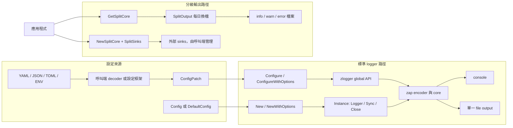

# zlogger

[](https://github.com/vincent119/zlogger)
[](LICENSE)
[](https://go.dev/)
[](https://github.com/vincent119/zlogger/actions/workflows/ci.yml)
[](https://codecov.io/gh/vincent119/zlogger)
[](https://goreportcard.com/report/github.com/vincent119/zlogger)

**繁體中文** | [English](README.en.md)

基於 [zap](https://github.com/uber-go/zap) 的結構化日誌 library，提供可處理錯誤的
初始化、明確的資源生命週期、context fields、安全檔案輸出，以及每日或自訂的分級
輸出能力。

## 架構概覽



`Configure` 與 `New` 的 `outputs` 只建立標準 console 或單一 file output。每日三檔輸出
使用 `GetSplitCore`；容量、保留及壓縮 rotation 則使用 `NewSplitCore` 接入外部 sink，
例如 timberjack。`NewSplitCore` 不取得外部 sink 的 ownership。

## 安裝

需要 Go 1.25 或更新版本。

```bash
go get github.com/vincent119/zlogger
```

目前最新 tag 為 `v1.0.5`，尚未包含本 README 對 `main` 所描述的 `Configure`、
`ConfigPatch`、`NewSplitCore` 等新 API。正式環境請使用已發布 tag；新 API 將於下一個
SemVer 版本發布。發布前僅供評估時，可明確使用：

```bash
go get github.com/vincent119/zlogger@main
```

## 快速開始

```go
package main

import (
	"log"

	"github.com/vincent119/zlogger"
)

func main() {
	cleanup, err := zlogger.Configure(nil)
	if err != nil {
		log.Fatalf("初始化 logger 失敗：%v", err)
	}
	defer func() {
		if err := cleanup(); err != nil {
			log.Printf("關閉 logger 失敗：%v", err)
		}
	}()

	zlogger.Info("服務啟動", zlogger.String("component", "api"))
	if err := zlogger.Sync(); err != nil {
		log.Printf("同步 logger 失敗：%v", err)
	}
}
```

`Configure` 成功後會同時發布 zlogger 與 zap global logger。cleanup 應在所有日誌停止
寫入後執行。

## 設定

### 使用 ConfigPatch

新程式應使用 `ConfigPatch`。pointer 用來區分「未提供」與明確零值，未提供的欄位會
由 `DefaultConfig` 補齊。

```go
level := "debug"
format := "json"
outputs := []string{"console", "file"}
logPath := "./logs"
fileName := "app.log"
addCaller := true
development := false
colorEnabled := false

cleanup, err := zlogger.Configure(&zlogger.ConfigPatch{
	Level:        &level,
	Format:       &format,
	Outputs:      &outputs,
	LogPath:      &logPath,
	FileName:     &fileName,
	AddCaller:    &addCaller,
	Development:  &development,
	ColorEnabled: &colorEnabled,
})
if err != nil {
	return fmt.Errorf("設定 logger: %w", err)
}
defer func() { _ = cleanup() }()
```

`Config` 表示完整執行期設定。`Config.Merge` 因 bool 無法區分「未提供」與 `false`，
已 deprecated；新程式不應以它組合部分設定。

### 從設定檔載入

zlogger 不會讀取 YAML、JSON、TOML 或環境變數，也不定義設定來源優先級。呼叫端應用
decoder 或設定框架把資料解析成 `ConfigPatch`，再交給 `Configure` 做預設值合併、
正規化、驗證與 logger 建立。

`ConfigPatch` 提供 `json`、`yaml`、`toml`、`mapstructure` tags。這些 tags 只供外部
工具映射欄位，不代表 zlogger 內建對應 loader。

YAML 結構：

```yaml
log:
  level: debug
  format: json
  outputs:
    - console
    - file
  log_path: ./logs
  file_name: app.log
  add_caller: true
  add_stacktrace: false
  development: false
  color_enabled: false
```

以下 JSON 範例只使用標準庫，並拒絕未知欄位：

```go
type AppConfig struct {
	Log zlogger.ConfigPatch `json:"log"`
}

file, err := os.Open("config.json")
if err != nil {
	return fmt.Errorf("開啟設定檔: %w", err)
}
defer func() { _ = file.Close() }()

var appConfig AppConfig
decoder := json.NewDecoder(io.LimitReader(file, 1<<20))
decoder.DisallowUnknownFields()
if err := decoder.Decode(&appConfig); err != nil {
	return fmt.Errorf("解析設定檔: %w", err)
}

cleanup, err := zlogger.Configure(&appConfig.Log)
if err != nil {
	return fmt.Errorf("設定 logger: %w", err)
}
defer func() { _ = cleanup() }()
```

YAML、TOML 或 Viper 也應啟用對應的嚴格未知欄位模式。decoder 若已忽略未知 key，
`Config.Validate` 收到 struct 後無法再偵測該 key。

### 設定欄位

| key | 型別 | 預設值 | 合法值或條件 |
| --- | --- | --- | --- |
| `level` | string | `info` | `debug`、`info`、`warn`、`error`、`fatal`，不分大小寫 |
| `format` | string | `console` | `console`、`json`，不分大小寫 |
| `outputs` | []string | `[console]` | `console`、`file`；至少一項、不得重複、不分大小寫 |
| `log_path` | string | `./logs` | 啟用 `file` 時不可為空 |
| `file_name` | string | 空字串 | 啟用 `file` 時須為安全 leaf name；空字串使用日期命名 |
| `add_caller` | bool | `true` | 是否加入 caller |
| `add_stacktrace` | bool | `false` | 是否加入 stacktrace |
| `development` | bool | `false` | 是否使用 zap development mode |
| `color_enabled` | bool | `true` | 僅 `format=console` 時產生 ANSI 色碼 |

`ConfigPatch.Resolve` 會複製 `outputs`，並將 level、format、outputs 正規化為小寫。
未知值、空 outputs、重複 outputs，以及 file output 使用空 `log_path` 時，會回傳可由
`errors.Is(err, zlogger.ErrInvalidConfig)` 判斷的錯誤。decoder 或設定檔 I/O 錯誤不會
被包裝成 `ErrInvalidConfig`。

### 顏色輸出

只有 `format=console` 且 `color_enabled=true` 時會輸出 ANSI 色碼。JSON 即使保留
`color_enabled=true`，level 也不會含 ANSI 控制碼。

```go
disabled := false
cleanup, err := zlogger.Configure(&zlogger.ConfigPatch{
	ColorEnabled: &disabled,
})
```

## 初始化與生命週期

| 入口 | 錯誤處理 | 資源責任 | global 影響 |
| --- | --- | --- | --- |
| `Configure` | 回傳 error | 呼叫回傳的 cleanup | 設定 zlogger 與 zap global |
| `ConfigureWithOptions` | 回傳 error | 呼叫回傳的 cleanup | 設定 zlogger 與 zap global |
| `Init` | 失敗可能 panic | compatibility 路徑 | 設定 zlogger 與 zap global |
| `New` | 回傳 error | 呼叫 `Instance.Close` | 無 |
| `NewWithOptions` | 回傳 error | 呼叫 `Instance.Close` | 無 |
| 直接 `zap.New` | 由呼叫端組裝 | 呼叫端管理 sink | 無，除非另行 `zap.ReplaceGlobals` |

`Configure` 在同一 process 只能成功一次。初始化失敗不會發布半成品，修正設定後可以
重試；成功後再次呼叫會回傳 `ErrAlreadyConfigured`。cleanup 可重複呼叫，但不會重設
再次 Configure 的資格。

`Init(*Config)` 只為來源碼相容而保留。它無法回傳設定或 I/O 錯誤，初始化失敗可能
panic；新程式應使用 `Configure`。

不需要 global logger 時，直接持有 `Instance`：

```go
instance, err := zlogger.New(zlogger.DefaultConfig())
if err != nil {
	return fmt.Errorf("建立 logger: %w", err)
}
defer func() { _ = instance.Close() }()

instance.Logger().Info("服務啟動")
if err := instance.Sync(); err != nil {
	return fmt.Errorf("同步 logger: %w", err)
}
```

`Instance.Close` 可安全重複及並行呼叫。Close 後不得繼續使用 `Logger()` 回傳的 logger；
`Instance.Sync` 會回傳包裝 `os.ErrClosed` 的錯誤。

`SetLevel` 可動態調整 global logger level：

```go
zlogger.SetLevel("debug")
```

目前未知字串會沿用 legacy 行為並回退為 `info`，不會回傳錯誤。

## 輸出模式

### 標準 console 與 file

`Config.Outputs` 可選 `console`、`file` 或兩者。標準 file output 是單一檔案，不包含
每日換檔或容量 rotation。`file_name` 留空時使用當日日期作為檔名。

### 檔案安全與權限

`log_path` 是呼叫端信任並選定的 base directory。`file_name` 與分級輸出的
`filePrefix` 只允許單一 leaf name，不得是 `.`、`..`，也不得含路徑分隔符、絕對路徑、
Windows drive prefix 或 NUL。

不安全名稱可由 `errors.Is(err, zlogger.ErrUnsafeLogPath)` 判斷；經 Config 驗證失敗時，
錯誤鏈也會保留 `ErrInvalidConfig`。

新建目錄與檔案預設使用 `0700` 與 `0600`。umask 可能進一步收緊權限，既有物件不會
被 chmod。需要明確放寬新建物件時：

```go
instance, err := zlogger.NewWithOptions(
	cfg,
	zlogger.WithDirPerm(0o750),
	zlogger.WithFilePerm(0o640),
)
```

目錄必須包含 owner `rwx`，檔案必須包含 owner `rw`；不得包含 other-write 或非
permission bits。無效值可由 `errors.Is(err, zlogger.ErrInvalidFilePermission)` 判斷。
權限 options 不屬於設定檔欄位，避免未受信任的外部設定直接放寬 filesystem 權限。

檔案 leaf 透過 `os.Root` 限制在 base directory 內，穩定存在的最終 symlink 會被拒絕。
此機制不是完整 filesystem sandbox；呼叫端仍須保護 base directory、mount 與設定來源。

### 每日分級輸出

```go
core, cleanup, err := zlogger.GetSplitCore(
	"./logs",
	"app",
	zapcore.EncoderConfig{
		TimeKey:    "ts",
		LevelKey:   "level",
		MessageKey: "msg",
		EncodeTime: zapcore.ISO8601TimeEncoder,
		EncodeLevel: zapcore.CapitalLevelEncoder,
	},
)
if err != nil {
	return err
}
logger := zap.New(core)
defer func() {
	_ = logger.Sync()
	cleanup()
}()
```

產生的檔案與路由如下：

- `app-info-YYYY-MM-DD.log`：DEBUG、INFO
- `app-warn-YYYY-MM-DD.log`：WARN
- `app-error-YYYY-MM-DD.log`：ERROR、DPANIC、PANIC、FATAL

cleanup 會停止每日換檔 goroutine 並關閉檔案。logger 停止使用後應先 `Sync`，再執行
cleanup。需要自訂新建權限時使用 `GetSplitCoreWithOptions`。

也可直接建立 `SplitOutput`。它的 `Close` 可重複及並行呼叫；關閉後 `Write`、`Sync`
會回傳包裝 `os.ErrClosed` 的錯誤。

### 自訂分級 sink

`NewSplitCore` 將三個既有的 `zapcore.WriteSyncer` 組成分級 core：

```go
core, err := zlogger.NewSplitCore(
	zapcore.NewJSONEncoder(encoderConfig),
	zlogger.SplitSinks{
		Info:  infoSink,
		Warn:  warnSink,
		Error: errorSink,
	},
)
if err != nil {
	if errors.Is(err, zlogger.ErrInvalidSplitCore) {
		return fmt.Errorf("分級輸出設定無效: %w", err)
	}
	return err
}
logger := zap.New(core)
```

`Info` 接收 DEBUG、INFO；`Warn` 接收 WARN；`Error` 接收 ERROR 以上。三個欄位應使用
不同 sink。`NewSplitCore` 不取得外部資源 ownership，也不呼叫 sink 的 `Close`；
呼叫端須先同步 logger，再自行關閉 sink。

### 容量 rotation：timberjack

`SplitOutput` 只提供每日換檔。單檔容量、備份數量、保存天數及壓縮可使用
[timberjack](https://github.com/DeRuina/timberjack)：

```bash
go get github.com/DeRuina/timberjack
```

單檔範例建立的是獨立 `*zap.Logger`，不會設定 zlogger package-level logger：

```go
tjLogger := &timberjack.Logger{
	Filename:    "./logs/app.log",
	MaxSize:     100,
	MaxBackups:  10,
	MaxAge:      30,
	Compression: "gzip",
}

core := zapcore.NewCore(
	zapcore.NewJSONEncoder(encoderConfig),
	zapcore.AddSync(tjLogger),
	zap.InfoLevel,
)
logger := zap.New(core, zap.AddCaller())
defer func() {
	_ = logger.Sync()
	_ = tjLogger.Close()
}()

logger.Info("伺服器啟動", zap.String("port", "8080"))
```

即使另外呼叫 `zap.ReplaceGlobals(logger)`，也只會替換 `zap.L()`；它不會設定 zlogger
自有的 global logger，因此不能改用 `zlogger.Info` 呼叫此 logger。

需要三檔容量 rotation 時，建立三個 timberjack logger 並傳給 `NewSplitCore`。此模式
不使用 `SplitOutput`，避免兩個元件同時管理 rotation。每個檔案應只有一個 process
寫入；多 process 環境應使用不同檔名或外部 log collector。

## Context 與 fields

```go
ctx := zlogger.WithRequestID(context.Background(), "req-123")
ctx = zlogger.WithUserID(ctx, 12345)
ctx = zlogger.WithTraceID(ctx, "trace-abc")
ctx = zlogger.WithOperation(ctx, "login")
ctx = zlogger.WithComponent(ctx, "auth")

zlogger.InfoContext(ctx, "處理請求", zlogger.String("action", "login"))
fields := zlogger.FromContext(ctx)
```

`WithContext` 與 `FromContext` 會在邊界複製 fields slice，避免呼叫端透過共享底層陣列
修改 context 內的欄位。額外傳給 `InfoContext` 等函式的 fields 會附加在 context fields
之後。

常用 field helpers：

```go
zlogger.String("key", "value")
zlogger.Strings("roles", []string{"admin"})
zlogger.Int("count", 42)
zlogger.Uint("user_id", 12345)
zlogger.Float64("price", 99.99)
zlogger.Bool("active", true)
zlogger.Duration("latency", time.Second)
zlogger.Time("timestamp", time.Now())
zlogger.Err(err)
zlogger.Any("data", value)
```

## Gin 整合範例

Gin middleware 是引用端整合範例，不是 zlogger package 的一部分，也不會讓 zlogger
核心依賴 Gin。時間格式與 UTC 由 zlogger encoder 管理，不在 middleware 重複設定。

```go
package middleware

import (
	"time"

	"github.com/gin-gonic/gin"
	"github.com/vincent119/zlogger"
)

const (
	logCategoryKey = "log_category"
	logSkipKey     = "log_skip"
	logFieldsKey   = "log_fields"
)

type Zfn func(*gin.Context) []zlogger.Field

type Zconfig struct {
	SkipPaths []string
	Context   Zfn
	Category  string
}

func SkipMiddlewareLog(c *gin.Context) {
	c.Set(logSkipKey, true)
}

func SetLogFields(c *gin.Context, fields ...zlogger.Field) {
	current, _ := c.Get(logFieldsKey)
	existing, _ := current.([]zlogger.Field)
	c.Set(logFieldsKey, append(existing, fields...))
}

func SetLogCategory(c *gin.Context, category string) {
	c.Set(logCategoryKey, category)
}

func Logger(conf Zconfig) gin.HandlerFunc {
	skipPaths := make(map[string]struct{}, len(conf.SkipPaths))
	for _, path := range conf.SkipPaths {
		skipPaths[path] = struct{}{}
	}

	return func(c *gin.Context) {
		if _, skip := skipPaths[c.Request.URL.Path]; skip {
			c.Next()
			return
		}

		start := time.Now()
		ctx := c.Request.Context()
		if requestID := c.GetHeader("X-Request-ID"); requestID != "" {
			ctx = zlogger.WithRequestID(ctx, requestID)
			c.Request = c.Request.WithContext(ctx)
		}

		c.Next()
		if skip, _ := c.Get(logSkipKey); skip == true {
			return
		}

		category := conf.Category
		if value, ok := c.Get(logCategoryKey); ok {
			category, _ = value.(string)
		}
		fields := []zlogger.Field{
			zlogger.String("method", c.Request.Method),
			zlogger.String("path", c.Request.URL.Path),
			zlogger.Int("status", c.Writer.Status()),
			zlogger.Duration("latency", time.Since(start)),
			zlogger.String("category", category),
		}
		if value, ok := c.Get(logFieldsKey); ok {
			custom, _ := value.([]zlogger.Field)
			fields = append(fields, custom...)
		}
		if conf.Context != nil {
			fields = append(fields, conf.Context(c)...)
		}

		if len(c.Errors) > 0 {
			zlogger.ErrorContext(ctx, "HTTP request failed", fields...)
			return
		}
		zlogger.InfoContext(ctx, "HTTP request", fields...)
	}
}
```

handler 已自行記錄完整日誌時，使用匯出的函式避免重複記錄：

```go
middleware.SetLogFields(c, zlogger.String("user_id", "12345"))
zlogger.InfoContext(c.Request.Context(), "處理 callback")
middleware.SkipMiddlewareLog(c)
```

## 安全性

日誌欄位應採白名單，只記錄診斷所需的最小資料。不要記錄 token、API key、密碼、
私鑰、Authorization、cookie、session identifier、完整個資，或包含秘密欄位的完整
request、response、Config 與任意 struct。

只需要標示欄位已遮蔽時：

```go
zlogger.Info("驗證請求",
	zlogger.Redacted("authorization"),
	zlogger.String("request_id", requestID),
)
```

`Redacted` 只輸出固定 `[REDACTED]`，不會自動掃描或遮罩其他欄位。

## API 導覽

| 類別 | API | 說明 |
| --- | --- | --- |
| global 初始化 | `Configure`、`ConfigureWithOptions` | 回傳 cleanup 與 error |
| instance 初始化 | `New`、`NewWithOptions` | 不修改 global 狀態 |
| compatibility | `Init` | deprecated；失敗可能 panic |
| global 日誌 | `Debug`、`Info`、`Warn`、`Error`、`Fatal` | 使用已 Configure 的 logger |
| context 日誌 | `DebugContext`、`InfoContext`、`WarnContext`、`ErrorContext` | 合併 context fields |
| context fields | `WithContext`、`FromContext`、`WithRequestID`、`WithUserID`、`WithTraceID`、`WithOperation`、`WithComponent` | 建立與讀取 request-scoped fields |
| level | `SetLevel` | 動態調整 global level |
| 標準分級 | `GetSplitCore`、`GetSplitCoreWithOptions` | 每日三檔與內建生命週期 |
| 自訂分級 | `NewSplitCore`、`SplitSinks` | 接入外部 WriteSyncer |
| 直接分級輸出 | `NewSplitOutput`、`NewSplitOutputWithOptions` | 呼叫端持有 `SplitOutput` |

主要錯誤值：

| 錯誤 | 意義 |
| --- | --- |
| `ErrInvalidConfig` | 設定值不符合公開契約 |
| `ErrAlreadyConfigured` | global logger 已成功設定過一次 |
| `ErrUnsafeLogPath` | 檔名或 prefix 不是安全 leaf name |
| `ErrInvalidFilePermission` | 新建檔案或目錄 mode 不安全 |
| `ErrInvalidSplitCore` | encoder 或必要 sink 缺失 |
| `os.ErrClosed` | Instance 或 SplitOutput 已關閉 |

所有 sentinel error 應使用 `errors.Is` 判斷。

## 開發與品質驗證

```bash
make verify
```

常用子命令：

```bash
make test-race
make lint
make coverage-check
make bench
make fmt-check
make vuln
```

CI 使用 Go 1.25.12 與 Go 1.26.5 執行 race test 與 vulnerability scan，並在 Linux、
macOS 15、Windows 2025 驗證相容性。coverage job 通過 90% 門檻後上傳
`coverage.out` 至 Codecov。

## License

MIT
